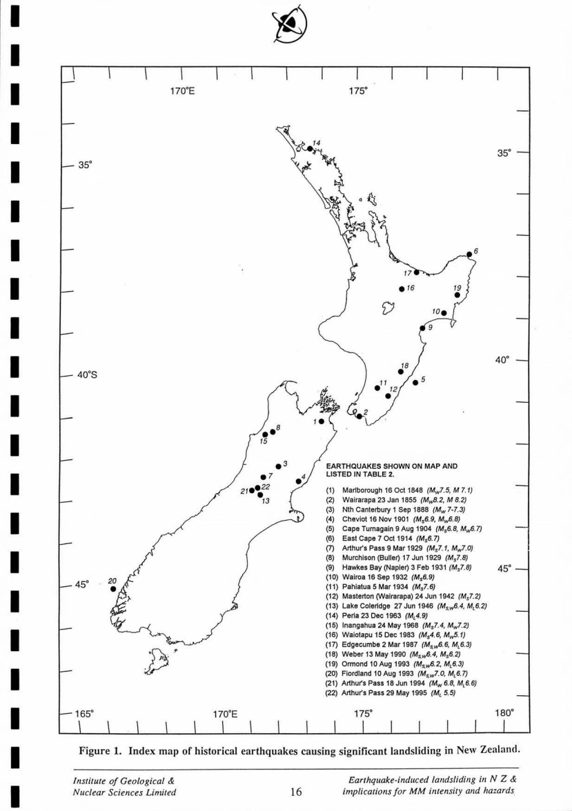
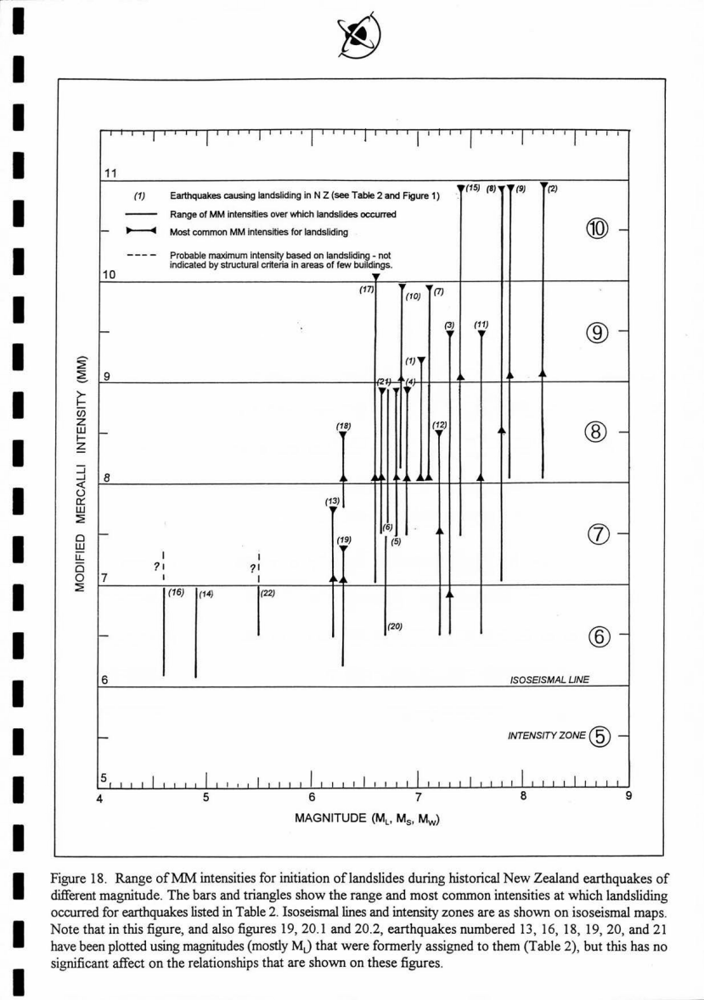
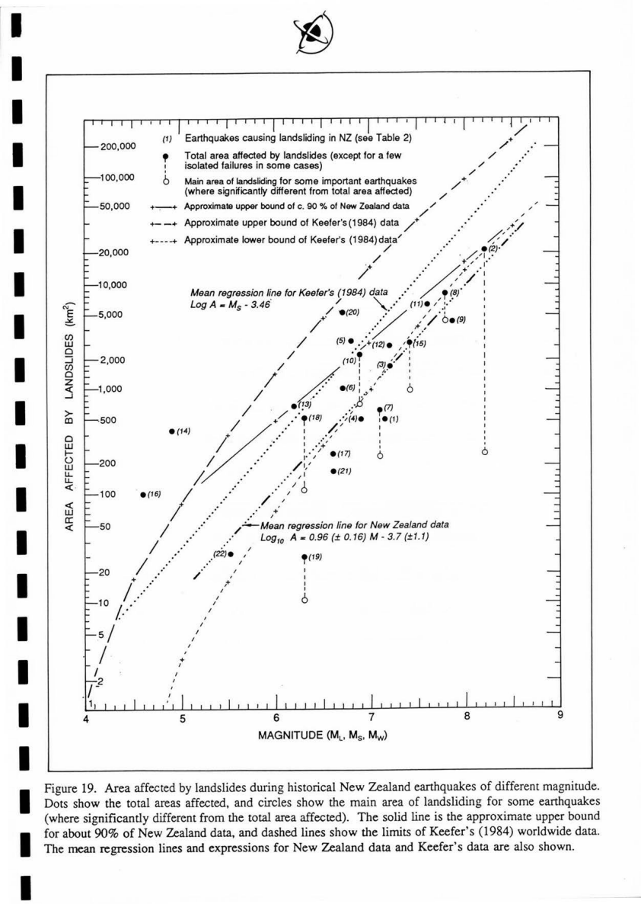
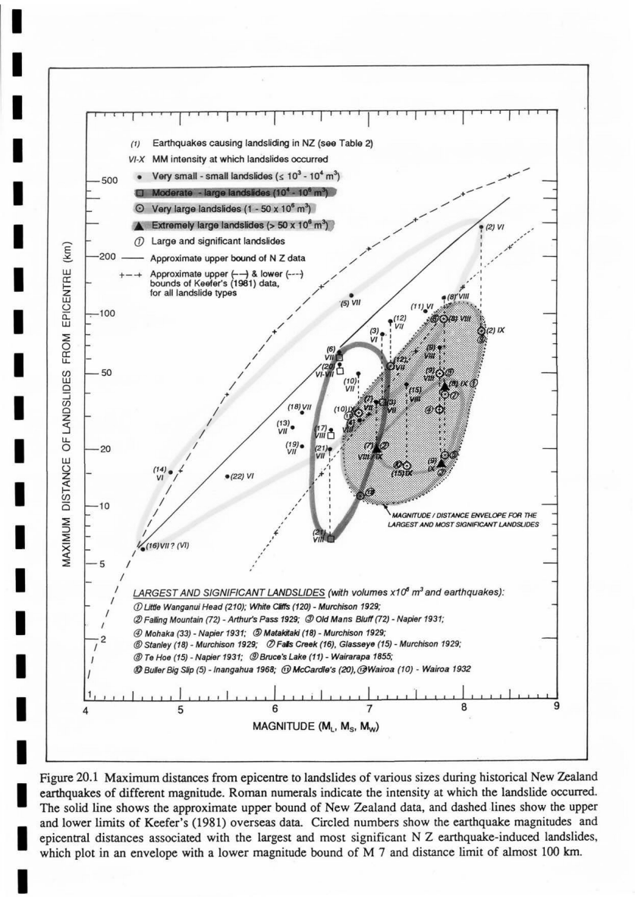
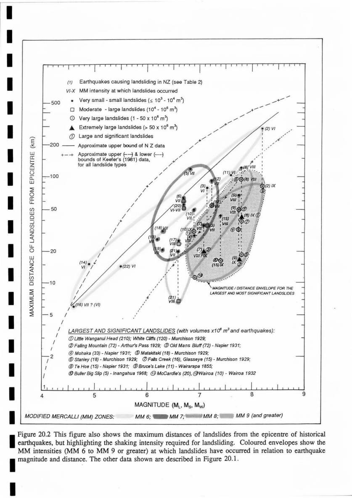
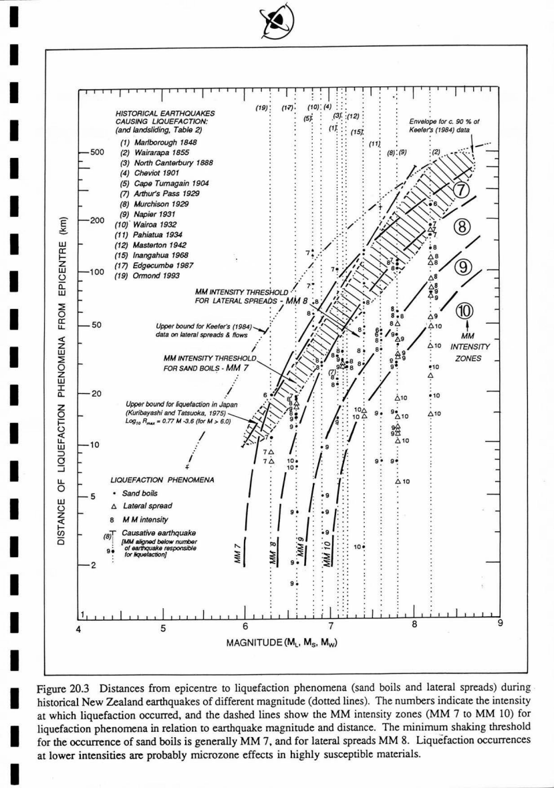
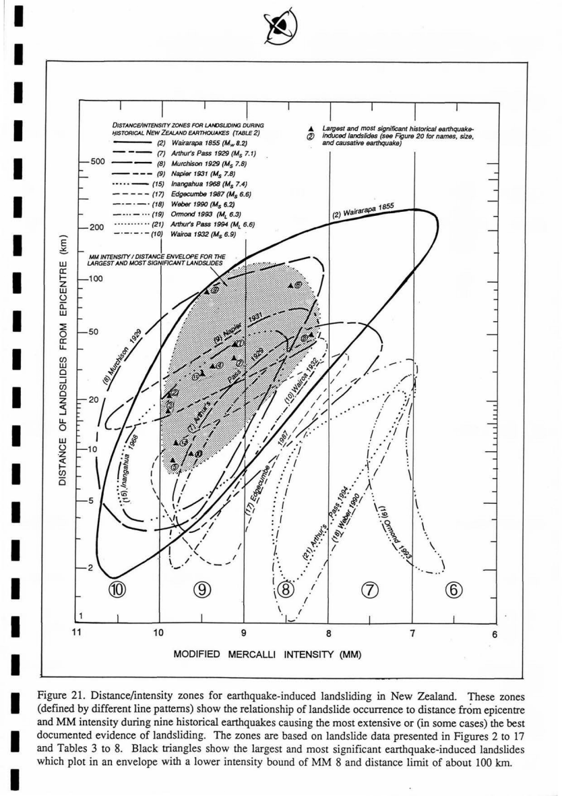
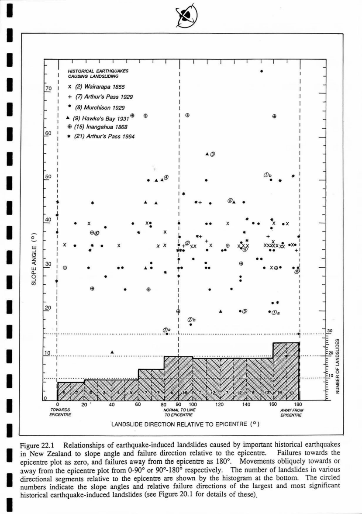
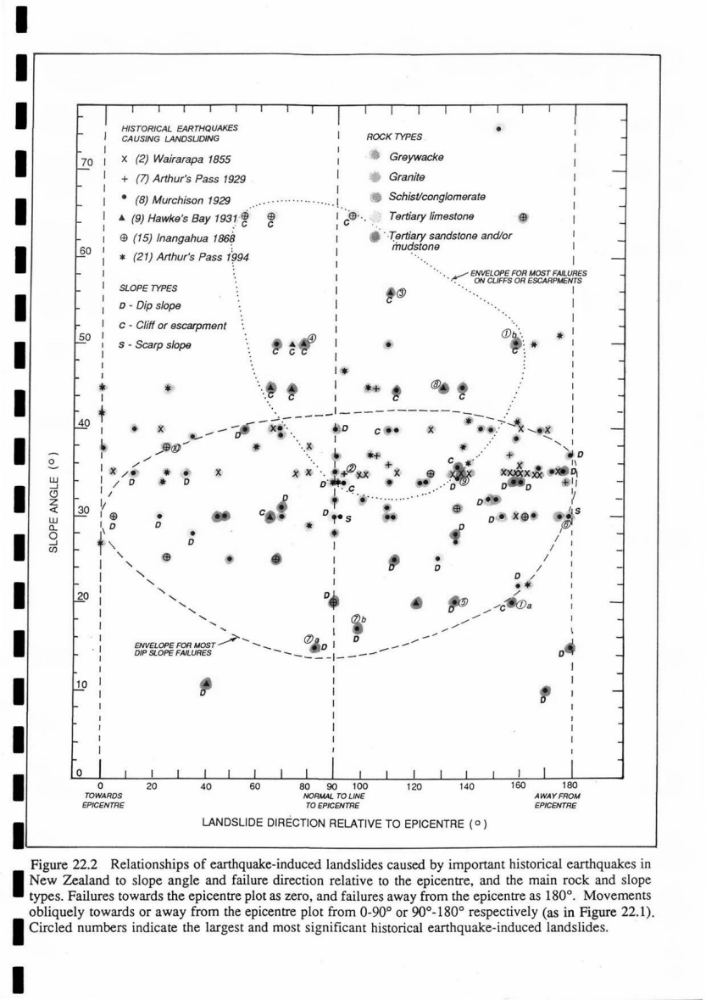

# Earthquake-induced landsliding in New Zealand and implications for MM intensity and seismic hazard assessment

Hancox, G.T., Perrin, N.D. & Dellow, G.D. (1997). GNS Client Report 43601B,
prepared for the Earthquake Commission Research Foundation (EQC research project
95/196), 10 December 1997. The PDF beside this file,
`hancox-1997-eq-induced-landsliding-nz-mm-intensity-eqc.pdf`, is the copy
published on the Natural Hazards Commission's research site.

## About this markdown version

The PDF is a scan. This file is its OCR text layer, converted to markdown so it
can be searched and quoted; it is a working copy, and the scan is the record.

- **Page markers.** `<!-- PDF page n -->` gives the PDF page (not the report's
  own page number) that each passage comes from, so anything quoted can be
  checked against the scan.
- **Prose** is the OCR text with running headers and footers removed, lines
  rejoined into paragraphs, and a fixed list of recurring OCR errors corrected
  ("eanhquake", "rupmre", "magnimde" and similar). Other OCR errors remain,
  mostly in names, symbols and superscripts (for example "km2" for km², "106 m3"
  for 10⁶ m³).
- **Tables** (Tables 1–11, and the contents and lists) are kept verbatim from the
  OCR in fenced blocks. Their column alignment is lost; read the values against
  the scan before using them.
- **Figures.** The plots behind the report's relationships (Figures 1 and 18–22)
  are embedded as page images from the scan, in `figures/`. The landslide maps
  and photographs are not; each is marked with its caption and PDF page.
- **Checked against the scan:** the regression equations of section 3.3 (PDF
  page 81), shown in bold.

The key results for the landslide model portfolio, in section 3 (PDF pages
73–84):

- Landsliding starts at about M 5 and MM6, and is significant at M 6 or greater.
  The threshold for the **Wellington Region is higher, MM7**, which the report
  attributes to "the better performance of greywacke slopes under earthquake
  conditions" (PDF page 80).
- **Area affected** (the area within which landslides occurred, not the area
  that slid): log10 A = 0.96 M − 3.7, A in km² (section 3.3, Figure 19).
- **Maximum distance** from the epicentre to landslides of each size class
  (section 3.4, Figures 20.1 and 20.2); large and very large failures within
  about 100 km, at MM8 or more.
- **Slope angle** of failures (section 3.5, Figure 22.1).

---

<!-- PDF page 1 -->
```text
9 5- /19 4 e:***
Q&
Client Report 43601B
EARTHQUAKE-INDUCED
LANDSLIDING IN
NEW ZEALAND AND
IMPLICATIONS FOR MM
INTENSITY AND SEISMIC
HAZARD ASSESSMENT
Prepared for
Earthquake Commission
Research Foundation
By
G T Hancox
N D Perrin
G D Dellow
10 December 1997
A STUDY FUNDED BY THE
EARTHQUAKE COMMISSION
[RESEARCH PROJECT 95/196]
& NON SPECIFIC PGSF FUNDING
Institute of
GEOLOGICAL
& NUCLEAR
SCIENCES
Limited
```

<!-- PDF page 2 -->
Inst,tute of GEOLOGICAL & NUCLEAR SCIENCES Limited EARTHQUAKE-INDUCED LANISLIDING IN NEW ZEALAND AND IMPLICATIONS FOR MM INTENSITY AND SEISMIC HAZARD ASSESSMENT Prepared for EARTHQUAKE COMMISSION RESEARCH FOUNDATION By GT Hancox, ND Perrin, and GD Dellow 10 December 1997 A STUDY FUNDED BY THE EARTHQUAKE COMMISSION [RESEARCH PROJECT 95/196] AND NON SPECIFIC PGSF FUNDING Client Report 43601B Gracefield Research Centre, 69 Gracefield Road, PO Box 30368, Lorver Hlitt, New Zealand, Telephone. +64-4-570 1444, facsimile: +64-4-569 0600 A Crown Researcb Institute

<!-- PDF page 3 -->
This report has been prepared by the Institute of Geological & Nuclear Sciences Limited exclusively for and under contract to the Earthquake Commission Research Foundation (EQC). Unless otherwise agreed in writing, all liability of the Institute to any party other than EQC in respect of this report is expressly excluded.

RECOMMENDED BIBLIOGRAPHIC REFERENCE Hancox, G. T., Perrin, N. D., Dellow, G. D. 1997: Earthquake-induced landsliding in New Zealand and implications for MM intensity and seismic hazard assessment. GNS Client Report 43601B, December 1997.

<!-- PDF page 4 -->
TECHNICAL ABSTRACT Landsliding and ground damage caused by 22 historical earthquakes in New Zealand have been studied to determine: (a) relationships between landslide distribution and earthquake magnitude, epicentre, faulting, geology and topography, and (b) improved environmental response criteria and ground classes for assigning MM intensities and seismic hazard assessments in New Zealand. It has been shown that in New Zealand, very small landslides occur at about M 5, but significant landsliding occurs only at M 6 or greater. Most widespread landsliding (mainly disrupted slides or falls of rock and soil) has been caused by shallow earthquakes (< 45 km) of M 6.2- 8.2. The minimum MM intensity threshold for landsliding is MM6, while the most common intensities for significant landsliding are MM7 and 8. Very large landslides occur mainly at MM9 and 10, and are used in this study to redefine zones of MM10 shaking for the 1855 Wairarapa and 1929 Murchison earthquakes. The maximum area affected by landslides (or in which they occur) ranges from about 100 km2 at M 5 to 20,000 km2 at M 8.2. The expression: Loglo A (area km2) = 0.96 M (magnitude) - 3.7 can be used to estimate the average area likely to be affected by landsliding during earthquakes in N Z. Overseas earthquakes generally affect larger areas probably because of topographic and climatic differences The intensity threshold for liquefaction in New Zealand was found to be MM7 for sand boils, and MM8 for lateral spreading, but both may occur at one intensity level lower in highly susceptible materials. The minimum magnitudefor liquefaction is M 6, but is more common at M 7 and greater. Liquefaction ground damage is most common at MM8-10, at epicentral distances of 10-100 km. Landslide size is strongly dependent on magnitude, intensity, and distance. In N Z, smaller slides are formed at maximum epicentral distances of almost 300 km (for M 8.2, at MM6). Large and very large failures occur at distances of up to about 100 km (for M 6 or more, at MM8-10). Landslides during overseas earthquakes often occur at greater maximum distances due to poorly understood combinations and interactions of topographic, geologic, climatic, and seismic factors. If other factors are about equal, landsliding in NZ is likely to be slightly more severe and widespread during winter than in summer. Next to earthquake magnitude and intensity, landslide occurrence is most strongly controlled by topography, rock and soil types, with failures mostly on moderate to very steep slopes (20 °-50°). The most common landslides during earthquakes are rock and soil falls on very steep cliffs, escarpments, gorges, gravel banks, and high unsupported man-made cuts. Such features are highly hazardous and more susceptible to rapid failure because of rock defects, low strength, and topographic amplification of shaking. Large dip slope failures of Tertiary sandstone and mudstone often occur on gentle to steep slopes (10°-40°). Very large rock avalanches are caused by earthquakes of M 6.5 or greater, on slopes steeper than 25°-30° and more than 100-200 m high, especially on strongly shaken high narrow ridges. The good correlation between landsliding and the fault rupture zone indicated by aftershocks suggests that overall landslide distribution can be used to indicate the approximate location of the epicentre and fault rupture zone for some earthquakes, but allowance must be made for topographic effects. Historical seismicity shows that shallow M 5 and 6 or greater earthquakes that trigger damaging landslides are more likely in northwest Nelson, the central Southern Alps, Fiordland, Marlborough, Wellington, Wairarapa, Hawke's Bay, and East Cape areas. The central North Island, Auckland, Central Otago and Southland are regarded as lower hazard areas.

More detailed and expanded environmental response criteria (landslides, subsidence, sand boils, lateral spreads) in the MM intensity scale are proposed, along with provisional ground type classes of varying landslide susceptibility (similar to those for buildings). It is hoped that these can be used for assigning more reliable and consistent earthquake intensities in areas where there were few buildings. Relationships developed in this study can be used to assess earthquake-induced landslide hazard and risk in New Zealand. Further studies are recommended to incorporate results from this project into a GISbased National Landslide Hazard Model, which could be used to predict landslide hazard in different parts of New Zealand for triggering events such as moderate to large earthquakes and rainstorms. Other research that is recommended includes detailed studies of some earthquakes (e.g. 1929 Murchison, 1855 Wairarapa) to refine the ground type classes, palaeoseismic studies in known "seismic gaps" on major active faults, and continued earthquake reconnaissance studies in New Zealand and overseas.

<!-- PDF page 5 -->
NON-TECHNICAL ABSTRACT Landsliding and ground damage caused by 22 historical earthquakes in New Zealand have been studied to allow relationships to be determined between landslide distribution and earthquake size or magnitude (M), Modified Mercalli (MM) shaking intensity, the earthquake location (epicentre) and faulting, geology (rocks and soils) and topography (slope angle, type etc). Other objectives were to produce improved environmental criteria (based on landslides and ground damage effects), and develop different classes of ground types for assigning MM intensities and earthquake (seismic) hazard assessments in New Zealand. It has been shown that in New Zealand, very small landslides occur at about M 5, but significant landsliding only occurs at M 6 or greater. Most widespread landsliding (mainly slides or falls of rock and soil) has been caused by shallow earthquakes (< 45 km) of M 6.2- 8.2. The minimum MM intensity (threshold) for landsliding is MM6, while the most common intensities for significant landsliding are MM7 and 8. Very large landslides occur mainly at MM9 and 10, and are used in this study to re-define zones of MM10 shaking for the 1855 Wairarapa and 1929 Murchison earthquakes. The maximum area in which landslides occur ranges from about 100 km2 at M 5 to 20,000 km2 at M 8.2 (for the 1855 Wairarapa earthquake). The M 7.8 Murchison earthquake in 1929 caused widespread and damaging landsliding over about 7000 km2 of northwest Nelson, killing fifteen people. Overseas earthquakes were generally found to affect larger areas, probably because of topographic and climatic differences In N Z, the threshold for soil liquefaction (a condition where saturated fine sandy soils loose strength and flow like a liquid), was found to be MM7 for sand boils (sand and water ejections), and MM8 for fissuring and spreading in alluvium, but both may occur at one intensity level lower in highly susceptible materials. The minimum magnitude for liquefaction is M 6, but is more common at M 7 and greater. Liquefaction ground damage is most common at MM8-10, at distances of 10-100 km from the epicentre. Landslide size is strongly dependent on magnitude, intensity, and distance. In N Z, smaller slides are formed at maximum epicentral distances of almost 300 km (for M 8.2, at MM6). Large and very large failures occur at distances of up to about 100 km (for M 6 or more, at MM8-10). Landslides during overseas earthquakes often occur at greater maximum distances due to poorly understood combinations and interactions of topographic, geologic, climatic, and seismic factors. If other factors are about equal, landsliding in NZ is likely to be slightly more severe and widespread during winter than in summer. Next to earthquake magnitude and intensity, landslide occurrence is most strongly controlled by topography, rock and soil types, with failures mostly on moderate to very steep slopes (20 °-50°). The most common landslides during earthquakes are rock and soil falls on very steep cliffs, escarpments, gorges, gravel banks, and high unsupported man-made cuts. Such features are highly hazardous and more susceptible to rapid failure because of rock defects, low strength, and topographic amplification of shaking. Large failures in sandstone and mudstone often occur on bedding planes tilting down gentle to steep slopes (10°-40°). Very large rock avalanches are caused by earthquakes of M 6.5 or greater, on slopes steeper than 25°-30° and more than 100-200 m high, especially on strongly shaken high ridges. Historical seismicity shows that shallow M 5 and 6 or greater earthquakes that trigger damaging landslides are more likely in northwest Nelson, the central Southern Alps, Fiordland, Marlborough, Wellington, Wairarapa, Hawke's Bay, and East Cape areas. The central North Island, Auckland, Central Otago and Southland are regarded as lower hazard areas.

More detailed and expanded environmental response criteria (landslides, subsidence, sand boils, lateral (fissuring) spreading) in the MM intensity scale are proposed, along with provisional ground type classes of varying landslide susceptibility (similar to those for buildings). It is hoped that these can be used for assigning more reliable and consistent earthquake intensities in areas where there were few buildings. Relationships developed in this study can be used to assess earthquake-induced landslide hazard and risk in New Zealand. Further studies are recommended to incorporate results from this project into a National Landslide Hazard Model (using a computer-based GIS or Geographic Information System), which could be used to predict landslide hazard in different parts of New Zealand for triggering events such as moderate to large earthquakes and rainstorms. Other research that is recommended includes detailed studies of some earthquakes (e.g. 1929 Murchison, 1855 Wairarapa) to refine the ground type classes, palaeoseismic (prehistoric earthquake) studies along parts of active faults where there have been few historical earthquakes, and continued earthquake reconnaissance studies in New Zealand and overseas.

<!-- PDF page 6 -->
```text
CONTENTS
Page No.
EXECUTIVE SUMMARY ................................................................. 5
1. INTRODUCTION ........................................................................... 9
1.1 Background............................................................................ 9
1.2 Previous studies...................................................................... 11
1.3 Objectives and relevance of study................................................. 19
1.4 Research methods.................................................................... 20
1.5 Report outline........................................................................ 21
2. LANDSLIDES DURING NEW ZEALAND EARTHQUAKES ...................... 22
2.1 Introduction........................................................................... 22
2.2 Marlborough earthquake of 16 October 1848 (1) ................................ 23
2.3 Wairarapa earthquake of 23 January 1855 (2).................................... 24
2.4 North Canterbury earthquake of 1 September 1888 (3)........................... 26
2.5 Cheviot earthquake of 16 November 1901 (4).................................... 27
2.6 Cape Turnagain earthquake of 9 August 1904 (5). .............................. 28
2.7 East Cape earthquake of 7 October 1914 (6)..................................... 29
2.8 Arthur's Pass earthquake of 9 March 1929 CD................................... 30
2.9 Murchison (Buller*) earthquake of 17 June 1929 (8) ............................ 32
2.10 Hawkes Bay (Napier*) earthquake of 3 February 1931 (9) .................... 35
2.11 Wairoa earthquake of 16 September 1932 (10) .................................. 38
2.12 Pahiatua earthquake of 5 March 1934 01)........................................ 39
2.13 Masterton (Wairarapa*) earthquake of 24 June 1942(12)...................... 40
2.14 Lake Coleridge earthquake of 27 June 1946 (13) ................................ 41
2.15 Peria earthquakes of 23 December 1963 (14)..................................... 42
2.16 Inangahua earthquake of 24 May 1968 (15)...................................... 43
2.17 Waiotapu earthquake of 15 December 1983 (16) ................................ 45
2.18 Edgecumbe earthquake of 2 March 1987 (17).................................... 46
2.19 Weber earthquake of 13 May 1990 (18)
2.20 Ormond earthquake of 10 August 1993 (19)..................................... 48
2.21 Fiordland earthquake of 10 August 1993 (20).................................... 49
2.22 Arthur's Pass earthquakes of 18 June 1994 (21) and 29 May 1995 (22) ...... 50
* Alternative names recently used by some authors (e.g. Downes, 1995: Dowrick, in prep)
```

<!-- PDF page 7 -->
```text
3. RELATIONSHIPS OF LANDSLIDING TO SEISMIC AND
ENVIRONMENTAL FACTORS .......................................................... 54
3.2 Earthquake magnitude and MM intensity......................................... 54
3.3 Earthquake magnitude and area affected by landsliding ......................... 56
3.4 Earthquake magnitude and distance from epicentre .............................. 58
3.5 Slope angle and failure direction............... ....... 60
3.6 Rock type and slope type........................................................... 61
3.7 Relationships toother factors....................................................... 62
4. LANDSLIDING AND MM INTENSITY .............................................. 68
4.1 Introduction .......................................................................... 68
4.2 Landslide criteria forassigning MM intensity.....................................69
4.3 Ground type classes and MMIntensity............................................73
4.4 Other earthquake intensity scales...................................................75
5. IMPLICATIONS FOR HAZARD AND RISK ASSESSMENT .......................76
6. RECOMMENDATIONS ................................................................... 77
7. CONCLUSIONS............................................................................ 78
8. REFERENCES.............................................................................. 80
ACKNOWLEDGMENTS ......................................................................... 85
APPENDICES
APPENDIX la: Modified Mercalli Earthquake Intensity Scale -
NZ 1965 and NZ 1991 Proposed versions
APPENDIX lb: Modified Mercalli Earthquake Intensity Scale -
NZ 1996 version
APPENDIX 2: Liquefaction -Summary and definition of terms
```

<!-- PDF page 8 -->
```text
LIST OF FIGURES Page No
Figure 1. Locations of earthquakes causing significant landsliding in NZ ................ 16
Figures 2 to 17 are maps of landslides and ground damage attributed to the most significant
historical New Zealand earthquakes, as listed below: - At back of Report after Appendix 2 (A2)
- Other figures follow Page No
Figure 2. Wairarapa 23 Jan 1855 ......................................................... A2
Figure 2.1 Gold's Lane Slide caused by the 1855 Wairarapa earthquake ................ 25
Figure 3. North Canterburyl Sep 1888.................................................. A2
Figure 4. Cheviot 16 Nov 1901............................................................ A2
Figure 5. Cape Turnagain 9 Aug 1904.................................................... A2
Figure 6. Arthur's Pass 9 Mar 1929 ...................................................... A2
Figure 6.1 Photo of Falling Mountain landslide .......................................... 31
Figure 7. Murchison 16 June 1929........................................................ A2
Figure 7.1-7.7 Photos of typical landslides caused by the Murchison earthquake ....... 34
Figure 8. Hawke's Bay 3 February 1931 A2
Figure 8.1-8.4 Photos of landslides caused by the Hawke's Bay earthquake ............. 37
Figure 9. Wairoa 16 Sep 1932 ............................................................ A2
Figure 10. Pahiatua 5 Mar 1934 ............................................................ A2
Figure 11. Masterton 24 Jun 1942 A2
Figure 12. Lake Coleridge 27 Jun 1946 .. .... A2
Figure 13. Inangahua 24 May 1968 A2
Figure 13.1-13.6 Photos of typical landslides caused by the Inangahua earthquake .... 44
Figure 14. Edgecumbe 2 Mar 1987 A2
Figure 14.1-14.3 Photos of landslide and liquefaction effects from Edgecumbe ........ 46
Figure 15. Weber 13 May 1990 ............................................................ A2
Figure 16. Ormond 10 Aug 1993 ....................................................... A2
Figure 17. Arthur's Pass 18 Jun 1994 and 29 May 1995 ............................... A2
Figure 17.1-17.2 Photos of typical landslides caused by Arthur's Pass 1994 ............ 51
Figure 18. Landsliding related to earthquake magnitude and intensity .................. 54
Figure 19. Landsliding related to earthquake magnitude and size of affected area .... 54
Figure 20.1 Landsliding related to earthquake magnitude and distance from epicentre . 54
Figure 20.2 Landsliding related to magnitude, distance, and MM intensity .............. 54
Figure 20.3 Liquefaction effects related to magnitude, distance, and MM intensity ... 54
Figure 21. Landsliding related to MM intensity and distance from epicentre ......... 54
Figure 22.1 Relationships of landslides to slope angle and failure direction ............. 60
Figure 22.2 Relationships to slope angle, failure direction, rock type and slope type .. 60
Figure 23. Map of main landslides caused by historical earthquakes in NZ........... 60
```

<!-- PDF page 9 -->
```text
LIST OF TABLES:
Table 1. Earthquake-induced landslide types and threshold conditions .............. 12/13
Table 2. Historical earthquakes causing significant landsliding in New Zealand ....... 15
Table 3 Main landslides caused by the 23 January 1855 Wairarapa earthquake ...... 25
Table 4 Main landslides caused by the 9 March 1929 Arthur's Pass earthquake ..... 31
Table 5 Main landslides caused by the 17 June 1929 Murchison earthquake ...... 33/34
Table 6 Main landslides caused by the 3 February 1931 Hawke's Bay earthquake ... 37
Table 7 Main landslides caused by the 24 May 1968 Inangahua earthquake .......... 44
Table 8 Main landslides caused by the 18 June 1994 Arthur's Pass earthquake ...... 51
Table 9 Summary of landsliding in MM intensity zones during earthquakes ...... 52/53
Table 10 Relationships of landsliding to fault rupture zone during NZ earthquakes ... 63
Table 11. Proposed environmental criteria for the MM intensity scale............... 70/71
141)
```

<!-- PDF page 10 -->
EXECUTIVE SUMMARY Landslides have occurred during many historical earthquakes in New Zealand. Since 1840 about 22 earthquakes have resulted in significant or widespread and damaging landsliding. The damage caused has been substantial, second only to building damage caused by strong shaking. Many roads and buildings have been destroyed or closed by landslides and rock falls, and at least seventeen people are known to have been killed, two by coal falls in mines. This study of the landsliding and ground damage caused by these earthquakes was undertaken to enable relationships in New Zealand between landslide distribution and earthquake magnitude, epicentre, and the fault rupture zone to be defined, to provide improved criteria for assigning MM intensities based on environmental responses and ground type classes, and ultimately for assessing landslide hazards and risk.. The main findings of the study are summarised below. The minimum magnitude for minor earthquake-induced landsliding in New Zealand is about M 5, but significant landsliding generally occurs only during earthquakes of magnitude 6 or greater, depending on their depth and location, and at minimum shaking intensities of MM6. Historically, most of the widespread and damaging landsliding has been caused by shallow earthquakes of magnitude 6.2 to 8.2, at intensities of MM7 to MM10 at distances of up to about 150 km. Landslides formed at MM6 at distances of 5 km to almost 300 km, have caused relatively little damage.

The earthquake magnitude threshold for significant earthquake-induced landsliding in New Zealand (all rock types and all types of slides) is considered to be about M 5, and the minimum shaking intensity threshold for landsliding is MM6. The most common levels of shaking associated with landslides during earthquakes are MM8 and MM7. Although landsliding associated with MM9 and MM10 shaking was more widespread and damaging (as it was during the 1929 Murchison and 1968 Inangahua earthquakes) it has occurred less frequently. Most earthquake-induced landslides at all intensities were disrupted slides or falls of rock and soil. These relationships for New Zealand are generally consistent with Keefer's (1984) study of worldwide and United States earthquakes, except that Keefer found the threshold earthquake magnitude for landsliding was M 4, and the minimum threshold intensity for landsliding was MM4 to MM5, although the predominant minimum intensities were MM6 and MM7. Earthquake effects overseas appear influenced by data from arid areas, where thermal weathering, together with much lower rainfall is thought to allow slopes to fail during weaker shaking. The minimum intensity threshold for liqu «action phenomena during New Zealand earthquakes was commonly MM7 for sand boils, and MM8 for lateral spreading. However, such effects may also occur at one intensity level lower in areas of highly susceptible materials or high groundwater levels, as shown by the Edgecumbe 1987, and Ormond 1993 earthquakes. Liquefaction-induced ground failure is most common at intensities MM8 to MM10, at epicentral distances of 10-100 km. The minimum magnitude for liquefaction appears to be about M 6, and is most likely to occur during longer-duration moderate and large earthquakes. The general agreement between the New Zealand and Japanese liquefaction data and about 90% of Keefer's (1984) data for lateral spreads and flows suggest that the maximum distances of liquefaction from the epicentre in New Zealand may be predicted by the formula of Kuribayashi and Tatsuoka (1975): Loglo Rmax (distance, km) = 0.77 M (magnitude) -3.6.

<!-- PDF page 11 -->
Correlations between magnitude and landsliding for New Zealand earthquakes show that the maximum area likely to be affected by landslides (or more correctly the area in which landslides might occur) ranges from zero at M 4, 100 km2 at M 5, 500 km2 at M 6, 2000-3000 km2 at M 7, 7000 km2 at M 7.8, and up to 20,000 km2 at M 8.2. Earthquakes causing the most extensive landsliding in N Z were: 1855 Wairarapa (M 8.2,20,000 km2); 1929 Murchison (M,7.8,7,000 kmb; 1934 Pahiatua *17.6, 6,500 kmb; 1931 Hawke's Bay (Ms'7.8,4,700 kmb; and 1968 Inangahua (M7.4, 3,200 kmt. The following expression was developed to predict the average area likely to be affected by landslides during earthquakes in New Zealand: Logio A (area kmb = 0.96 M (magnitude) - 3.7.

Conversely, magnitude can be estimated from area affected by landsliding using the expression: M = 1.04 Loglo A + 3.85.

These relationships differ slightly from those for overseas earthquakes, which generally affect larger areas probably because of topographic and climatic differences. The distances at which earthquake-induced landslides occur in New Zealand also show a strong correlation with magnitude and intensity. Very small to small (5 103-104 mt landslides occur at maximum epicentral distances of about: 10 km for M 5 (MM6); 30 km for M 6 (MM7); 100 km for M 7 (MM7); and almost 300 km for M 8.2 (at MM6). Moderate to large landslides (104- 106 m3) generally only occur at greater than M 6 to 6.5, and epicentral distances of about 5 km (MM8) to 70 km (MM7). Very large and extremely large (>1 to >50 x 106 mb landslides only occur at magnitudes greater than about M 6.9 and 7.1 respectively, at distances of 10 km at MM9 or MM10, to almost 100 km at intensity MM8 and MM9. Extensive and very large landslides are used in this study to re-define MM9 and MM10 zones for the 1929 Murchison and 1855 Wairarapa earthquakes, and establish a MM9 zone for the 1929 Arthur's Pass earthquake. As expected, landslides within different intensity zones are magnitude and distance dependant, with smaller slides occurring at lower intensities at a greater range of magnitudes and distances, reflecting both variations in the factors causing landsliding, and scatter in the accuracy of intensity data and earthquake locations. As with area, the maximum distances to landslides during New Zealand earthquakes are usually less than those associated with overseas earthquakes. This difference is probably due to a combination of topographic, geologic, climatic, and seismic factors, the relative importance and interaction of which are currently unknown. However, from a hazard and risk perspective in New Zealand the difference is somewhat beneficial. Relationships of earthquake-triggered landslides to slope angle, failure direction, rock type and slope type identified in this study show that: (a) landslides occur mostly on slopes of 20 °-50°, and (b) slope movements are mainly oblique or directly away from (a line back to) the epicentre. The relation to failure direction may reflect the source of seismic waves from the epicentre and fault rupture zone, and also the effects of short period (higher acceleration) shaking which triggers landsliding. Failures on slopes normal to the epicentre are mainly rock falls and slides on very steep (35°->70°) cliffs, escarpments, or dip slopes of 15°-40°. Such slopes are more susceptible to rapid failure because of unfavourable topographic and geological conditions. Together with shaking intensity and duration, landslide size is most strongly influenced by slope angle and slope type, with the largest and most significant earthquake-triggered failures occurring on slopes steeper than 30°, cliffs and escarpments. Very large landslides formed on gentle to moderate slopes (10°-20°) are mainly dip-slope failures in Tertiary rocks.

<!-- PDF page 12 -->
Landslides during earthquakes also show a strong correlation between rock type and slope. Failures in well jointed rocks such as greywacke and granite occur mainly on moderate to steep (25 °-45°) slopes. Landslides of Tertiary sandstone and mudstone occur on gentle to steep (10°40°) dip slopes, whereas limestone failures mainly occur on steeper cliffs and escarpments. Larger rock slides and rock fall avalanches are more likely to be triggered by longer-duration shaking associated with larger earthquakes (> M 6.5), on slopes steeper than 25°-30° and more than 100-200 m high. Smaller failures occur mainly on steep cliffs, gorges, road and rail cuttings, and quarries. This is similar to relationships for worldwide earthquakes. Topographic amplification of shaking often occurs during earthquakes, resulting occasionally in very large rock avalanches, cracking and "ridge rents" on high ridges, and more commonly in rock falls from high cliffs, escarpments, and some man-made cuts. Isolated failures of this type may be regarded as local site effects, but numerous failures indicate general strong shaking of at least intensity MM8. Slope configuration and steepness are regarded as key factors, which together with lithology and geological structure, combine to control the distribution of rock falls, slides and avalanches during earthquakes. Areas below steep natural and man-made slopes are therefore regarded as highly hazardous during earthquakes. In New Zealand, many buildings have been destroyed in such areas, and at least fifteen people have been killed by earthquaketriggered rock falls and slides from steep slopes, cliffs, and unsupported cuts. The study also showed that earthquakes that trigger landslides are more likely in central New Zealand, in northwest Nelson, the central Southern Alps, Marlborough, Fiordland, Wellington, Wairarapa, Hawke's Bay, and East Cape areas. Historically, this is the area where most of the shallow earthquakes of magnitude 5 or greater have been located. The most commonly affected rock types are greywacke, granite, schist and conglomerate, Tertiary sandstone, mudstone, limestone, and Quaternary volcanics and tephra. Closely jointed and weathered rock masses (granite and greywacke) and overlying colluvial slope deposits tend to be more affected, especially in steep high rainfall mountain areas. Failures at lower intensities (MM6) have occurred in weakly cemented Tertiary sandstone and limestone and have been common during several earthquakes. Closely jointed volcanic rocks appear to be vulnerable to widespread landsliding only during M 6.0 earthquakes or greater (2 MMD. Few earthquakes of M 5 or greater have occurred in the central North Island, Auckland, Canterbury and Central Otago and Southland, where the hazard from earthquake-induced landsliding is regarded as low. There is seldom an obvious correlation of landslide distribution with ground surface faulting, possibly because much of the surface faulting was of limited extent, or of a secondary nature. However, a good correlation has been demonstrated between landsliding and the fault rupture zone indicated by aftershocks, as shown by the 1929 Murchison, 1968 Inangahua, 1990 Weber, and 1994 Arthur's Pass earthquakes. This association suggests that landslide distribution can provide a reliable indication of the probable epicentre location and extent of the fault rupture zone for a given earthquake, although allowance must be made for topographic features such as cliffs and escarpments which are more susceptible to failure. The study failed to demonstrate a definite link between landslide distribution and focal plane mechanism (fault type) and seismic focussing during earthquakes. However, seismic focussing may have occurred during some events (e.g. 1929 Murchison, 1932 Wairoa). Detailed studies of these earthquakes may provide evidence of such an effect and a better understanding of landslide damage likely during future earthquakes.

<!-- PDF page 13 -->
Climatic factors have not greatly affected the severity of earthquake-induced landsliding in New Zealand, with magnitude, depth, and location close to susceptible slopes being more important factors. However, landsliding during the 1929 Murchison earthquake was reportedly worse because it occurred during a very wet winter. If other factors are about equal, therefore, earthquake-induced landsliding in New Zealand is likely to be somewhat more severe and widespread during winter than it is in summer. For any given earthquake, slope aspect (shady versus sunny) does not appear to be a significant factor in controlling landsliding distribution. One of the important objectives of the study was to improve the definitions of environmental response criteria (landslides, subsidence, sand boils, lateral spreads) in the MM intensity scale, which were previously poorly described, and to develop a range of ground type classes of varying landslide vulnerability (similar to those used for buildings) that could be used for assigning more consistent and reliable earthquake intensities in areas where there were few buildings. Results of this study have provided the basis for revising the environmental criteria in the New Zealand MM intensity scale, which have been expanded and described in more detail. The main differences between the proposed and earlier versions of the MM scale are: (a) very small landslides are formed, along with minor liquefaction (sand boils) at MM6; (b) significant small to moderate landslides are formed at MM7; widespread small-scale landsliding and a few moderate to very large failures occur at MM8, together with small landslide-dammed lakes, sand boils, and localised lateral spreads; and (c) widespread and damaging large to extremely large landslides, lateral spreading, and landslide-dammed lakes are formed in susceptible terrain at MM9 and MM10. In addition, five provisional ground type classes are proposed to indicate landslide susceptibly and intensity effects in areas of different terrain, rock, and soil types. Further detailed studies of two or three selected earthquakes are proposed to refine and establish more definitive criteria for these classes and their use within the MM scale in New Zealand. The study has allowed relationships to be developed for earthquake-induced landsliding and its distribution in New Zealand. From that information it is possible to assess earthquake-induced landslide susceptibility hazard and risk for different parts of the country, but this is beyond the scope of the present study. It is therefore recommended that in a future study the results of this study (especially the landslide database and relationships to earthquake magnitude, intensity, rock and slope type, groundwater) be incorporated into a GIS based National Landslide Hazard Model. By selecting and weighting the main causal factors (rock and soil types, slope angle, height etc) this model could then be used to predict or zone landslide susceptibility and hazard in different parts of New Zealand for triggering events such as moderate to large earthquakes and rainstorms. Other studies of earthquake-induced landsliding that are also recommended include: (a) detailed studies of the 1929 Murchison and 1968 Inangahua earthquakes, and the 1855 Wairarapa earthquake; (b) further refinement of ground type classes; (c) palaeoseismic studies in known "seismic gaps" on major active faults (e.g. central Alpine Fault, and southern White Creek Fault); and (d) continued earthquake reconnaissance studies in New Zealand and overseas.

<!-- PDF page 14 -->
## 1 Introduction

### 1.1 Background

It is well known that earthquakes are a major cause of landslides. Damage caused by earthquake-induced landslides is usually second only to that of strong shaking and in the last 150 years alone has resulted in substantial economic losses and tens of thousands of deaths, both overseas and in New Zealand. Earthquake shaking causes landslides in several ways: (a) horizontal accelerations temporarily increase (gravitational) shear stresses within a slope; (b) the strength of slope materials is decreased due to a reduction in intergranular bonding; and (c) cyclic loading causes increased pore pressures in slope materials, which results in strength loss and possibly liquefaction in sands and silts.

Although there is only limited information on horizontal ground accelerations (PGA) during New Zealand earthquakes, an indication of PGA and its relationship to landslide generation can be obtained from correlations of Modified Mercalli (MM) earthquake intensity with PGA. Studies by Trifunac and Brady (1975), Murphy and O'Brien (1977), and Krinitzsky and Chang (1988) suggest the following approximate relationship between MM intensity and PGA: Modified Mercalli Earthquake Intensity (MM) Mean peak horizontal ground acceleration (PGA, g) 0.03 - 0.04 6 0.05 - 0.08 7 0.10 - 0.15 8 0.18 - 0.25 9 0.30 - 0.50 10 0.50- 2 1.0 Widespread landslides have occurred during many historical New Zealand earthquakes and they have often been used in assigning MM intensities for these events. However, landslide effects are poorly defined in the several versions of the MM scale (Appendix la and lb), largely because they are so variable. The types and size of earthquake-induced landslides vary with different rock types, material strength, slope angle, geological structure, and earthquake size and location. There are a few papers that discuss landslides during some New Zealand earthquakes (e.g., Speight, 1933; Henderson, 1937; Adams, et al., 1968; Franks, et al., 1989; Paterson and Bourne-Webb, 1994), but there are no comprehensive studies and little published data correlating landsliding with MM intensities and other seismicity parameters.

<!-- PDF page 15 -->
Revision of the Modified Mercalli Seismic Intensity scale for use in New Zealand was carried out in 1991 by a Study Group of the New Zealand National Society for Earthquake Engineering (Study Group of the NZNSEE, 1992). The Study Group made a number of changes to the 1965 version (Eiby, 1966). Since the revision was primarily aimed at making the MM scale appropriate for modern (earthquake resistant) construction, most of the changes related to building damage, although some were intended to better define earthquake shaking effects on the environment such as landslides and ground damage resulting from liquefaction phenomena (mainly sand boils and lateral spreads, as defined in Appendix 2). The NZ 1965 and 1991 Proposed versions of the MM scale are included here as Appendix la. Because the Study Group found there were few published historical data on MM intensities and earthquake-induced landslides (which vary with different geological conditions, material strength, slope angle, groundwater,- and earthquake size and location) they were unable to establish well defined landslide and ground failure criteria for the NZ 1991 Proposed scale. In the 1991 version it is suggested that in New Zealand major slides probably occur at MM8, and are general on steep slopes only at MM9 (the area of widespread landsliding has corresponded to about the MM9 isoseismal in several historic events). No environmental effects are listed for MM10, although it can be inferred that they would be similar to MM9 but more intense and widespread, as amended in a study by Brabhaharan et al. (1994). In the 1991 Proposed MM scale landsliding and ground damage criteria and effects were poorly defined because the Study Group found few data on which to base a revision of these environmental effects. To a large extent this reflects the state of our historical earthquake records and how landslide effects have been interpreted by past researchers in assigning intensities to New Zealand earthquakes. By studying earthquake-induced landsliding during historical earthquakes in New Zealand the present study is aimed at improving this situation. Recent studies of New Zealand earthquakes has resulted in formal revisions to the NZ 1991 MM earthquake intensity scale (Dowrick 1996, see Appendix lb). Changes made include improvements to structural damage criteria at MM6 to MM8, discussion of the influence of ground conditions on construction performance, and inclusion of structural criteria for MM 10 to MM12, which were lacking from the 1991 version (Appendix la). Dowrick (1996) also includes clarification and expansion of environmental response criteria (such as landslides) and re-introduces them for MM10 (but not MM11 and MM12). As indicated by Dowrick's (1996) revisions of environmental criteria are largely based on early work by the authors of the present study, and are similar to revisions made by Hancox et al. (1994). The NZ 1996 version of the MM intensity scale (Appendix lb) is the most complete published version currently available, and is therefore used in this report where appropriate to relate landsliding and ground damage to MM intensity. However, it should be noted that most of the intensity maps for historical earthquakes included in this report are based on earlier versions of the MM intensity scale, on MM maps derived from conversions of RossiForel intensities (Downes, 1995), or on recent revisions of isoseismal maps for some earthquakes maps (D J Dowrick pers. comm., 1997). Any significance differences that arise from the various MM scales used are discussed later in the report, as appropriate.

<!-- PDF page 16 -->
### 1.2 Previous studies

In the last ten years, overseas earthquake studies have provided considerable information on the types of landslides caused by earthquakes, and the different shaking (MM) levels at which they occur, for example Keefer, 1984; Keefer and Wilson, 1989; and Jibson, 1996. Keefer (1984) studied 40 historical earthquakes worldwide and several hundred earthquakes from the United States to determine the characteristics, geologic environments, and hazards of landslides caused by seismic events. Significant results of this study are as follows: (1) Three general categories of earthquake-induced landslides are recognised: (a) disrupted rock and soil falls, slides, and avalanches; (b) relatively coherent slides and slumps in rock and soil; (c) lateral spreads and flows in soils.

(2) The area affected by landslides during earthquakes correlates well with magnitude, ranging from about 200 km2 at M5-6, to 100,000 km at M 8.5, at epicentral distances ranging from 0 to more than 200 km. Disrupted falls and slides are formed at greatest distances, with coherent slides and lateral spreads formed closer to the earthquake source. (3) A minimum shaking intensity of about MM6 is required to induce landslides, with a minimum magnitude of about M 5.2. Shallow disrupted rock falls, rock slides soil falls and slides on steep slopes and cuts are initiated by the weakest shaking (common at MM6), but coherent, deep-seated slides and lateral spreads require stronger shaking 9 MMD. Rock and soil avalanches require the strongest shaking (2 MM7 - 8), and are more prone to triggering by the longer-duration, lower frequency shaking associated with larger earthquakes (M 6-6.5), mainly on slopes steeper than 25 ° and higher than 150 m.

Landslides of all types can occur at intensities one or two levels lower than the intensities at which they are common.

(4) The materials most susceptible to earthquake-induced failures are weakly cemented rocks, closely jointed indurated rocks, residual soils and colluvium, non-cohesive alluvium (especially if saturated), loess, and granular man-made fill. Steep natural slopes and man-made cuts were most prone to failure, with narrow ridges and spurs, coastal cliffs, terrace edges and stream channels being particularly vulnerable. (5) Few earthquake-induced landslides were found to be reactivated older landslides, with most failures being in materials that have not previously failed. [However, this does not preclude failures from oversteepened scarps (enlargement) of pre-existing landslides]. The main earthquake-induced landslide types, threshold conditions, and geological factors determined by Keefer (1984) are summarised in Table 1.

<!-- PDF page 17 -->
```text
Minimum / Minimum
TYPES OF Threshold Common Threshold Topography and Common geological features;
LANDSLIDE and Magnitude Threshold Slope angle features most materials (rocks/soils) most often
ABUNDANCE Intensity and height affected involved in landslides
(ABBREVIATIONa 1 (M) (MM)
DISRUPTED SLIDES
& FALLS IN ROCK (Da
·
 ROCK FALLS (DR/F) M 4 IV / VI 40° Narrow spurs; ridge Closely jointed rocks; also weakly
- very abundant crests; man-made cuts cemented materials (tuff, siltstone,
sandstone, conglomerate, breccia)
, ROCK SLIDES (DR/SL) M 4 V / VII 35° hillside channels and Well bedded / jointed rock masses, with
- very abundant flutes rock defects dipping out of slopes
ROCK AVALANCHES M 6
- uncommon (DR/AV)
IV / VI 25°, 150 m Steep mountain faces Generally intensely fractured rock masses;
undercut by erosion often weathered or weakly cemented;
faults, master joints, bedding or foliation
dipout of slope; evidence of prior failure.
COHERENT SLIDES
IN ROCK (CA)
, ROCK SLUMPS (CR/SLU) M 5
, ROTATIONAL (ROT)
- moderately common
V / VII 15° Old slumps may be Deep-seated slides in sedimentary,
reactivated. Man-made metamorphic, and igneous rocks.
cuts vulnerable. Most rocks weak due to weathering, joints,
shearing or poor cementation.
ROCK BLOCK SLIDES M 5
- uncommon (CR/BS)
V / VII 15° Often on steep cliffs & Deep-seated failures on flat-lying basal
man-made slopes surfaces (bedding, joints) dipping out of
slopes. Often in tuff, andesite, pumice,
weakly-cemented or close-jointed rocks.
DISRUPTED SLIDES (DS)
AND FALLS IN SOIL
· SOIL FALLS (Ds/8 M 4 IV / VI 63° Steep coastal cliffs, Weakly cemented sand or gravel; some
- moderately common (common) stream banks, terrace clayey soils also.
edges; cut slopes.
, SOIL SLIDES (Ds/S) M 4 IV / VI 15° mainly as above Weak residual soils and colluvium on
- very abundant rock/soil contact and between soils;
terrace deposits; man-made fills.
SOIL AVALANCHES M 6.5
- abundant (DS/AV)
IV / IV 25° Similar to slides, but
more disaggregated
and faster moving.
Similar to materials involved in soil slides.
COHERENT SLIDES
IN SOILS (CS)
, SOIL SLUMPS (CS/SLU) M 4.5 V / VII 10° Steep stream banks; Generally deep-seated; man-made fill
- abundant man-made fills / cuts. the most common material involved.
SOIL BLOCK SLIDES M 4.5
- abundant (CS/BS)
V / VII 6 - 85° Slopes, terrace edges Deep-seated, translational failures in soils
adjacent to rivers and failing on saturated weak layers, and
coastal areas particularly liquefiable layers.
M 5
SLOW EARTH FLOWS
- uncommon (CS/FL)
V / VII 10° Mainly affecting slopes Tear-drop shaped failures of clay, silty clay
formed in residual soils and clayey silt with saturated basal shear
and colluvium. surfaces.
LATERAL SPREADS
· SOIL SPREADS (LS) M 5 V / VII < 1° Slopes and terraces Often large deep-seated, translational
adjacent to rivers and failures in soils, and man-made fills,
- abundant coasts; man-made fills. failing on saturated liquefiable layers.
Glacial, estuarine, deltaic, and eolian
materials most susceptible.
M 5 V / VII 2° Slopes close to rivers & Fluid-like flows in loess (dry), but mainly
, RAPID SOIL FLOWS coasts with high water saturated sands and silts; travel great
- moderately (SFL) tables & springs. distances at high speed.
common Also reclaimed land on Some fills and tailings affected.
flood plains and coast.
NOTE
1. Abbreviations for landslide types (e.g., DR/F} are used in descriptions of landslides caused by New Zealand earthquakes (Section 2).
Landslide types are based on Varnes (1978) - see page 2 of Table 1 for definitions.
Table 1. (a) Earthquake-induced landslide types and threshold conditions (after Keefer. 1984)- Page 1 of 2.
Earthquake-induced tandstiding in NZ&
```

<!-- PDF page 18 -->
MAIN LANDSLIDE TYPES' GENERAL DESCRIPTIONS OF LANDSLIDE TYPES ROCK2 FALLS and SOIL FALLS Rock falls are individual boulders or disrupted masses of rock that move down very steep slopes (> 40 °) by bounding, rolling or free fall. Soil falls are blocks or masses of soil materials that move in a similar way, and break apart during transport or on impad. Rock and soil falls are the most abundant of all earthquake-induced landslides.

ROCK SLIDES and SOIL SLIDES Rock and soil slides are slope movements of soil or rock masses that slide on discrete planes of weakness within the rock and/or soil mass, or on the planar boundary between soil and bedrock, or the regolith and the unweathered bedrock. Slides may be translational failures on planar rock defect surfaces (bedding, joints, fault zones, and foliation or schistosity surfaces) that dip downslope; failures in soft rocks and soils are usually rota#ona/ on gently curved surfaces. Such landslides can occur on slopes as gentle as 10°, but mostly originate on slopes steeper than 35°. The term "slump" is commonly used to refer to a small rotational slide in soils. TOPPLES Topples are falls or slides of rock and/or soil, where movement involves pivotal rotation about a centre of gravity, and outward tilting of rock or soil masses usually involving opening of steep defect surfaces (joints, bedding, foliation) dipping into a slope. Topples not distinguished in report. FLOWS Flows are masses of soils and or broken rock fragments that move down slope like a viscous liquid, rather than on a single basal shear surface. Flows may be composed of soil (often mud), debris, and rock fragments; they may be wet or dry; and they may move slowly or extremely rapidly, depending on how they form and slope steepness. Debris or rock slides may begin slowly and become extremely rapid debris or rock flows or avalanches (see below) as the displaced material looses cohesion, gains water, or encounters steeper slopes. ROCK AND SOIL AVALANCHES Rock and soil avalanches are landslides that may start as falls or slides and move rapidly down slopes and disintegrate into rapidly flowing streams of rock fragments and/or soil materials (flows). Such landslides are long run-out failures that can travel up to several km at velocities of up to 200300 km/hr. Rock avalanches (sturzstroms) can develop on slopes with a minimum inclination of 25° and height of 100 m, but are more common on high mountain slopes steeper than 35-40°. LATERAL SPREADS In the context of earthquake-induced landslides Lateral Spreads are extensional movements of cohesive or more often non-cohesive alluvial materials adjacent to streams and rivers, without a basal shear zone. Lateral movement and spreading is due to liquefaction of underlying saturated sand and silt materials due to prolonged strong shaking. Lateral spreads are usually charaderised by fissuring of the ground surface along river banks and ejections of water and fine sand. NOTES:

1. The above definitions are based on Keefer (1984), after the landslide terminology of Varnes (1978) and Cruden and Varnes (1996). Landslides are categorised firstly on the nature of the slope movement involved, and secondly on the type of material involved, which is classified as either "rock" or "soil-, on the basis of its state prior to landslide initiation. 2. The term *rock 'signifies firm intact bedrock. 'Soil ' signifies a loose, unconsolidated, or poorly cemented aggregate of soil particles, and encompasses the entire regolith (surficial soils, colluvial material and weathered bedrock), and all man-made fills. The terms Vebris" and "earth", as used by Vames (1978) and in places in this report, refer to coarse and fine soil materials respectively. Table 1 (continued). (b) Definitions of main earthquake-induced landslide types - Page 2 Of 2

<!-- PDF page 19 -->
Although landslide-related criteria are not referred to in the MM scale at intensities less than MM7, the study by Keefer (1984) clearly shows that earthquake-induced landslides do occur at intensities lower than MM7 (Table 1). The NZNSEE Study Group (1992) acknowledges that landslides can be caused by shaking intensities lower than MM7, but they fail to recognise the differences in landsliding that are caused by earthquakes of different magnitude and shaking intensities, or the potential uses of landslide data in MM intensity studies related to both historical and future earthquakes in New Zealand.

In New Zealand a number of historical earthquakes since 1840 have resulted in large and or widespread landsliding (Table 2). However, the landsliding caused by these earthquakes is variably documented and is described in detail for only a few. Of the earlier events, brief written descriptions are given of landslides caused by the 1929 Arthur's Pass (Speight, 1933) and the 1931 Hawke's Bay (Baird, 1931) earthquakes. More detailed accounts are given of landsliding during the 1929 Murchison (Buller) earthquake by Henderson (1937) and Pearce and O'Loughlin (1985), although the complete landslide distribution has not yet been mapped. Fuller descriptions are given of landslides caused by more recent larger earthquakes such as: Inangahua 1968 (Adams et al., 1968); Edgecumbe 1987 (Franks et al., 1989); Weber 1990 (Perrin 1990); Fiordland 1993 (Van Dissen et al. 1994); Ormond 1993 (Read and Sritharan, 1993); and Arthur's Pass 1994 (Paterson and Bourne Webb, 1994). Earthquake-induced landslides have been widely used in palaeoseismic studies both overseas (e.g., Jibson and Keefer, 1989; Jibson, 1996) and in New Zealand (e.g., Adams, 1981; Crozier, 1992). Such studies rely on convincing evidence of the seismic origin of the landslides by a single earthquake, which is difficult to obtain for prehistoric events as landslide dating is required. Landslide damage provides an indication of the area affected by the earthquake, from which an indication of the earthquake epicentre and magnitude can be determined. Using data from the 1929 Murchison earthquake, Adams (1981) concluded that the area containing landslide-dammed lakes formed during an earthquake is an indication of the area shaken to intensity MM10, and used this approach to develop the following relationship between earthquake magnitude and the area affected by landslides: where M Ms = 0.5 loglo (Ax) + 5.9 s is surface wave magnitude, and Ax is the area (kmb affected by MM10 shaking. More recent studies (Dowrick, 1994; 1996) suggest, however, that this relationship is not strictly true as areas formerly designated'as MM10 have now been downgraded to MM9 or MM8. In his study of the 1929 Murchison earthquake, Dowrick (1994) was unable to assign MM10 from building damage, although shaking probably reached MM10 in the "heavy" landslide zone close to the fault rupture where there were no buildings (see Section 2.9). Dowrick (1994) assigned MM9 only to six large landslides that formed landslide-dammed lakes during the earthquake, with the others caused by MM8 or M 7 shaking due to a combination of rock strength, discontinuities, steep slopes, and groundwater conditions. He also suggested that criteria for assigning intensity based on landslides need to be described in more detail in order to be reliable at MM8 and MM9, and that a range of categories of landslide vulnerability similar to those used for buildings would be appropriate.

<!-- PDF page 20 -->
```text
NAME (& Number)1 DATE
MAGNjTUDE DEPTH
EFFECTS KEY REFERENCES
(1) Marlborough 16 Oct 1848 M
(formerly M 7.1)
W 7.5 10 MM9 in Wairau and Awatere valleys; Grapes et al., in prep.
surface faulting in Awatere valley. Dowrick & Rhoades, in
Many slides in epicentral area. prep (D&R); GNS Files'
(2) Wairarapa 23 Jan 1855 M
(formerly M 8.2)
W 8.2 20 MM9 in Wellington; widespread Eiby, 1989; Grapes and
landsliding in Wellington region. Downes, 1997; (D&R)
(3) Nth Canterbury 1 Sep 1888 Mw 7- 7.3 10 Surface faulting at Glynn Wye Cowan, 1991; (D&R)
(4) Cheviot 16 Nov 1901 Ms 6.9 10 Landslides at MM8-9; roads blocked Dowrick and Rhoades, in
MW 6.8 prep.
(5) Cape Tumagain 9 Aug 1904 MS 6.8 LC Widespread damage and land-slides in Downes, 1995; Dowrick
MW 6.7 Nth Wairarapa. & Rhoades, in prep
(6) East Cape 7 Oct 1914, MS
28 Oct 1914 M.
6.7 S Significant landsliding; 1 death. Dowrick & Smith, 1990;
6.4 Morgan 1920; Downes'95
(7) Arthur' s Pass 9 Mar 1929 MS 7.1. <15 Widespread landslides in mountainous Speight,1933; Yang 1989;
MW 7.0 country. (D&R).
(8) Murchison 17 Jun 1929 Ms 7.8 10 Widespread catastrophic landslides; Henderson, 1937;
(Buller) MW 7.8 extensive damage; surface faulting; Pearce & O'Loughlin,
17 deaths, 14 due to landsliding. 1985; Dowrick, 1994.
(9) Hawke's Bay 3 Feb 1931 MS
(Napier) M
7.8 17 Widespread damage, surface faulting, Baird, 1931; GNS Files;
7.8 landslides; 256 deaths. D&R in prep.
(10) Wairoa 16 Sep 1932 Ms 6.9 20 Damage in Gisborne and Wairoa; D&R in prep.; Ongley
MW 6.8 significant landsliding. 1937; Downes'95
(11) Pahiatua 5 Mar 1934 M., 7.6 15 Much damage in S Hawkes Bay and N D&R, in prep; Hancox et
Wairarapa; 1 death. al. 1994; Downes, 1995
(12) Masterton 24 Jun 1942 Ms 7.2 15 Much damage in Wairarapa and Dowrick & Smith, 1990;
(Wairarapa) 2 Aug 1942 Ms 7.0 43 Wellington; many landslides. Hancox et al., 1994
(13) Lake Coleridge 27 Jun 1946 M
(formerly MS,6.2)
S,
M.. 6.4 10 Some minor landsliding of note Eiby, 1990; (D&R)
(14) Peria 23 Dec 1963 ML 4.9 10 Minor landsliding Eiby, 1968
(15) Inangahua 24 May 1968 M
MW
7.4 10 Much damage; extensive and large Adams, et al.,1968;
7.2 landslides in Buller area; 3 deaths. D&R in prep.
(16) Waiotapu 15 Dec 1983 VIS
Aw
4.6 3 Minor landslide effects generally Dowrick & Smith, 1990
5.1 D&R in prep.
(17 Edgecumbe 2 Mar 1987 V|S
V'w
6.6 6 Much damage, surface faulting; many Lowry et al,1989; Franks
6.6 landslides and extensive liquefaction. et al.,1989; D&S 1990
(18) Weber 13 May 1990 M S, MW 6.4 11 Widespread minor landsliding in weak Perrin, 1990; Downes,
Tertiary rocks; minor damage to roads 1995; (D&R)
(19) Onnond 10 Aug 1993 Ms 6.2 39 Widespread minor landsliding in weak Read & Cousins, 1993;
(formerly ML,6.3) MW 6.2 Tertiary rocks; minor damage to roads Reyners et al in prep; (D&R)
(20) Fiordland 10 Aug 1993 MS 7.0 20 Sparsely-distributed landsliding over a Van Dissen et al. 1994;
(formerly M46.7) MW 7.0 wide area; generally small slides. D& R, in prep.
(21) Arthur's Pass 18 Jun 1994 MW 6.8 4 Widespread landsliding in the Southern Paterson & Bourne, 1994;
(formerly M46.6) Alps epicentral area (D&R); GNS records
(22) Arthur's Pass 29 May 1995 ML 5.5 4 Landslides affected road cuts and fills Paterson & Berrill, 1995
1. Numbers show earthquake locations on index map (Figure 1).
2. Magnitudes values are either: local (MJ; surface wave (MS); moment (Mw), see Section 2.1
3. Centroid (centre of fault rupture surface) depths (krn) from Dowrick & Rhodes in prep. (S=shallow 145 km; LC= Lower crustal 245 km).
4. Files and other seismological and landslide data held by the Institute of Geological & Nuclear Sciences Limited (GNS).
Table 2. Historical earthquakes causing significant landsliding in New Zealand
```

<!-- PDF page 21 -->


*Figure 1. Index map of historical earthquakes causing significant landsliding in New Zealand.* (PDF page 21, rendered from the scan.)

<!-- PDF page 22 -->
A recent study of earthquake-induced slope failures in the Wellington region by Hancox et al. (1994) looked at the effects of historical earthquakes on slopes, and relationships to geology, topography, earthquake magnitude, epicentral distance, shaking intensity. These relationships were later used to prepare hazard zonation maps of earthquake-induced slope failure susceptibility. The study identified about 20 significant (small to moderate' size) earthquakeinduced landslides in the Wellington region since 1840. These landslides were initiated by shaking of at least intensity MM7, with no significant slope failures reported for MM6. The only events to cause significant landsliding in the Wellington region were the Wairarapa earthquake of 23 January 1855 and the Masterton earthquakes of 24 June and 2 August 1942. Based on historical evidence the threshold for significant earthquake-induced landsliding in the Wellington Region is considered by Hancox et al. (1994) to be MM7, with only a few very small slides and rock falls expected at MM6. Small to moderate landslides are expected at intensity MM8 on steep and marginally stable slopes, and MM9-10 or greater shaking is required for the development of larger and more widespread landsliding. Most earthquakeinduced landslides have occurred on steep to very steep (30-45 °) bedrock slopes, slopes undercut by erosion, and steep cut slopes along roads and railway lines. Failures in alluvial materials occurred mainly along river channels, terrace edges, and steep coastal cliffs. The indicated earthquake shaking threshold levels and areas susceptible to failure were considered to provide a basis for future landslide hazard zonation studies in the Wellington area. Although only relatively minor landslide damage occurred in the Wellington City during the June 1942 (MM7- MM8) earthquake, that event may not be representative of what to expect during a similar future earthquake. Because of urban development slopes in the Wellington area are more modified today than in 1942, future MM7 shaking may result in more extensive failures of cuts and fills than has occurred in the past. Several MM6 earthquakes that have been strongly felt in the Wellington area since 1942 (e.g., 1966, 1968, 1973, 1977) suggest that future MM6 shaking will cause only minot landsliding or damage on both natural and engineered slopes.

Changes or removal of vegetation was considered unlikely to greatly influence the susceptibility of slopes to earthquake-induced landsliding, except where this has caused mobilisation and accumulation of colluvium. The potential for future earthquake-induced landslides at MM7 is likely to be most significant on modified (engineered) and naturally over steepened slopes. During strong and very strong shaking (MM8-9) the probability of failures on such slopes is likely to be much higher than at MM7. Geological precedent evidence suggests that the development of large-scale earthquake-induced landslides on natural slopes in greywacke bedrock is much less likely, except where river or coastal erosion, or engineering modifications have over steepened the toes of slopes. Earthquake-induced slides of regolith and colluvial materials are likely to be more numerous during and after high rainfall and sustained wet periods.

1 LANDSUDE SIZE TERMS - the approximate sizes of landslides referred to in this report are as follows: VERY SMALL (£10' m'); SMALL (10'-104 nf); MODERATE (10'-10 rn'); LARGE (108-1 rn); VERY LARGE (210 nf).

<!-- PDF page 23 -->
The Wellington study also showed that systematic studies of landslide and ground damage during earthquakes can provide good evidence of environmental damage effects that can be correlated with shaking intensities indicated by structural damage in different areas, and the shaking threshold levels for earthquake-induced landsliding. From the study of historical earthquakes (Hancox et al., 1994) the following landslide effects can be inferred at different earthquake shaking intensities in the Wellington region:

MM6 - minor (very small) falls of loose rock and soils from steep banks and cuts MM7 - very small to small but significant landslides on steep banks and cuts slopes MM8 - many small to moderate slides on steeper slopes MM9 - moderate to large failures, landslide effects widespread MM10 - landslides widespread; large to very large slides on steep high slopes Although these threshold shaking levels for landsliding were considered appropriate for the Wellington region, Hancox et ill. (1994) noted that they should not be directly applied to other pans of New Zealand with different terrain and rock types, and suggested that further studies are needed to determine appropriate threshold levels for other regions. This would enable the Wellington study to be seen in a national context, and also provide a better basis for defining environmental criteria in the New Zealand MM scale.

A systematic study of earthquake-induced landsliding and ground damage during historical earthquakes in New Zealand was therefore proposed to provide better data for correlating landslide and other environmental effects with MM shaking intensity, and provide better data for future earthquake hazard assessments.

<!-- PDF page 24 -->
### 1.3 Objectives and relevance of study

Systematic studies of earthquake-induced landslides have been carried out overseas, but few have been done in New Zealand. As a result, our understanding of the full significance of landslides during earthquakes in New Zealand is generally poor, especially in terms of what slopes are most susceptible to failure, landslide types, size, and the associated hazards. Most research on earthquake-induced landsliding in New Zealand has been related to sitespecific and regional hazard consultancy studies, reconnaissance studies of recent earthquakes, and review of the MM Scale for use in New Zealand. Many of these studies indicated the need for more detailed research into earthquake-induced landslides in New Zealand. The main objectives of the present study are therefore to:

(1) Review information on earthquake-induced landsliding and ground damage during historical earthquakes in New Zealand.

(2) Determine the areas affected by significant landsliding during those earthquakes, and the location, type, size and effects of the main landslides. (3) Establish what relationships exist between earthquake-induced landslides and earthquake magnitude, epicentral distance, MM intensity, geology and topography. (4) Compare MM intensities based on earthquake-induced landsliding with intensities based on structural damage and felt reports.

(5) Establish appropriate environmental (landsliding and ground damage) criteria for further refinement of the New Zealand MM intensity scale.

(6) Determine threshold MM intensities for earthquake-induced landsliding in New Zealand, relationships to overseas studies and possibly other intensity scales such as the RF (Rossi-Forel) and EMS (European Macroseismic Scale, previously called MSK) scales, and the implications for seismic hazard assessment.

The study allows better prediction of the scale, locations, hazard and damage potential of earthquake-induced landsliding caused by future earthquakes of varying size in different parts of New Zealand, and facilitates hazard mitigation planning. Criteria for assigning intensities based on landslides will be described in more detail in the MM intensity scale, and will therefore be more reliable in assigning intensities during future earthquakes in New Zealand and reassessments of historical earthquakes.

It is also believed that results of the study will provide a better basis for correlating MM intensities based on environmental criteria with intensities based on building damage and felt reports. Intensity maps for future earthquakes in New Zealand should therefore be more reliable, and this should result in improved earthquake hazard and risk assessments.

<!-- PDF page 25 -->
### 1.4 Research methods

Work undertaken to achieve the objectives outlined above included: (a) review of relevant data on earthquake-induced landsliding; (b) mapping of landslides caused by the Arthur's Pass earthquake of 18 June 1994; (c) studies of earthquake-induced landsliding caused by other historical earthquakes in NZ; and (d) data interpretation and report preparation. The main methods and procedures used are briefly described below:

(a) Data review: Relevant information on earthquake-induced landsliding during historical earthquakes in New Zealand was reviewed, including scientific and technical papers, newspapers, and files and seismological and landslide data held by the Institute of Geological and Nuclear Sciences Limited (GNS). Valuable data was also found in historical books (e. g., in the National Library, and Alexander Turnbull Library); consultants reports (e.g., Hancox et al., 1994; McCahon, et al., 1993), and University theses (e. g., Dellow, 1988; Yang, 1989). Relevant overseas and New Zealand literature was also reviewed. (b) Study of historical earthquakes: The main focus of the study was on historical earthquakes in New Zealand that have caused significant earthquake-induced landsliding, particularly those listed in Table 2. Maps of landslides associated with these earthquakes were prepared from information compiled in the data review, supplemented by studies of aerial photos, topographic maps, and information from the GNS database of large landslides. Landslide data was plotted on 1:250,000 topographic maps, together with seismicity data (isoseismals, epicentre), surface faulting, and the area affected by landsliding. (c) Aerial reconnaissance and photography: Aerial photography of areas affected by the 18 June 1994 and 29 May 1995 Arthur's Pass earthquakes was carried out in May 1995 and February 1996 to enable accurate mapping and assessment of landslides and ground damage caused by the 1994/95 earthquakes. Observations by others (Pattle & Wood, 1994; Paterson & Bourne-Webb, 1994; Berrill, McManus & Clarke, 1995; and Paterson & Berrill, 1995) were also plotted and added to the landslide database. Earlier aerial photographs were also examined to confirm that the landslides plotted were formed during the earthquakes, which in some cases were reactivations or enlargements of existing failures. Aerial reconnaissance was also recently carried out in the northwest Nelson area to obtain photos of landsliding caused by the 1929 Murchison and 1968 Inangahua earthquakes. These earthquakes caused possibly the most extensive earthquake-induced landsliding during historical earthquakes in New Zealand. The photos were used to help identify and locate the landslides and illustrate features discussed in the report. [NOTE: still planned, but not yet done] (d) Data integration and assessment: This phase of the study involved integration and assessment of data resulting from a review of historical earthquake-induced landsliding in New Zealand, studies of earthquakes that have caused significant landsliding, and evaluation of landslide types and sizes, and the extent of areas affected by landslides. Earthquake-induced landstiding in NZ&

<!-- PDF page 26 -->
In the assessment phase the primary aims were to establish: (i) relationships between earthquake-induced landsliding in New Zealand and earthquake magnitude, epicentral distance, MM intensity, geology and topography; (ii) correlation of intensities based on landslide criteria with those based on structural damage and felt reports; (iii) more detailed criteria for assigning intensity based on landslides; (iv) threshold shaking levels required for earthquakeinduced landsliding in regions of different geology and terrain; and (vi) implications for earthquake risk assessments and landslide hazard zonation in New Zealand.

### 1.5 Report outline

The report is divided into several sections, with background data provided in Appendices. Section 1 introduces the study, giving the background to the research, describing relevant previous overseas and New Zealand work on earthquake-induced landslides, and briefly summarising the objectives and relevance of the study, and research methods. In Section 2 information is presented on earthquake-induced landslides during selected relevant historical New Zealand earthquakes. These events are listed and summarised in Table 2, and their locations are shown in Figure 1. Landsliding associated with each earthquake is briefly described, and for the six most significant earthquakes pertinent data on the main landslides are summarised in tables (Table 3 to 8). For the better documented earthquakes (16) the locations and extent of landsliding is shown on Techbase-generated maps (at scales of 1:250,000 or 1:400,000), along with relevant seismicity and surface faulting data (Figures 2 to 17). A few of the larger and more significant landslides for some earthquakes are illustrated by colour photos (see list of Figures).

Relationships of earthquake-induced landsliding to seismic and environmental factors are considered in Section 3. Using data presented in Section 2, the relative effects of earthquake magnitude, epicentral distance, shaking intensity, rock and soil types, geological structure, topography, climate, and groundwater on landslide incidence are assessed and described. In Section 4 relationships between landsliding and MM intensity are further considered, with discussion of threshold shaking levels for landsliding and observed effects at different MM intensities, and proposed more detailed descriptions of environmental (landslide and ground damage) criteria in the New Zealand MM intensity scale.

Implications of the study results and revision of the MM intensity environmental criteria for earthquake hazard and risk assessment in NZ are discussed in Section 5. Recommendations for further actions, and future work are outlined in Section 6, and conclusions drawn from the study are presented in Section 7.

<!-- PDF page 27 -->
## 2 Landslides During New Zealand Earthquakes

### 2.1 Introduction

As already discussed, our studies of historical earthquakes that have caused significant earthquake-induced landsliding in New Zealand drew heavily on published information in old newspapers, books, and scientific papers, supplemented by data from aerial photos, and topographic maps. The earthquakes included in this study are listed in Table 2, with their locations shown in Figure 1. For consistency with newspaper reports and many technical papers, dates of earthquakes are given in N Z Standard time rather than Universal Time. Where possible, surface wave magnitudes (MS) or moment (MW) are given for each earthquake, which are preferred for events of about M 5 or greater (Dowrick, in prep, a), and allow earthquakes and their effects to be compared on a more consistent basis. Earthquake depths refer to the centroid (of the fault rupture surface) position determined from aftershocks, moment calculations, or estimates based on surface faulting (Dowrick and Rhoades, in prep). In this section, earthquake-induced landsliding caused by each of the earthquakes listed in Table 2 is briefly described. Landslides known to have been triggered by the (17) most important and/or better documented earthquakes were plotted on 1:250,000 topographic maps, together with seismicity data (isoseismals, epicentre), surface faulting, and the areas affected by landsliding during these earthquakes. This information was entered into a relational database (Techbase) for data integration, and is presented in the report as Techbase-generated figures on base maps prepared from digital 1:250,000 topographic data (Figures 2 to 17). Landslide data for the six most significant earthquakes is summarised in tables (Tables 3- 8), presenting information on landslide type and size, distance from the epicentre, slope angle and type, failure direction relative to the epicentre, geology, and social impact (damage, deaths). Notes only are presented for smaller or poorly documented earthquakes, about which there is insufficient information on landsliding for a map or data table to be prepared. A summary of landsliding in various intensity zones is presented in Table 9 and discussed in Section 4. The landslide maps and data tables allow the relationship of landsliding to earthquake magnitude, epicentre, ground surface faulting, the relationship of landsliding to isoseismals, and the pattern of aftershocks to be determined. For many older events only approximate positions of individual slides and areas of known landsliding could be shown. When using aerial photos it was often necessary to make subjective judgements on which earthquake or other cause individual landslides were formed by. Generally such assessments were based on the relative freshness of the landslide scar, the state of vegetation, historical photos, and written accounts in scientific papers and newspapers.

The most useful data for better defining environmental criteria in the MM scale come from a few well documented earthquakes, such as Arthur's Pass 1929, Murchison 1929, Inangahua 1968, Edgecumbe 1987, Ormond 1993, and Arthur's Pass 1994. However, few of these earthquakes allow good comparison of environmental and structural MM criteria because most of the landsliding occurred in hilly areas where there are fewer buildings. Unfortunately it has not been possible in this national study to describe landslides caused by individual earthquakes in great detail. Some earthquakes (e.g., 1855 Wairarapa, 1929 Murchison, 1932 Wairoa, and 1968 Inangahua) deserve more detailed study and discussion than has been possible here. Suggested further studies of some earthquakes are discussed in Section 6.

<!-- PDF page 28 -->
### 2.2 Marlborough earthquake of 16 October 1848 (1)

The Mw 7.5 (formerly M 7.1) Marlborough earthquake of 16 October 1848 caused landsliding over an area of about 500 km2 in the Wairau and Awatere valleys, the Marlborough Sounds, and also possibly near Wanganui, where ground saturation was considered to be the main contributing factor (Eiby, 1980). Historical records give sparse accounts of the ground damage. No major landslides were reported from the Wellington region, but there was some evidence of incipient failures (cracks, very small falls) in alluvial materials along river channels, terraces, and coastal cliffs, (Hancox et al., 1994), and ground cracking and ground water phenomena (water ejections) near Ohau *iby, 1890).

In the area of MM9 shaking (the MM9 zone, i.e. between the MM9 and MM10 isoseismals) in the Awatere valley ground damage included lateral spreading, subsidence, and sand boils (within 15-30 km of the epicentre). Only one locality is mentioned specifically in relation to landsliding and this refers to a large failure (disrupted rock slide?) on the coast at the White Bluffs (Eiby, 1980). No other detailed accounts of landsliding are known, although several mention landslides when describing the damage caused by this earthquake. Surface fault rupture - 105 km long has recently been confirmed on the Awatere Fault and has been used to re-estimate the earthquake magnitude (Grapes et al., in prep). Within the MM8 area there are reports of liquefaction at Ohau, liquefaction and incipient landsliding near Waikanae, liquefaction on a beach at Wellington, large fissures in the ground and rockfalls near Plaxbourne and a possible incidence of lateral spreading in the Awatere valley On view of the now confirmed fault rupture in the Awatere valley, lateral spreading was possibly widespread). The only damage reported within the MM7 isoseismal is minor liquefaction and numerous small landslides in the vicinity of Wanganui. The interesting point to note from the felt intensity and ground damage distribution is the lack of landslides in the Wellington area, and conversely their occurrence near Wanganui. This apparently contradictory information is probably related to the different bedrock geology of the two areas: indurated greywacke in Wellington, and weak mudstones near Wanganui. Also of note is the lack of reported ground damage at Nelson, where MM7 was reported. The lack of infrastructure at the time of this earthquake precludes any useful comment as to the impact of a similar event in the future.

Key References: Eiby, 1980; Grapes et al., in prep.

<!-- PDF page 29 -->
### 2.3 Wairarapa earthquake of 23 January 1855 (2)

The Mw 8.2 Wairarapa earthquake of 23 January 1855 caused very extensive landsliding. The main area of landslides extended over about 5000 km2 of the southern North Island, but was mainly centred in the epicentral area in the southern Rimutaka Range and hills east of Wellington Harbour (Figure 2). Elsewhere there were widespread ground settlement and liquefaction effects (sand boils and lateral spread fissuring) but mainly only isolated landslides. The total area affected by landsliding and liquefaction was about 20,000 km2, extending to Wanganui River and Cape Kidnappers in the North Island, and northeastern South Island. The most intense landslide damage was located in the Orongorongo Ranges, within 10-15 km of the inferred epicentre, where numerous rock avalanches occurred near the crest of the range (Figure 2). Extensive landsliding was also reported from the Rimutaka Ranges and along the coastline of Palliser Bay. There is also probably significant under-reporting of landslides from the ranges of the eastern Wairarapa were there were few people at the time of the earthquake. Fault rupture extended from Palliser Bay to about 90 km inland. The main landslides included mainly rock avalanches, rotational soil block slides, disrupted rock and soil slides and rock and soil falls. These slides are listed and described in Table 3 and their locations shown in Figure 2 (numbered slides). Table 3 shows that several very large slides were formed, including Bruce in the Wairarapa (c. 11 x 106 m3), and the many slides in Green's Stream (c. 0.5-0.7 x 106 m3 ) and Mukumuka Stream in the southern Rimutaka Range. Gold's Slide (c. 0.3 x 106 m3 ) into Port Nicholson blocked the WellingtonHutt road (Figure 2.1),and other smaller slides and slips caused considerable damage around Wellington. The road from Lower Hutt to the Wairarapa was blocked by numerous landslides. Landslides reported on the east coast of the South Island between the Wairau and Clarence rivers are poorly described. In the North Island there were reports of landslides in the Wanganui River area, and falls of conglomerates from near-vertical cliffs at Cape Kidnappers. About the time of the earthquake there were also sketchy reports of landslides on Mt Taranaki, Mt Tongariro, and just south of Cambridge, but the accuracy of these reports is uncertain. The isoseismals show that the most extensive landsliding occurred within the MM9 and MM10 isoseismals, with significant landsliding also occurring in the MM8 and MM7 zones (Figure 2). It should be noted that a MM10 zone has not been recognised by Grapes and Downes (1997), but one has been assigned from this study based on extensive landsliding in the southern Rimutaka Range, and also surface faulting and widespread liquefaction (sand boils and particularly lateral spreading) in the Wairarapa (Figure 2). However, the MM10 zone is considerably smaller than that assigned by Eiby (1989). Liquefaction was also reported in Wellington and the Hutt Valley, Marlborough, and on the west coast of the North Island between Waikanae and Wanganui. The ground damage caused by earthquake shaking of mainly MM10 to MM8 in the middle of summer was extensive and caused significant disruption, destroying roads and bridges and damming rivers. Further detailed studies of the landsliding and ground damage associated with this earthquake are warranted to follow up recent work by Grapes and Downes (1997), and provide a better understanding of the environmental effects of "great" earthquake shaking in greywacke and Tertiary rocks. Key References: Eiby, 1989; Grapes and Downes, 1997.

<!-- PDF page 30 -->
```text
LANDSLIDE (Number and Name) Pl DISTANCE APPROX FAILURE SLOPE LITHOLOGY /41; SLOPE TYPE [5];
(and 260 Map and LD No.) FROM VOLUME TYPE [2] ANGLE/ DIP/DIR OF GEOL STRUCTURE ML
EPICENTRE (x 106 mt DIR Iw DRAINAGE /71 & SOCIAL EFFECTS I81
(1) Bruce's Lake (T26/1) 83 km NW 10.8 CSR/Rot 35
° / 270° Ten sst, mst, Ist; d/Idl
(2) Mukamuka Stream (R27/17) 4 km N 5.0 DHR/AV 5° / 270° greywacke
(3) Kotumo Stream (R28/4) 5 km WSW 3.5 DHR/AV 35° / 140° greywacke
(4) Matthews Stream (R27/15) 5 km NNE 3.0 DHR/AV 35° / 000° greywacke
(5) Kotumo BB (R28/16) 4 km WSW 2.4 DHR/AV 35° / 180° greywacke
(6) Mukamukaiti Stream (R28/7) 3 km WNW 2.4 DHR/AV 40° / 180° greywacke
(7) Hinakataka Stream (R28/14) 2 km N 2.1 DHR/AV 35° / 080° greywacke
(8) Mukamukaiti Stream (R28/23) 2 km WNW 2.0 DHR/AV 35° / 190° greywacke
(9) Fishermans Rock (R28/5) 3 km WSW 1.9 DHR/AV 35° / 160° greywacke
(10) Tapokopoko Stream (R28/35) 3 km NW 1.5 DHR/AV 35° / 090° greywacke
(11) Red Rock (R28/10) 5 km W 1.4 D H R/AV 30° / 290° greywacke
(12) Dicks Hut (R 28/11 ) 5 km W 1.3 DHR/AV 35° / 310° greywacke
(13) Windy Point (R28/6) 2 km SW 1.2 DHR/AV 40° / 170° greywacke
(14) Tapokopoko Stream (R28/34) 3 km NW 1.2 DHR/AV 35° / 130° greywacke
(15) Wootton Stream 3 (R27/16) 4 km NW 1.0 DHR/AV 35° / 290° greywacke
(16) The Peak (R28/20) 3 km W 1.0 DHR/AV 38° / 170° greywacke
(17) Mukamuka Stream (R27/21) 4 km N 1.0 D H R/AV 35° / 080° greywacke
(18) Browns Stream (R27/13) 5 km N 0.8 DHR/AV 40° / 340° greywacke
(19) Goat Stream (R27/14) 6 km N 0.8 DHR/AV 40° / 350° greywacke
(20) Green Stream (R27/12) 4 km NNW 0.7 DHR/AV 35° / 000° greywacke
(21) Green Stream (R27/19) 4 km NNW 0.6 DHR/AV 35° / 290° greywacke
(22) Peak Stream (R28/12) 4 km WNW 0.6 DHR/AV 35° / 280° greywacke
(23) Wootton Stream 1 (R28/38) 4 km WNW 0.6 DHR/AV 35° / 320° greywacke
(24) Green Stream (R27/20) 4 km NNW 0.5 D H R/AV 35° / 000° greywacke
(25) Tapokopoko Stream (R28/36) 3 km NW 0.4 DHR/AV 35° / 270° greywacke
(26) Peak Stream 2 (R28/32) 4 km WNW 0.4 DHR/AV 35° / 270° greywacke
(27) Peak Stream 3 (R28/33) 4 km WNW 0.3 DHR/AV 35° / 270° greywacke
(28) Gold's (R27/2) 23 km NNW 0.3 DHR/AV 40° / 180° greywacke
(29) Wootton Stream 2 (R28/39) 4 km NW 0.2 DHR/AV 35° / 320° greywacke
NOTES:
[1] Name and number of landslide, as shown map of landslides caused by the 1855 Wairarapa earthquake (see Figure 2).
[2.] Failure type classification (e.g., slides, falls, avalanches, and flows of rock, debris, or soil) based on Varnes, 19784 and Keefer 1981
[Abbreviations: DR = disrupted rock; S = soft; H = hard; CR = Coherent rock; F = fall: SL = slide; AV=avalanche; Rot = rotational slide]
P.] Estimated slope angle prior to failure, and direction of landslide movement (which generally equates to slope aspect).
[4.] Main lithology of landslide material: e.g. greywacke (gwke); Tertiary sandstone (Tert sst); mudstone (mst); limestone (Ist); conglomerate (cong)
[5.] Relationship of slope to geology: dip slope (dsl), scarp slope (ssl); escarpment/diff (esc). In the area affected by this earthquake, bediding dips
in greywacke are mostly steep, either down or up slope. The relationship of gology to slope direction is therefore less important for this event.
[6.] Dip and direction of bedding: gentle (g, 0-10°); moderate (m, 11-30°); steep (>30°); north (N), east (E), south (Sh west (W) etc.
[7] Effect on drainage: Landslide-dammed lake (Idl); infilled, drained landslide dammed lake (d/Idl)
[8] Social significance (deaths, injuries, damage buildings and structures).
Table 3. Main landslides caused by the 23 January 1855 Wairarapa earthquake
```

<!-- PDF page 31 -->
· rk i HS Figure 2.1: Top - Water colour painting of "Gold's Slide" triggered by the 1855 Wairarapa earthquake. This large rock/debris fall avalanche from the c. 120 m high coastal cliff into Wellington Harbour, had a volume of about 300,000 m3 and blocked the Wellington-Hutt road. Bottom - Recent photo of "Gold's Slide", just north of the BP Service Station on the Hutt- Wellington motorway. Note that the slide debris (D), head scarp (HS), and side scarp (SS) are still clearly visible. This landslide demonstrates the vulnerability of main roads and railway lines located in the at the foot of steep coastal cliffs to earthquake-induced landsliding. (Top) Turnbull Library painting by Charles Gold, 1803-1871. (Bottom) Photo by Graham Hancox, 1994

<!-- PDF page 32 -->
### 2.4 North Canterbury earthquake of 1 September 1888 (3)

The Mw 7.0-7.3 North Canterbury (Amuri) earthquake of 1 September 1888 caused landsliding over about 1600 km2 of mountainous terrain west and southwest of Hanmer in North Canterbury. Ground surface rupture on the Hope Fault extended from the western end of the Hanmer Plain west to at least the junction of Kiwi Creek with the Hope River (Figure 3). The earthquake caused dextral (right-lateral) offsets of between 1.5 to 2.6 m of fence lines crossing the Hope Fault at four localities in the Hope Valley. Rock and soil falls, disrupted rock and soil slides and rock avalanches were reported from the vicinity of the fault rupture area. Rock falls and small disrupted soil slides were also reported from the Otira Gorge and Bealey River on either side of Arthur's Pass. Disrupted soil slides were reported at Totara Flat on the West Coast. Rock falls were reported along the banks of the Charwell River (a tributary of the Conway). Liquefaction of alluvium was reported in the Hanmer Basin. It is noted that at the time of the earthquake the epicentral area was sparsely populated and areas where landslides were reported are concentrated near areas of settlement. It is likely therefore that earthquake-induced landsliding for this earthquake (and probably other events of a similar age) was more extensive than reports indicate. Landslides occurred in alluvial deposits and on the steep slopes underlin by Torlesse greywackes. The greatest concentration of ground damage was reported in the immediate vicinity of and to the south of the surface fault rupture zone. The isoseismals shown in Figure 3 have been assigned during this study from evidence of fault rupture and landslide damage. The epicentral area appears to have been subjected to intensities of at about MM9 based on the type and extent of the reported landslides. Minor landsliding occurred in areas shaken to MM8 with minor rock and soil falls and disrupted soil slides in areas shaken to MM7 and MM6. Ground damage caused by the North Canterbury earthquake (in early spring) was minor to heavy. Earthquake-triggered landslides blocked roads in the affected area, but caused only minor disruption because of its isolation.

Key References: Hutton, 1888; Mckay, 1890; Cowan, 1991.

<!-- PDF page 33 -->
### 2.5 Cheviot earthquake of 16 November 1901 (4)

The M 6.9 Cheviot earthquake of 16 November 1901 caused landsliding over an area of about 500 km2 in the coastal ranges of North Canterbury (Figure 4). Rock falls were also reported from a cliff on Banks Peninsula (possibly MM5-6 locally). The reported ground damage included rock and soil falls, disrupted soil slides, coherent soil slides, and sand boils. Most of the landslides were developed in Tertiary age rocks (siltstone, sandstone and limestone) on steep (>30 °) slopes.

The largest landslides associated with the Cheviot earthquake were reported from the coast between the mouth of the Jed River and Port Robinson and in the valleys of the Stanton and Leader Rivers. It is noticeable that landslides were not reported in the Torlesse rocks (indurated sandstones and siltstones). Landslides were reported to have blocked roads and created at least one small landslide dammed lake on the Stanton River (Figure 4). Liquefaction (sand boils) was reported between Cheviot and Parnassus, and also at Kaiapoi some 85-90 km to the south. The sand boils reported at Kaiapoi were probably due to highly susceptible saturated soils causing local amplification of ground shaking The isoseismals shown in Figure 4 are based on work in progress by Dowrick (pers. comm., 1997), and are consistent with the landsliding and ground damage determined during this study. In the epicentral region the reported landsliding and ground damage is consistent with at least MM9 and MM8 shaking, with smaller rock and soil falls further afield indicative of MM7. The ground damage caused by MM9 to MM7 intensity shaking in relatively dry conditions (late spring) was moderate and caused some disruption, blocking roads and damaging bridges.

Key References: Mckay, 1902; Dowrick and Rhoades, in prep; Dowrick, pers. comm., 1997.

<!-- PDF page 34 -->
### 2.6 Cape Turnagain earthquake of 9 August 1904 (5)

The M 6.8 Cape Turnagain earthquake of 8 August 1904 caused minor landsliding over an area of about 3500 km2 on the east coast of the North Island between Napier and Featherston. Figure 5 shows the main landslides and ground damage attributed to the earthquake with inferred isoseismals (the latter are from Downes, in prep). Rock falls were reported from the cliffs between Cape Kidnappers and Clifton Station south of Napier (MM7), from Bluff Hill in Napier (MM7), from the McLaughlin cliffs on the Ruamahanga River at Gladstone in the Wairarapa (MM7), from river terraces in the Pohangina valley in the eastern Manawatu (MM6-7). There was also a (doubtful) report of falls from the Hatepe purnice cliffs on the shore of Lake Taupo (215 km NW of the epicentre) where MM3 was reported. Figure 5 shows that landslides were most common in the area between Akitio-DannevirkePorangahau, especially the Weber-Cape Turnagain area (MM8) where failures were mainly soil and rock falls and disrupted soil slides. Landslides in and around Napier, in the Pohangina valley, and Gladstone were from near-vertical cliffs. Slope failures in the WeberCape Turnagain area were minor and mainly from road cuts. The most widely reported ground damage caused by this earthquake was liquefaction which was reported at Napier, Otane-Waipawa, on the coast near Porangahau, Herbertville, Akitio, Castlepoint, and Gladstone (Figure 5).

The ground damage caused by the Cape Turnagain earthquake is distinctly different in character from that associated with other earthquakes in the area (such as Pahiatua 1934, Masterton 1942, Hawke's Bay 1931, Weber 1990) - for example, there are fewer landslides and a large amount of liquefaction. The areal distribution of ground damage and landslides is very extensive (about 3500 knf), and significant landslides were triggered at considerable distance (Bluff Hill at Napier is 130 km north of the epicentre). This suggests that the earthquake was larger, probably about MS 7.4, than was formerly assigned (MS 6.7 in Downes, 1995).

The principal ground damage occurred within the MM8 isoseismal, with minor landslides blocking some roads. In the MM7 isoseismal landslides were reported from Napier, Cape Kidnappers, Dannevirke and Gladstone with liquefaction at Napier, Waipawa and Gladstone. At MM6 the only reports of ground damage are from the Pohangina valley and the Makerua Swamp near Shannon. The ground damage caused by earthquake shaking of MM8 to MM6 in late winter was moderate, with only a minor impact.

Key References: Downes, 1990; Downes (in prep.); Dowrick and Rhoades, in prep.

<!-- PDF page 35 -->
### 2.7 East Cape earthquake of 7 October 1914 (6)

The Ms 6.7 East Cape earthquake of 7 October 1914 and later aftershocks on 28 October (Ms 6.5) and 22 November were felt widely on the Raukumara Peninsula causing shaking of intensity MM6 to MM8 (Dowrick, pers. comm., 1997). The 7 October earthquake caused numerous landslides in the epicentral region (MM7-8), with one slide near Cape Runaway (1015 km WSW of the epicentre) reported to have killed a shepherd (Morgan, 1920). Liquefaction is also thought to have occurred in the epicentral area, with reports of fissures and sand boils in river beds and on the adjacent flats. Downes (1995) suggested that such damage indicates intensity MM9 shaking in the epicentral region, but the reported damage could occur at MM8, which is more likely in the light of recent studies by D J Dowrick (pers. comm, 1997). There is insufficient information to justify a landslide map for this earthquake. The aftershock of 28 October 1914 was not as severe as the main shock of 7 October, with a maximum intensity of MM8 reported (Downes, 1995). There were reports of large slips and ground "opening up" in the hills near Te Araroa (30 km to the SE), and a "huge" landslide occurred at Tawhiti Point (Waipiro Bay) about 57 km to the SSE (Morgan, 1920). Key references: Morgan, 1920; Downes, 1995; Dowrick, pers. comm., 1997.

<!-- PDF page 36 -->
### 2.8 Arthur's Pass earthquake of 9 March 1929 (7)

The M 7.1 Arthur's Pass earthquake of 9 March 1929 caused widespread landsliding over a total area of about 650 km2 in the Arthur's Pass area, with an elongated main zone of landslides spread over 220 km2 between Arthur's Pass and Lake Sumner, roughly co-incident with the Kakapo Fault. Figure 6 shows areas of landsliding and isoseismals attributed to the 1929 Arthur's Pass earthquake, with data on the main landslides summarised in Table 4. The isoseismals shown in Figure 6 are based on those given by Downes (1995), but have been moved to coincide with Yang's (1992) inferred epicentre position near Cox Saddle. Three very large first time slides occurred at Falling Mountain (Figure 6.1), Thompson Stream, and Roche Pass (slides 1-3, Figure 6 and Table 4). Another large slide (4), noted by Speight (1933) in the headwaters of the South Branch of the Hurunui River, is not obvious today so is inferred to have been much smaller. Some reactivation of the ancient slide impounding Lake Minchin was apparent (6), and many minor failures were noted by Speight (1933) as occurring on the glacially oversteepened parts of the valley sides in the Minchin, Thompson, Cox and South Branch Hurunui valleys. Rock falls and drop-outs affected the Arthur's Pass highway (SH 73), particularly in the area of the Zig-Zag and Otira Gorge (at least 22 slips blocked the road, see Figure 17.2 for location), but these were minor in comparison with the slope failures recorded by Speight (1933) closer to the assumed epicentre. The isoseismals shown in Figure 6 are based partly on current work by Dowrick (pers. comm., 1997), with MM9 based on landsliding evidence determined during this study. All the landslides noted by Speight (1933) occur well inside the MM8 isoseismal, and probably indicate MM9 to 10 shaking in the main zone of landsliding, which is aligned closely with the Kakapo Fault (Figure 6). Speight (1933) observed sand boils on the shores of Lake Sumner (the only reported case of liquefaction), and also noted 6 m vertical offsets on fractures through Roche Pass, and reported rifting near Lake Mason (in "loose ground"). Whether these latter features indicate ground surface (earthquake-generating) displacement of the Kakapo Fault has not been resolved.

Contemporary reports (in McSaveney, 1982) from Arthur's Pass and Otira villages reveal that many screes were mobilised, and many slides up to 105 m3 were triggered in the immediate area, as would be expected for intensities of MM8. However, Speight (1933) specifically stated that no significant slips occurred on the north slopes of the Crawford Range, nor the Studleigh Range and Poulter Range south of Ranger Stream. This is surprising, considering the inferred MM8 intensities in the area.

Key references: Speight, 1933; Yang, 1992; McSaveney, 1982; Dowrick, pers. comm., 1997.

<!-- PDF page 37 -->
```text
LANDSLIDE (Number and Name) m DISTANCE APPROX FAILURE SLOPE
(and 260 Map and LD No.) FROM VOLUME TYPE f21 ANGLE/
EPICENTRE (x 106 m3) DIR (31
LITHOLOGY /41: SLOPE TYPE /51;
DIP/DIR OF GEOL STRUCTURE MI;
DRAINAGE m & SOCIAL EFFECTS I81
(1) Falling Mountain [K33,7] 20.5 km, SW 72.0
(2) Thompson [L33, 1] 3.5 km, SW 17.6
(3) Ellis Stream [L33, 4] 6 km, ENE 5.0
(4) South Branch, Hurunui (a) 8.5 km, ENE 2.0
(5) South Branch, Hurunui (b) 11 km, ENE 0.25
(6) Minchin (reactivation) [L33,2] 7.5 km, SW 1.5
DR/AV 37
°/ 300° Greywacke; s(NW)
DR/AV 36°/ 295° Greywacke; s(NW); Idl
DR/AV 34°/ 070° Greywacke; s(WNW); Idl
DR/AV 35°/ 340° Greywacke; s(NW)
DR/AV 45°/ 355° Greywacke; s(WNW)
DR/SL 37°/ 250° Greywacke; s(N to NW), partly bedding?
NOTES:
[1] Name and number of landslide (as shown on map of landslides caused by 1929 Arthur's Pass earthquake, see Figure 6).
[2.] Failure type classification (e.g., slides, falls, avalanches, and flows of rock, debris, or soil) based on Varnes, 1978.; and Keefer 1981
[Abbreviations: DR = disrupted rock; S = soft; H = hard; CR = Coherent rock; F = fall; SL = slide; AV=avalanche; Rot = rotational slide]
[3.1 Estimated slope angle prior to failure, and direction of landslide movement (which generally equates to slope aspect).
[4.] Main lithology of landslide material. e.g. granite; greywacke (gwke); Tertiary sandstone (Tert sst); mudstone (mst); limestone (Ist); conglomerate (cong)
[5.] Relationship of slope to geology: dip slope (dsl); scarp slope (ssl); escarpment/cliff (esc).
[6.] Dip and direction of bedding: gentle (g, 0-10°); moderate (m, 11-30°); steep (>30°); north (N), east (E), south (S), west (W) etc.
[7] Effect on drainage: Landslide-dammed lake (Idl); infilled, drained landslide dammed lake (d/Idl)
[8] Social significance (deaths, injuries, damage buildings and structures).
Table 4. Main landslides caused by the 9 March 1929 Arthur's Pass earthquake
```

<!-- PDF page 38 -->
.2 - PZUR Jet ..

t S r 'U i Figure 6.1: Aerial views of the "Falling Mountain" Landslide, an extremely large rock avalanche, 10 km east of Arthur's Pass. This was the largest landslide caused by the 1929 Arthur's Pass earthquake (M 7.1). resulting in the collapse of a high mountain peak. The highly disintegrated greywacke and argillite landslide debris (about 72 x 106 mb fell about 1200 m, and flowed rapidly down the Otehake valley for about 4.5 km, forming a well defined bush edge "trim line" in the valley bottom. This landslide shows some typical features of very large rock avalanches in greywacke terrain, particularly the fine (pebble to boulder size) and the highly fragmented nature and long run-out of the slide debris. Topographic amplification of seismic shaking on this high glacially-oversteepened mountain ridge and weak closely bedded and jointed rock mass were factors which contributed to the nature of this failure. Photos by: Lloyd Homer: CN 38035/6 (top) ; Graham Hancox 1/28 - 24/2/96 (bottom) dM

<!-- PDF page 39 -->
### 2.9 Murchison (Buller) earthquake of 17 June 1929 (8)

The M 7.8 Murchison (Buller) earthquake of 17 June 1929 caused widespread landsliding over about 4500 km2 of the mountains of northwest Nelson, mainly in an area up to 90 km north of the epicentre, and (fewer) 20 km to the south. The total area affected by landsliding was about 7000 kmi and with the possible exception of 1855 Wairarapa was the most extensive catastrophic landsliding caused by any historical N Z earthquake. Figure 7 shows the locations of landslides, liquefaction effects, and isoseismals attributed to the Murchison earthquake, with data on the main landslides (numbered 1-66) summarised in Table 5. Some of the typical 1929 slides are shown in Figures 7.1 to 7.7 About 50 very large landslides were triggered ranging in size from 1 to 200 million mi but there were also numerous smaller failures (not numbered), some of these form thin superficial deposits with moderate to small volumes along escarpments and in the heads of mountain valleys (Figure 7). Because of scale limitations, other much smaller slides which are reported to have been widespread are not shown on the landslide map. The numerous landslidedammed lakes formed during the earthquake (about 40 are listed in Table 5) is an indication of both the severity of the landsliding and the terrain affected (narrow mountain valleys are more easily dammed by large landslides). Landslide-dammed lakes are often short-lived features, and about a third of those formed in 1929 have now been drained by dam breaching, or are infilled with sediments. For example, the Buller, Matakitaki, Maruia, Mokihinui and Karamea rivers were temporarily dammed by slide debris. Landslides damaged buildings, caused the deaths of 14 people, and blocked the road through the Buller Gorge, and the road to Seddonville and Karamea. Two miners were killed by coal collapses at Seddonville. Landslides were largest and most common on steep slopes (20 °-50°) formed on dip slopes in Tertiary sandstones and mudstones, and in weathered, well jointed granite (see Table 5). Extensive rock falls occurred on limestone escarpments and coastal cliffs, and there were also many smaller slope debris/regolith failures, especially in the Buller River area. There was also widespread liquefaction and deformation of alluvium. Fissuring and sand ejection was common along river banks in the Murchison Basin and also along the waterfronts at Westpon and Greymouth. Sand boils with little associated damage were reported from Westport, Seddonville, Little Wanganui, Karamea, Takaka, and Riwaka.

The isoseismals shown in Figure 7 are based on Dowrick (1994), which have been modified from the results of this study. In the epicentral region the reported landsliding and ground damage is consistent with MM9 and MM10 shaking. Accordingly, a MM10 zone has been assigned, in which most of the larger failures occurred up to 50-60 km from the epicentre. This is consistent with Dowrick's (1994) observations (see Section 1.2). Also, many large slides also occurred up to 90 km to the north, suggesting that the MM9 isoseismal extended 40 km further nonh than previously determined (as shown in Figure 7). Few landslides were reported in the MM7 and MM8 areas, particularly to the south and southeast of the inferred epicentre. The pattern of landslide damage indicates strong focussing of earthquake shaking northward from the White Creek fault rupture (the assumed epicentre). This suggests that the zone of very strong shaking, and probably subsurface fault rupture, may extend for 70-80 km north of the Buller River, but only 15-20 km to the south. Further detailed studies of the landsliding and ground damage associated with this earthquake are warranted to follow up the work of Dowrick (1994), and provide better data for the refinement of MM criteria and ground type classes (Section 4.3), and hazard assessment in the region. Key references: Henderson, 1937; Dowrick, 1994.

<!-- PDF page 40 -->
```text
LANDSLIDE (Number and Name) Ill DISTANCE APPROX FAILURE SLOPE LITHOLOGY /41; SLOPE TYPE [5];
(and 260 Map and LD No.) FROM VOLUME TYPE /21 ANGLE/ DIP/DIR OF GEOL STRUCTURE 01;
EPICENTRE (x 106 mD DIR /31 DRAINAGE m & SOCIAL EFFECTS /81
(1) Little Wanganui Head (L28/2) 41 km, NNW 210 DSR/SL,ROT 20
° / 315° Ten sst/calc mst; esc, g(E)
(2) Whitecliffs (Kongahu Pt) (L28/1) 39 km, NNW 120 DSR/ROT 50° / 315° Tert sst/calc mst; esc, g(E)
(3) Stanley (upper) (M26/5) 90 km, NNE 18 DR/AV 30° / 020° Pal cong/volcs; ssl, s(E); Idl
(4) Matakitaki (Mud) ( M29/5) 14 km, SE 18 DSR/SL,AV 20° / 090° Ten sst/mst; dsl, sCE); d/ldl; 5 deaths
(5) Falls Creek 0-284) 38 km, NNW 16 SR/SL 15° / 075° Ten sst/mst; dsl; m(E); Idl
(6) Glasseye (L2NG) 41 km, NNW 15 DSR/SL 17° / 060° Ten sst/mst; dsl, m(E); Idl
(7) Matiri (lower) (M29/1) 17 km NE 12 DR/F,AV 40° / 280° Ten sst/mst; dsl, s(W); Idl
(8) Marina L28/10 32 km N 10.8 DR/AV 32° / 090° Granite; Idl
(9) Dora (L.28/8) 26 km N 9 DSR/SL 31° / 110° Ten sst/mst; dsl, m(E); Idl
(10) Matiri (upper, Rt Br) (M28/8) 29 km NE 7.2 DR/R,AV 34° / 090° Ten Ist; dsl, m(E); Idl
(11) Kapapo/Haystack (L27/1) 53 km N 5.4 DR/AV 30° / 225° Ten sst/mst; dsl, m(E); d/Idl
(12) Hurricane (L Janette) (M28/9) 32 km NNE 5.4 DR/AV 40° / 090° Ten Ist; esc, m(ESE); Idl
(13) Lake Perrine C L.28/7) 24 km N 5 DR/F,SL 22° / 020° Ten Ist/mst; dsl, m(E); d/Idl
(14) Matiri (Right Branch) (M28/4) 28 km NNE 5 DR/AV 34° / 045° Tert mst/Ist; dsl, m(E); d/Idl
(15) Matiri (West Branch) (L29/2) 14 km NNE 4.8 DR/AV 45° / 090° Tel't mst; esc, m(WNW)
(16) Maruia Falls (l-29/7) 12 km SSE 4.5 DSR/F,SL 25° / 270° Ten sst/mst; dsl, m(W); d/Idl; 4 deaths
(17) Stanley (lower) (M26/6) 90 km NNE 4.5 DR/AV 30° / 050° Pal cong/volcs; dsl, s(SE); d/Idl
(18) Allen (M28/2) 37 km NNE 4.2 DR/AV 34° / 080° Granite; Idl
(19) Beautiful (M27/6) 69 km NNE 4.1 DR/AV 34° / 080° Granite; Idl
(20) Elmer (L26/2) 77 km N 4 DR/AV 37° / 090° Granite; Idl
(21) Matiri (Rain Peak) (M29/2) 14 km NE 4 DR/AV 30° / 220° Granite; Idl
(22) Goat (L28/14) 26 km N 3.8 DR/AV 30° / 135° Ten sst/mst; dsl, m(NE)
(23) Luna Slips (M28/1) 43 km NNE 3.6 DR/AV 35° / 030° Granite; d/Idl
(24) Johnson (l-28/12) 33 km N 3.2 DR/AV 28° / 090° Granite; d/Idl
(25) Rubble (upper) (L26/4) 75 km N 3 DR/AV 40° / 070° Granite; Idl
(26) Gouland (M26/8) 91 km N 3 DR/AV 25° / 230° Granite
(27) Tangent (1-27/5) 46 km N 2.7 DR/AV 30° / 290° Granite; Idl
(28) Matiri (Lake, upper) (M28/3) 29 km NE 2.7 DR/AV many 30° / 250° Ten Ist/mst; dsl, s(W); Idl
(29) Lindsay (lower) (M26/7) 80 km NNE 2.5 DR/AV 32° / 055° Pal cong/volcs; dsl, sCE);
(30) McNabb (M27/3) 72 km N 2.5 DR/AV 35° / 090° Granite; Idl
(31) Johnson Creek (129/8) 13 km SE 2 SDR/SL,AV 25°./ 085° Ten Ist/mst; dsl, g(E)
(32) Stern (L28/9) 14 km SE 2 DR/AV 30°/ 225° Ten Ist/mst; dsl, s(SE)
(33) Ugly (upper) (M26/11) 79 km N 2 DR/AV 32° / 300° Granite; d/Idl
(34) Mercury (M27/4) 50 km NNE 2 DR/AV 40° / 010° Granite; d/Idl
(35) Ngakawau (L29/1) 13 km NW 1.8 DR/AV 27° / 270° Greywacke; dsl, s(W); Idl
(36) Ferris (M27/7) 66 km NW 1.8 DR/AV 39° / 100° Granite;
NOTE: Table continued and notes defined on page 2/2.
Idl
Idl
(Page 1/ 2)
Table 5. Main landslides caused by the 17 June 1929 Murchison earthquake
```

<!-- PDF page 41 -->
```text
LANDSLIDE (Number and Name) Ill DISTANCE
(and 260 Map and LD No.) FROM
EPICENTRE
(37) Garribaldi (M27/9) 64 km NNE
(38) Silvermine ( M27/10) 60 km NNE
(39) Luna (M2&7) 44 km NNE
(40) Sphinx (Fern Flat) (L29/13) 7 km ESE
(41) Ugly (lower) (L26/3) 76 km N
(42) Discovery (M26/2) 79 km NNE
(43) Gorgeous (L28/13) 34 km N
(44) Hutchison (L29/5) 15 km SE
(45) Downey (M26/3) 77 km NNE
(46) Kakapo Saddle (M27/5) 44 km NNE
(47) Moonstone (M27/8) 48 km NE
(48) Barfoot ( M27/2) 72 km NNE
(49) Beautiful (upper) (M26/13) 76 km NNE
(50) Rubble (lower) (L.26/5) 75 km N
(51) Greys (L27/2) 63 km N
(52) Venus (M27/12) 53 km NNE
(53) Anaconda (L27/4) 43 km N
(54) Aorere Saddle (M26/12) 80 km N
(55) Kakapo (M27/13) 47 km N
(56) Maruia Valley (Ariki) (129) 4 km SE
(57) Burgoo (M26/4) 91 km N
(58) New Creek (L29) 15 km W
(59) Buller River (L29) 13 km SW
(60) SH 67 Glasseye Creek (L28) 34 km NNW
(61) SH 67 Corbyvale (1-28) 32 km NW
(62) SH 67 Karamea Bluffs 0-28) 30 km NW
(63) Tarakohe (Cement Works) (N25) 120 km NE
(64) Kahurangi (Lighthouse) (L.25/1) 109 km N
(65) Mokihinui Gorge (L28) 25 km N
(66) Little Wanganui (L27) 44 km N
APPROX FAILURE SLOPE LITHOLOGY I41; SLOPE TYPE [5];
VOLUME TYPE /21 ANGLE/ DIP/DIR OF GEOL STRUCTURE /61;
(x 106 m3) D IR (31 DRAINAGE M & SOCIAL EFFECTS Fl
1.8 DR/AV 45
° / 340° Tert/granite; esc; Idl
1.8 DR/AV 34° / 110° Ten Ist/sst; dsl, esc, g(S)
1.8 DR/AV 40° / 190° Granite
1.7 DR/F,AV 50° / 000 Tert calc mst; esc, m(SE); d/Idl
1.6 DR/AV 50° / 070° Granite
1.6 DR/AV 35° / 190° Semi-schist; dsl, sCE); Idl
1.5 DR/AV 30° / 070° Granite; d/Idl ?
1.5 DR/AV 28° / 280° Ten Ist/mst; dsl, m(NW)
1.5 DR/AV 35° / 170° Semi-schist; dsl, sCE); d/Idl
1.5 D R/AV 39° / 045° Granite
1.5 DR/AV 40° / 080° Granite; Idl
1.4 DR/AV 40° / 270° Granite; Idl
1.2 DR/AV 30° / 040° Granite
1 DR/AV 34° / 070° Granite
1 DR/AV 30° / 250° Granite
0.9 DR/AV 35° / 010° Granite
0.8 DR/AV 30° / 270° Greywacke; ssl, m(IE)
0.8 D R/AV 32° / 280° Granite
0.8 DR/AV 31° / 070° Granite
0.7 DR/F,SL 28° / 090° Ten sst/mst; d/Idl; 2 deaths
0.6 D R/AV 40° / 270° Semi-schist; dsl, s(W); d/Idl
< 0.7 CR/ROT 10° / 280° Ten mst; dsl, s(E)
< 0.7 DR/AV 38° / 045° w/granite, regolith; d/Idl
< 0.5 DR/SLF 34° / 315° Ten mst/sst; dsl, s(NW)
< 0.5 DR/SL 35° / 310° Ten msVsst; dsl, s(NW)
< 0.5 DR/R,SL 35° / 270° Tert sst/Ist; esc, g(E)
< 0.1 DR/F 75° / 015° Tert Ist; 1 death
< 0.5 DR/SL 15° / 000° Ten sst/mst/Ist; dsl, g(NW)
< 0.5 DR/F,SL 37° / 000° Granite/gwke; dsl, s; 2 deaths
-0.5 DR/F,AV 40° / 045° Granite; dldl
NOTES:
[1.] Name and number of the landslide, as shown on the landslide map ofthe 1929 Murchison earthquake (Figure 7).
[2.1 Failure type classification (e.g., slides, falls, avalanches, and flows of rock, debris, or soil) based on Varnes, 1978., and Keefer 1981
[Abbreviations: DR = disrupted rock; S = soft; H = hard; CR = Coherent rock; F = fall; SL = slide; AV=avalanche; Rot = rotational slide]
[3.] Estimated slope angle prior to failure, and direction of landslide movement (which generally equates to slope aspect).
[4.] Main lithology of landslide material: e.g. granite; greywacke (gwke); Tertiary sandstone (Tert sst); mudstone (mst); limestone (Ist); conglomerate (cong)
[5.1 Relationship of slope to geology: dip slope (dsl); scarp slope (ssl): escarpment/cliff (esc).
[6.] Dip and direction of bedding: gentle (g, 0-10°); moderate (m, 11-30°); steep (>30°); north (N), east (E), south (S), west (W) etc.
[7] Effect on drainage: Landslide-dammed lake (Idl); infilled, drained landslide dammed lake (d/Idl).
[8.] Social significance (deaths, injuries, damage buildings and structures). (Page 2/ 2)
Table 5. Main landslides caused by the 17 June 1929 Murchison earthquake
```

<!-- PDF page 42 -->
Figure 7.1: Aerial view of the Lower Lindsay Landslide, a very large rock avalanche (c. 2.5 x 106 mb in Palaeozoic conglomerate and volcanics triggered by the 1929 Murchison earthquake (Ms 7.8). This landslide is located 80 km NNE of the epicentre, on the north side of a high steep ridge at the south end of the Anatoki Range. The failure scar extends 900 m vertically and 1.3 km laterally from ridge crest to valley bottom. A small landslide-dammed lake was formed behind slide debris in Lindsay Creek (right). Topographic amplification of shaking on this high mountain ridge was a major reason for this failure. A similar failure (Lower Stanley Landsli(ie) is visible on the ridge in the distance. GNS Photo Collection f T t# '/ f' 4 ./ k r -

<!-- PDF page 43 -->
/r Figure 7.2: View north down the Matakitaki Valley towards Murchison (M) and the site of the Matakitaki Landslide (ML), a very large dip-slope failure in Tertiary sandstone and mudstone, and former lake area (1) formed during the 1929 Murchison earthquake. The two farm houses where five people were killed by landslide debris were located close to the steep bush-covered western (left) side of the valley. The top story of one house was carried 600700 m across the valley floor by rapidly flowing slide debris. Photo by G T Hancox: 1/9 - 1/5/95 h.

Figure 7.3: View north down the Matakitaki Valley showing the Old Man of the Buller Landslide (0) and small rock falls formed on the steep sandstone escarpment (S) during the 1929 Murchison earthquake. After the earthquake, the slope below the escarpment was littered with rock fall debris which is now mostly obscured by bush. Photo by G T Hancox: 1/10- 1/5/95

<!-- PDF page 44 -->
Figure 7.4: Elmer Landslide, a very large rock avalanche (c.4 x 106 mb triggered by the 1929 Murchison earthquake. This landslide is located 77 km N of the epicentre on the eastern side of the Domett Range. The failure extends about 600 m vertically and 1.3 km laterally from ridge crest to valley bottom. A landslide-dammed lake was formed behind slide debris (D) in the Ugly River (UR), a tributary of the Karamea River. Topographic amplification of strong shaking was also the main reason for this failure. GNS Photo by Lloyd Homer: CN 26119/4 r .De Figure 7.5: Garribaldi Landslide (GL, c.1.8 x 106 m, scar 85Om vertical and 1.8 km lateral) and rock slides (S) triggered by the Murchison earthquake off the northern side of Garibaldi Ridge, 64 km NNE of the epicentre. Landslide debris (D) still ponds the Karamea River (KR), with rapids formed downstream. Most slides are now partly overgrown, but the extensive landslide scarring and debris remains clearly visible in this area. GNS Photo by Lloyd Homer: CN 26264/20

<!-- PDF page 45 -->
m A ) L Figure 7.6: Aerial view up the Matiri valley (15 km north of Murchison) which was very badly damaged by landslides during the 1929 Murchison earthquake. The landslide damming Lake Matiri (M) was reactivated, and there were numerous 400-500 m rock fall/slides (S) of Tertiary limestone and mudstone from the eastern edge of the "Thousand Acres Plateau" escarpment. Other landslide scarring visible in this photo also dates from the Murchison earthquake. GNS Photo by Lloyd Horner: CN 21402/26 Figure 7.7: The Murchison earthquake triggered a fall of several "great blocks" of Tertiary limestone forming the sea cliff (at approximately point R) at the Tarakohe Cement Works, near Takaka, about 120 km northeast of the epicentre. The works powerhouse at the cliff base was damaged and an engineer was killed by the rock fall. GNS Photo by Lloyd Homer: CN 7028/2 implications for MM incensity and hazards

<!-- PDF page 46 -->
### 2.10 Hawke's Bay (Napier) earthquake of 3 February 1931 (9)

The MS 7.8 Hawke's Bay earthquake of 3 February 1931 caused moderate landsliding over an area of about 4,700 km2 to the north, west and south of Napier. Figure 8 shows the locations of known landslides that occurred, ground damage due to settlement and liquefaction, and isoseismals attributed to the Hawke's Bay earthquake. Data on the main landslides (numbered on Figure 8) is presented in Table 6. Because of the topography of the area affected by the earthquake, the largest landslides were from coastal cliffs north of Napier, between Tangoio and Waihua (for example, the Old Man's Bluff and Mohaka landslides, see Figure 8.1 for the latter). Smaller rockfalls occurred on cliffs around the edges of Scinde Island (Bluff Hill, Figure 8.3), and between Cape Kidnappers and Clifton (Figure 8.4). Marshall (1933) reported near-coastal "hillsides much broken by gravity slips" between Petane and Eskdale, but these are typical of the landslides affecting many slopes further inland. Landslides were generally reported to be widespread inland, particularly in the northern area, but few of these were very large. The most notable landslide inland is the Te Hoe (Ngatapa) landslide (3, Table 6), which dammed the Te Hoe River, forming a lake that lasted until 1938 when the natural dam failed during a prolonged wet period. Guthrie-Smith (1969) reported landsliding at Opouahi, which is inferred to be reactivation of a very large, ancient landslide, but he reports that this occurred as a result of the 13 February magnitude 7.1 aftershock, not the 3 February main shock. Pettinga (1987) reported reactivation of the Ponui landslide near Kairakau. Local farmers attributed a series of transverse fractures, with vertical offsets of 5 to 10 m, across the upper part of the mass of the ancient landslide to the 1931 earthquake. The landslides caused by the earthquake are mainly located within the MM8 isoseismal of Dowrick (in prep), close to the MM9 isoseismal. The zone affected by landslides is wider in the north than in the south, which is inferred to be a topographical and geological effect. In the hilly country south of Napier the topography is less rugged than in the north, with gentle dip slopes and steeper scarp slopes of cuestas formed in limestone being prominent. Also, broad alluvial plains occupy a large portion of the southern area. Apart from Marshall (1933), contemporary reports did not record the locations of landslides in most cases. The then-new Mohaka-Waikaremoana-Rotorua highway (SH 38) was reported to be blocked in a few places by slips, and the Napier-Taupo highway (SH 5) was reported to be blocked by slips in several places, including one near Tarawera, outside the MM8 isoseismal. The coastal failures described by Marshall (1933), the Te Hoe slide and the reactivation at Opouahi (Guthrie-Smith, 1969), and a slide blocking the road (SH 2) almost under the railway viaduct over the Matahorua Gorge are amongst the few that can be located accurately (see Table 6). Rock falls were reported in the Waikari Gorge on SH 2 near Putorino (party of motorists bombarded by rocks from the hills above, according to a popular account). Only general reference was made to landslides west of Napier, mainly in connection with blockages of back-country roads. There is almost no reference to landslides south of Napier, but it is known that there were falls from the conglomerate cliffs east of Clifton (where failures occurred during the 1855 and 1904 earthquakes), and minor rockfall failures of many of the slopes of limestone cuestas escarpments inland (Figure 8.2).

<!-- PDF page 47 -->
Other ground damage included surface ruptures and compressional features in the PoukawaAwanui area (Henderson, 1931), liquefaction and lateral spread, and partial to complete collapse of embankments (road, rail and river control structures), including subsidence of the abutment fills of almost every bridge from the Kopua railway viaduct (north of Ormondville) northwards. The Kopua viaduct coincides with the MM8 isoseismal of Dowrick (in prep). Through the MM8 intensity zone, all road and railway embankments settled and partially collapsed, especially where they crossed swampy ground. North of Otane, many ground fissures were observed close to the road and railway. Further northwards, liquefaction and lateral spreading was widespread through the alluvial river flats, with many ground fissures reported in Hastings and Havelock North. From Clifton to Scinde Island lateral spreading, subsidence and liquefaction were common along the coast and inland along the river courses. Settlement of the fill in the old channel of the Tutaekuri River through Napier was about 1 m, and a large section of the bank of the Tutaekuri on the edge of Taradale failed as a result of lateral spreading.

Most of the large landslides occurred within the MM9 isoseismal, with only one significant landslide (Te Hoe) in the MM8 intensity zone (Figure 8). Few large landslides occurred within the MM10 isoseismal, mainly because the area is generally flat apart from Scinde Island. However, the most severe liquefaction and lateral spreading was in the MM 10 zone, notably at Taradale, along the coast between Westshore and Bay View, and at Tangoio. Liquefaction was also noted at the mouth of the Mohaka River (intensity MM9). It appears that most of the liquefaction was within a zone subjected to an intensity greater than MM9. Landslides and embankment subsidences were nearly all within the MM8 isoseismal. Key references: Baird, 1931; Dowrick, in prep; Guthrie-Smith, 1969; Henderson, J., 1933; Marshall, 1933 ; Pettinga, 1987.

<!-- PDF page 48 -->
```text
LANDSLIDE (Number and Name) Ill DISTANCE APPROX FAILURE SLOPE
FROM VOLUME TYPE /21 ANGLE/
EPICENTRE (x 106 mb DIR 831
LITHOLOGY (41; SLOPE TYPE /51;
DIP/DIR OF GEOL STRUCTURE Mj;
DRAINAGE M & SOCIAL EFFECTS 01
(1) Old Man's Bluff
(2) Mohaka
(3) Te Hoe (Ngatapa)
(4) Karaka]
(5) Waihua
(6) Waitaha
(7) Bluff Hill
(8) Opouahi (reactivated)
(9) Kairakau (Ponui) (reactivated)
17 km, NNE 72 DR/AV
30 km, NE 33 CR-DR/SL
45 km, NNW 15 DR/F
36 km, NE 6 DR/SL
38 km, NE 5 DR/SL
25 km, NNE 2.4 D R/F
14 km, SSW 0.2 DHR/F
28 km, NNW 48 DSR/SL
64 km, S 1 DSR/SL
°/ 095° Ten mst, esc
>50°/ 150° Tert ssUmst, g, esc
45°/ 030° Ten sst, gorge, d/ldl
45°/ 160° Ten sst/mst, g, esc
30°/ 160° Ten sst/mst, g, esc
45°/ 150° Ten sst/mst, esc
>50°/ 095° Lst, g, eSC
11°/ 200° Ten mst/Ist, dsl
20°/ 240° Ten sst/mst, m, dsl
NOTES:
[1] Name and number of landslide (as shown map of landslides caused by 1931 earthquake, see Figure 8).
[2.] Failuretype classification (e.g., slides, falls, avalanches, and flows of rock, debris, or soil) based on Varnes, 1978.: and Keefer 1981
[Abbreviations: DR = disrupted rock; S = soft; H = hard; CR = Coherent rock; F = fall; SL = slide; AV=avalanche; Rot = rotational slide]
[3.] Estimated slope angle prior to failure, and direction of landslide movement (which generally equates to slope aspect).
[4.] Main lithology of landslide material: e.g. granite; greywacke (gwke); Tertiary sandstone (Tert sst); mudstone (mst); limestone (Ist); conglomerate (cong)
[5.] Relationship of slope to geology: dip slope (dsl); scarp slope (ssl); escarpment/cliff (esc)
[6.]Dip and direction of bedding: gentle (g, 0-10°): moderate (m, 11-30°).steep (>30°); north (N),east (E),south (S),west (W) etc.
[7] Effect on drainage: Landslide-dammed lake (ldl); infilled, drained landslide dammed lake (d/Idl).
[8] Social significance (deaths, injuries, damage buildings and structures)
Table 6. Main landslides caused by the 3 February 1931 Hawke's Bay earthquake
```

<!-- PDF page 49 -->
4 6:

Figure 8.1: Aerial view of the Mohaka Landslide which was triggered by the 1931 Hawke's Bay earthquake. This very large semi-rotational failure in weak Tertiary mudstone and siltstone is located on the steep coastal cliffs just west of the Mohaka River (M) mouth. and has an estimated volume of about 33 x 106 mt with a headscarp about 100 iii high. The slide debris, which is about 300-400 m wide and extends along the coast for 1.4 km (between the • marks), pushed out into the seas for 200-300 m meters, but has since been eroded away. This type of failure illustrates the vulnerability of steep high cliffs in weak materials to large failures during large earthquakes. Another slide of similar size (20 x 106 m3 and type was formed 18 km east (right) along the coast during the Ms 6.9 Wairoa 1932 earthquake. GNS Photo by Lloyd Horner: CN 40421/26 r -4 t Pf Figure 8.2. Te Mata Peak (399 m).

10 km SE of Hastings, a typical limestone escarpment (or cuesta) affected by rock falls during the 1931 Hawke's Bay earthquake.

Note the rock fall debris (R) from 1932, visible on the grassy slope below the very steep scarp.

GNS Photo by Lloyd Homer: CN 12787/10

<!-- PDF page 50 -->
$49-7 - -L' Figure 8.3: Aerial view of Bluff Hill (Scinde Island) at Napier, where large rock falls from the steep limestone cliffs occurred during the 1931 Hawke's Bay earthquake. The rock fall debris has been cleaned away, but the scollop-like source areas still scar the cliff face (R). The hazard from earthquake-induced rock falls is still very high in this area, posing a risk to the railway lines and main road sited at the base of the cliff. Fortunately, no buildings have been erected in the high hazard zone. GNS Photo by Lloyd Homer: CN 17691/10 A L Figure 8.4: Cliffs on the Cape Kidnappers coast where large rock falls were formed during the 1931 Hawke's Bay earthquake (R, debris). The steep 120 m high cliff face is composed of layers of weak sandstone, gravel, siltstone and peat aged from about 0.5 to 1 million years. It is highly susceptible to rock falls during earthquakes, and was noticeably affected by the 1855, 1904, and 1932 earthquakes. GNS Photo by Lloyd Homer: CN 7603/32

<!-- PDF page 51 -->
### 2.11 Wairoa earthquake of 16 September 1932 (10)

The M 6.9 Wairoa earthquake of 16 September 1932 caused significant landsliding over a 700 km2 area north of Wairoa, with the total area affected being about 2200 km2 ( Figure 9). The larger landslides occurred in a broad band from the coast at Wairoa through to Tiniroto, where the rocks are mainly weak Tertiary and Quaternary mudstone, muddy sandstone, and limestone. Ongley (1937) reported the area immediately to the northeast of Wairoa (within 10-20 km of the epicentre) to be the most broken part of the country, and presented photographs showing extensive regolith failures especially near ridge crests. Most of the observed slope failures were generally shallow, although there were also several large bedrock slides. A very large landslide occurred on the coast 5 km southwest of Wairoa (Figure 9), where a 600 m length of the coastal cliff "slid seaward" (Ongley, 1937). This failure (McCardle's landslide, c. 20 x 106 mt was probably similar in type and size to the Mohaka landslide that occurred during the 1931 Hawke's Bay earthquake (Figure 8). Another very large slide affected the Wairoa River at Maherangi (Wairoa landslide, c. 10 x 106 mb. There were also falls of limestone into the Mangapoike gorge, and a moderate to large landslide blocked the road and Hungaroa River north of Te Reinga. The relationship of geological structure to landslide occurrence was observed at Whakapunake and near the Mangapahi-Mangaone Junction, where scarp slopes were extensively affected by landslides but dip slopes showed little sign of failure. Elsewhere minor rockfalls and shallow regolith failures were common.

The isoseismals shown in Figure 9 are based on work in progress by Dowrick (pers. comm., 1997), and are consistent with the landsliding and ground damage determined during this study. The landslides occurred largely within the MM9 isoseismal, and a few (mostly minor) landslides are reported from within the MM8 and MM7 isoseismals. A zone of MM10 shaking (previously assigned by Eiby, in Downes, 1995) has not been recognised by Dowrick, based on building damage, and neither is a MM10 zone justified from the known landsliding. Only one or two possible instances of relatively minor liquefaction were observed. For example, on the Mahia Back Road a transport driver reported seeing hundreds of small geysers, and in Wairoa the main street was reported to have moved 5-7 cm towards the river (possibly due to lateral spreading). The ground damage in the Wairoa area caused by earthquake shaking of MM8 to MM9 in early spring was severe, and resulted in significant disruption to transport, blocking or destroying roads in many places. Key References: Ongley, 1937; Downes, 1995; Dowrick, pers. comm., 1997.

<!-- PDF page 52 -->
### 2.12 Pahiatua earthquake of 5 March 1934 (11)

The MS 7.6 Pahiatua earthquake of 5 March 1934 caused widespread minor landsliding over an area of about 6500 km2 in the southern Hawkes Bay, northern Wairarapa, Manawatu and Wanganui areas. Landslides attributed to the Pahiatua earthquake are shown in Figure 10, along with the epicentre (solution B of Bullen, 1938) and provisional isoseismals provided by G Downes (pers. comm., 1997). The landslides were generally concentrated mainly between Dannevirke and Masterton from east of the Tararua-Ruahine ranges to the coast, with a separate area of landslide damage near Wanganui.

The landslides were generally small (<10,000 mt and confined to Tertiary age rocks. The failures were predominantly disrupted soil slides and disrupted soft rock slides. Small rock falls and soil falls were more widely distributed and also occurred in greywacke terrain but had only a very minor impact. Falls of this type were the only failures recorded in greywacke terrain. One landslide-dammed lake was reported, blocking Whataroa Creek near Longbush. Blockage of roads were reported at Makuri, Pohangina, and Wanganui. Landslides on natural ground were especially noted on the Puketoi Ranges and Akaroa Peak areas and further south around Tauweru and Bideford. Liquefaction occurred in the lower reaches of the Manawatu River between the river mouth and the Moutua-Makerua area. Fill subsidence of roads and railways was the most common ground damage.

The ground damage was greatest within the MM9 isoseismal, but isolated landslide areas extended to the Wanganui and Whangaehu river area (MM6 zone) about 100 km northwest of the epicentre (Figure 10). Ground damage in the lower North Island caused by MM6 to MM9 earthquake shaking in early autumn was moderate in terms of scale and disruption caused, but was very widely distributed.

Key References: Bullen, 1938; Downes, 1995; G. Downes pers. comm., 1997.

<!-- PDF page 53 -->
### 2.13 Masterton (Wairarapa) earthquake of 24 June 1942 (12)

The M 7.2 Masterton (Wairarapa) earthquake of 24 June 1942 caused minor widespread but sparse landsliding over a 3700 km2 area in the lower North Island centred near Masterton, as shown in Figure 11. Landslides were also reported from the Wellington area. In the Wairarapa, slides occurred in the Waiohine River gorge west of Masterton, and a small failure was reported on the Rimutaka incline. Larger landslides affected the railway line between Mangamahoe and Mangatainoka north of Eketahuna. The Mangareia and Tanglewood roads to the west of the fault rupture were blocked by landslides. At Tauweru the hills were scarred by many landslides. Landslides were also reported from Longbush, Eketahuna, Gladstone and the Makuri Gorge.

In the Wellington region some moderate to large slides occurred in greywacke in the southern Tararua Range southeast of Otaki, and very small to small debris slides and rockfalls occurred in the Wellington City and Kapiti coast areas. A landslide at Plimmerton blocked both lines on the main trunk railway line and smaller rockfalls were reported between Plimmerton and Paekakariki. Rock falls were also reported along the Western Hutt Road and on the Rimutaka Hill Road with fissures in the road (fill filures) near the summit. Cut slopes on the Mangaroa Hill road failed as small rock and soil falls.

The isoseismals shown in Figure 11 are based on work in progress by Dowrick *ers. comm., 1997), and are consistent with the landsliding and ground damage determined during this study. The heaviest ground damage occurred in the MM8 isoseismal where roads were blocked and landslides were common in the epicentral region. In the MM7 isoseismal reports of landslides are more sparse and rare on natural slopes. In the MM6 isoseismal minor rockfalls are common and of nuisance value. The landslide at Goat Point (MM6) occurred in an area that had a history of instability. Liquefaction was reported from the MM8 area at Gladstone and in the epicentral area. The ground damage caused by earthquake shaking of MM8 to MM6 in early winter was moderate with a moderate impact. The MS 7.0 Masterton earthquake of 2 August 1942 caused less severe ground damage than the 24 June earthquake six weeks earlier. There was only moderate landslide damage in the Wairarapa, and minor subsidence of bridge approaches. Landslides were also reported from Otaki, Eketuhuna and on the Rimutaka Incline. Relatively little landsliding occurred in Wellington city with minor regolith slides and rockfalls in a few places. The maximum intensity for this earthquake was MM7 in the epicentral region and the reported ground damage (or lack of it) is consistent with this value.

Key References: Ongley, 1943 ; Downes, 1995 ; Dowrick, pers. comm., 1997.

<!-- PDF page 54 -->
### 2.14 Lake Coleridge earthquake of 27 June 1946 (13)

The M 6.4 (previously ML 6.2, Dowrick and Smith 1990) Lake Coleridge earthquake of 27 June 1946 caused minor to moderate landsliding over a 700 km2 area centred around Lake Coleridge (Figure 12). The reported landslides occurred along the Rakaia River from the Rakaia Gorge bridge to Mount Algidus. Some landslides also occurred around Lake Heron to the southwest.

Eiby (1990) reports that: (1) "Extensive landslides occurred throughout the MM7 area, and to a smaller extent in that of MM6. The country (where the earthquake occurred) is steep, with impressive scree slopes, and many of the slides reported are undoubtedly movements of existing slips; but it is probable that new slips also occurred..."; (2)"... slips and shattered rock on the Mount" (Hutt?); (3) "A two-ton boulder was dislodged from the cutting above the bridge and roads in the surrounding hill country were reported impassable"; (4) "... a bad slip at the Black Hill cutting had covered the road in thousands of tons of earth and rock..."; (5) "Rockfalls caused anxiety at the Power Station"; (6) "... slips and slumping occurred at a number of places more especially near the source of Whisky Creek"; (7) "On the hill roads boulders had been loosened, and there were numerous slips and surface cracks."; (8) "At Acheron River bridge a built up cutting had slumped towards the river." The reports given by Eiby (1990) tend to place the most intense landsliding in the Whisky Creek area, at the northern end of Lake Coleridge, where the intensity of shaking may have reached MM8. The landslides caused by the Lake Coleridge earthquake made roads impassable and caused anxiety at the Power Station. The known landslides were soilfalls, rockfalls, translational rock slides and soil slides, probably with volumes up to 10,000 ml The steep slopes (both natural and cut) in the area probably resulted in an increased incidence of landslides. No liquefaction was reported. The ground damage in the Coleridge area caused by earthquake shaking of MM7 in early winter was sufficient to block roads and had an impact that was disruptive in a minor way.

Key References: Eiby, 1990; Dowrick and Smith, 1990

<!-- PDF page 55 -->
### 2.15 Peria earthquakes of 23 December 1963 (14)

The Peria earthquakes of 23 December 1963 (MI. 4.9, two, spaced 7 seconds apart) caused very minor landsliding over a 450 km2 area south of Mangonui. The reported landslides occurred in three separate areas, all within 20 km of the epicentre. Eiby (1964a) writes that: (1) "Between Salvation Road and the road to Taupo Bay, there are steep-sided volcanic peaks, one of which is mapped as Akatere trig. On the southern slopes of these a large fresh slip scar was visible .... Other smaller slips could be seen through binoculars."; (2) "between Pupuke and Takakuri there was some dislodgement of unstable material from existing roadside slips."; and (3) "Between Victoria Valley and Mangamuka the road winds over a hill through a bush reserve, .... there were many small roadside slips, especially on the northern side of the hill, from which material had been freshly dislodged." The landsliding occurred within the MM6 isoseismal (none were reported from within the MM7 isoseismal). The landslides caused by the Peria earthquakes were small, with no roads reported as impassable to traffic. The landslides were soil falls and disrupted soil slides, generally with volumes of <10 mt and those that occurred were either on very steep natural slopes (>50 °), or else on small cut slopes. No liquefaction was reported. The extended duration of shaking resulting from two earthquakes 7 seconds apart probably increased the amount of damage. The ground damage in the Peria area caused by earthquake shaking of MM6 and MM7 in dry conditions was negligible and its impact was nondisruptive.

Key References: Eiby, 1964a, 1964b; Downes, 1995.

<!-- PDF page 56 -->
### 2.16 Inangahua earthquake of 24 May 1968 (15)

The MS 7.4 Inangahua earthquake of 24 May 1968 caused widespread landsliding over a 960 km2 area around Inangahua, and especially within 15-20 km of the epicentre. The total area affected by landsliding was about 3200 knf. Figure 13 shows the locations of known landslides that occurred, ground damage due to settlement and liquefaction, and isoseismals attributed to the Inangahua earthquake. Data on the main landslides (numbered 1-10 on Figure 13) is presented in Table 7. In was notable that most of the landslides occurred to the southeast, south, and southwest, with fewer to the north and northwest. The steep bushcovered slopes of the Buller River and its tributaries were particularly affected, with many large debris slides formed in weathered granite and surficial soils (see 10, Figure 13, and Figures 13.1-13.6), and extensive rock falls from steep limestone scarps (8, Figure 13). The larger failures were all within the MM9 isoseismal, less than 20 km from the epicentre, but a few large slides also occurred up to 40 km away (MM8). Numerous landslides blocked highways (>400,000 mt see Figure 13.5) and railway lines (>30,000 mb in the area for several days, causing extensive damage to SH 6 in the upper Buller Gorge. Landslides also blocked the road from Inangahua to Westport, and the road to Seddonville in the north. Of the main landslides that occurred (Table 7), perhaps the best known and most significant are: the Buller River "Big Slip" (Figures 13.2 & 13.3), a very large (5 million mt rock avalanche that temporarily dammed the Buller River (1); the Oweka slide, a large failure on a < 5 ° bedding plane in mudstone (5); Jackson's rock fall (from limestone cliff, see Figure 13.6) that destroyed a farmhouse leading to the death of an occupant (9); and the Ram Creek slide that formed a landslide-dam in Ram Creek (2). The locations of these slides are shown in Figure 13, and details of failure type, direction, slope angle, and rock types are given in Table 7. There was also much evidence of liquefaction, mainly sand boils, on the lower river terraces up to 30-35 km from the epicentre (MM8), with some lateral spreading in the Walker Flat area about 7 km west of Inangahua. Widespread slumping of road edges and spreading of road embankments and bridge approaches also occurred, mainly within the MM9 isoseismal. Key references: Adams et al. 1968; Lensen and Suggate 1968,1969; Oborn 1968; Douglas 1969; Duckworth 1969; Adams 1981.

<!-- PDF page 57 -->
```text
LANDSLIDE (Number and Name) Ill DISTANCE APPROX FAILURE SLOPE
(and 260 Map and LD No.) FROM VOLUME TYPE (21 ANGLE/
EPICENTRE (x 106 m3) DIR (31
LITHOLOGY /41; SLOPE TYPE [5];
DIP/DIR OF GEOL STRUCTURE /61;
DRAINAGE M & SOCIAL EFFECTS Wl
(1) Buller River "Big Slip" (L29/4) 9 km, SE 5
(2) Ram Creek (L29/6) 12 km, S 4.8
(3) Van Vugh's (SH 6) (,29/10) 4 km, SSE 2.25
(4) Little Deepdale Creek (L29/14) 9 km, SE 1.3
(5) Oweka (L29/12) 16 km, SW 1.2
(6) Bens Creek (L29/9) 6 km, S 0.5 - 1
(7) Ngakawau (L29/1) 9 km, NE 0.8
(8) Berlins-Whitecliffs 0.29) 13-17 km, SW < 0.8
(9) Jacksons (129) 11 km, SW < 0.2
(10) Buller Gorge Rd (many slides) (L29) 5-10 km, S,SE 0.1-0.2
DR,S/AV 25-38
°/340° Weathered granite, regolith; d/Idl
DR/SL,AV 31° / 225° Weathered granite; d/Idl
DSR/SL(Rot) 25° / 270• Ten mst; m(SSE)
DR,S/AV 35° / 080° Weathered granite, regolith; temp Idl
DR/SL >20° / 135° Ten mst; dsl, 3.5° (SE); bedding slide
DR/F CRS) 65° / 315° Ten Ist; esc, g(NW)
DR/AV 30° / 230° Pal greywacke; dsl, S(W); Idl
DR/F,AV >65°/ 310° Ten Ist; esc, g(NW)
DR/F >65°/ 340° Ten Ist; esc, g(WSW); 1 death
DR/F,SL,AV 30-65°/sth Weathered granite and regolith mainly.
NOTES:
[1] Name and number of landslide (as shown map of landslides caused by 1968 Inangahua earthquake (see Figure 13)
[2.] Failure type classification (e.g., slides, falls, avalanches, and flows of rock, debris, or soil) based on Varnes, 1978.; and Keefer 1981
[Abbreviations: DR = disrupted rock; S = soft; H = hard; CR = Coherent rock; F = fall; SL = slide; AV=avalanche: Rot = rotational slide]
[3.] Estimated slope angle prior to failure, and direction of landslide movement (which generally equates to slope aspect)
[4.] Main lithology of landslide material: e.g. granite, greywacke (gwke); Tertiary sandstone (Tert sst); mudstone (mst): limestone (Ist); conglomerate (cong)
[5.] Relationship of slope to geology: dip slope (dsl); scarp slope (ssl); escarpment/cliff (esc)
[6.] Dip and direction of bedding: gentle (g, 0-109; moderate (m, 11-30°h steep (>30°), north (N), east (E), south (S), west (W) etc.
[7] Effect on drainage: Landslide-dammed lake (Idl); infilled, drained landslide dammed lake (d/Idl)
[8] Social significance (deaths, injuries, damage buildings and structures).
Table 7. Main landslides caused by the 24 May 1968 Inangahua earthquake
```

<!-- PDF page 58 -->
· i<fi ,€ilr f e '2,4··A.

Figure 13.1: Typical shallow disrupted soil and debris slides formed in weathered granite and colluvium on very steep slopes in the Buller Gorge during the 1968 Inangahua earthquake (Ms 7.4) Similar slides and road cut failures severely affected the road on the other side of the river. GNS Photo Collection 1968 Figure 13.2: Very large rock avalanche (Big Slip, 5 x 106 mb formed in weathered granite during the 1968 Inangahua earthquake. Landslide debris slid and flowed rapidly from the ridge crest about 500-600 m vertically and 1.4 km laterally, and climbed 60-70 m up the far side of the valley, temporarily damming the Buller River. GNS Photo Collection 1968

<!-- PDF page 59 -->
*[Figure, map or photograph page (Figure 13.3: Typical disrupted weathered granite and regolith slides in the Buller River formed; Figure 15.2) is clearly the dominant feature, but there are also many other smaller shallow; Figure 13.4: Map of the Upper Buller Gorge showing slope angles and distribution of) -- see PDF page 59.]*

<!-- PDF page 60 -->
9 +1 Figure 13.5: Typical large disrupted rock fall from a very steep limestone escarpment in the lower Buller Gorge triggered by the 1968 Inangahua earthquake. These falls blocked State Highway 6 west of Inangahua (see Figure 13) for several days after the earthquake. GNS Photo Collection 1968 .1 Figure 13.6: Rock fall from a steep cliff face (escarpment) near Inangahua (Jackson's Landslide) and triggered by the 1968 Inangahua earthquake. The large blocks of limestone debris destroyed the Jackson's farm house not far from the cliff, killing one occupant. GNS Photo Collection 1968

<!-- PDF page 61 -->
### 2.17 Waiotapu earthquake of 15 December 1983 (16)

The MW 5.1 (previously MS 4.6, Dowrick and Smith, 1990) Waiotapu earthquake of 15 December 1983, caused very minor landsliding and other ground damage over an area of about 100 kmi between Waiotapu and Waikite Valley. Smith et al. (1984) report: "In addition to damage to roads in areas of fill and unconsolidated material, there were large boulders up to 2 metres in diameter displaced from road cuttings on State Highway 5 up to 1.5 kilometres south of Waiot ®u, and there was a landslide on the steep western face of Mount Paeroa, just south of the village of Waikite Valley." These two landslide occurrences are used to justify earthquake shaking of intensity an MM8, although both landslides (small cutting failures) lie outside the MM8 isoseismal (but within the MM7 isoseismal, and are possibly more representative of MM6). The landslides caused by the Waiotapu earthquake were minor, with no roads reported as impassable to traffic. The landslides are soil falls (boulders) and a possible translational soil slide. The sites of the ground damage in areas of fill and unconsolidated ground are not identified. No liquefaction was reported. The landslide on the western face of Mount Paeroa may have been caused by a combination of the direction of shaking and the topographic amplification of shaking. The ground damage in the Waiotapu area caused by earthquake shaking of MM6 and MM7 was negligible and its impact non-disruptive.

Key References: Smith et al, 1984; Downes, 1995; Dowrick and Smith, 1990; Dowrick and Rhoades, in prep (revised magnitude).

<!-- PDF page 62 -->
### 2.18 Edgecumbe earthquake of 2 March 1987 (17)

The MS 6.6 Edgecumbe earthquake of 2 March 1987 caused moderate landsliding over a 250 km2 area around the western and southern margins of the Rangitaiki Plains. The total area affected by ground damage was about 600 kmi Figure 14 shows the observed landslides and liquefaction effects (sand boils, lateral spreading, see Figures 14.1 and 14.2), and surface faulting caused by the Edgecumbe earthquake (Franks et al., 1989), and isoseismals drawn by Lowry et al. (1989).

The landslides are generally shallow and minor, involving only the topmost soil and rock units (disrupted soil and rock falls). The most obvious failures were on stream banks and slopes steeper than about 40 ° at distances of up to 25-30 km from the epicentre. Many of the failed slopes were dry (i.e. unsaturated). Minor disrupted rock falls and rock slides occurred along the steep slopes bordering Lake Matahina (>60°). Ridge rents or ridge-top cracking attributed to incipient soil slides was common to the south and southwest of the Rangitaiki Plains. Failures of road and railway cuttings in pumice and tehpra comprised over 50% of all slope failures observed and were almost always on slopes steeper than 50°. Rapid collapse occurred along semi-translational or mildly arcuate failure surfaces as disrupted soil falls or coherent soil slumps. The most spectacular coherent soil slump involved a 30 metre high pumice cut at 70° along a forestry road east of Kawerau. Figure 14.3 shows a typical disrupted soil fall (about 500-1000 m3 of weak ignimbrite) from a very steep coastal cliff that blocked SH 2 west of Matata.

Some landsliding occurred within the MM8 isoseismal, but most was within the area of MM9 shaking, although close to Edgecumbe township (some 8 or 9 km from the epicentre) MM10 was indicated by extensive slumping damage to river banks and severe cracking of roads and footpaths (Lowry et al., 1989). Slumping and spreading type failures of river banks and flood control stop-banks were widespread and resulted mainly from liquefaction-induced lateral spreading of the underlying soils (Pender and Robertson eds., 1987). There was also minor landsliding in the MM7 zone, with a few small rock and soil falls in weak materials on coastal cliffs and settlements in soft ground reported at Ohope (Lowry et al., 1989). The ground damage in the Edgecumbe area caused by earthquake shaking of MM8 and MM910 in early autumn was moderate in both extent and the disruption which it caused. Landslide damage would probably have been more extensive if the earthquake had been centred in hilly terrain rather than under the Rangitaiki Plains. However this does explain why liquefaction was so widespread, since most of the soils underlying the plains are saturated, with the water table close to the ground surface. Similar liquefaction effects were observed in Hawkes Bay during the 1931 Hawke's Bay earthquake (Section 2.10).

Key References: Pender and Robertson eds., 1987; Lowry et at, 1989; Franks et at 1989; Dowrick and Smith, 1990.

<!-- PDF page 63 -->
Figure 14.1: Typical liquefaction-induced sand boil formed in many places over much of the Rangitaiki Plains during the (Ms 6.6) Edgecumbe earthquake of 2 March 1987. The deposit of fine pumiceous sand was ejected, along with water, during the earthquake shaking. GNS Photo Collection 1987 Figure 14.2: Typical liquefaction-induced lateral spreading (fissuring and sand ejection) formed along the banks of the Whakatane River during the Edgecumbe earthquake. The effects shown here are only minor (2-5 cm cracks) but in places was more severe (10-20 cm cracks), accompanied by slumping and small collapses into the river channel. Similar damage affected stop banks and roads in several places, but the lateral displacements were generally small (mainly less than 0.5-1 m). GNS Photo Collection 1987 Earthquake-induced landstiding in NZ& ..,2:

.. 4 26. 7' * I .

.

<!-- PDF page 64 -->
Figure 14.3: Typical disrupted soil (weak ignimbrite) fall on very steep coastal cliff triggered by the 1987 Edgecumbe earthquake. This landslide, of possibly about 500-1000 ml blocked SH 2 west of Matata, and is typical of failures observed on steep slopes formed in weak materials in the Edgecumbe area. GNS Photo Collection 1987 Earthquake-induced land.sliding in NZ&

<!-- PDF page 65 -->
### 2.19 Weber earthquake of 13 May 1990 (18)

The MS 6.4 (formerly Ms 6.2) Weber earthquake of 13 May 1990 caused moderate landsliding over a 100 km2 area to the east of Weber, especially 10-15 km south of the epicentre. The total area affected by landsliding was about 500 kmi The larger landslides occurred in an area S to SW of the epicentre, with some smaller landslides to the north. Few landslides were seen to the east or west of the epicentre. Figure 15 shows the landslide distribution and isoseismals associated with the Weber earthquake.

The observed slope failures were generally small with about eight of moderate size (these were responsible for the road closures). Most of the cut slopes in the area are about 60 °, and failures on these slopes were controlled by the depth of relaxed or root-wedged material present on them. Generally, rockfalls occurred in weak rocks (e.g., soft mudstones) and to a lesser extent in limestone and the Whangai Mudstones. Rockfalls also occurred in the relaxed and weathered surface veneer and exploited a lack of cohesion across rock mass defects (i.e., bedding and joints). No reactivation of pre-existing large rotational or planar landslides was observed.

With the exception of a rockfall at Conoor, the larger landslides and most of the small landslides occurred within the MM8 isoseismal, with a few, mostly minor landslides within the MM7 isoseismal. Only one or two instances of relatively minor liquefaction were observed on the lowest terraces of the largest rivers in the region. The ground damage in the Weber area caused by earthquake shaking of MM7 and MM8 in relatively dry conditions was minor and caused only minor disruption (damage to roads).

Key References: Perrin, 1990; Johnstone and Potangaroa, 1993; Downes 1995; Dowrick and Rhoades, in prep (revised magnitude).

<!-- PDF page 66 -->
### 2.20 Ormond earthquake of 10 August 1993 (19)

The Ms 6.2 (ML 6.3) Ormond earthquake of 10 August 1993 caused minor landsliding over about 35 km2, mainly in an area within 5-10 km northeast of the epicentre to the north of Ormond, and southeast of Te Karaka. Ground damage in the affected area includes rock and soil falls, disrupted soil slides, a reactivated (accelerated) earth flow, sand boils and minor lateral spreading (Read and Sritharan, 1993). The observed landslides, liquefaction effects, and isoseismals (from Read and Cousins, 1994) associated with the Ormond earthquake are shown in Figure 16.

Reports of ground damage outside the main zone include post-earthquake accelerated movement of an earthflow near Waimata, a sand boil near Manutuke, and reports of landslide activity in the vicinity of Waerengaokuri (Figure 16), where accelerated earthflows and ridge crest cracking were reported (Read and Sritharan, 1993; Read and Cousins 1994). The main zone of ground damage lies at the northern end of the MM7 isoseismal. MM7 appears to be threshold shaking level for landslides in dry conditions in the Gisborne district. Similar MM intensities were reported in the Gisborne earthquake of 4 March 1966 which occurred at the end of summer. It is probable that groundwater conditions were similar to, if not slightly drier than in the 1966 earthquake, and no landslides have so far been attributed to the latter, although there is one report of sand boils but no location is given. Key References: Read and Sritharan (1993); Read and Cousins (1994); Reyners et at. in prep; Dowrick and Rhoades, in prep (revised magnitude).

<!-- PDF page 67 -->
### 2.21 Fiordland earthquake of 10 August 1993 (20)

The MS 7.0 (previously ML 6.7) Fiordland of 10 August 1993 earthquake caused widespread but sparsely distributed landsliding (less than one landslide per 100 knf) over a 5000 kn12 area to the east of the epicentre. The widespread areal distribution of landslides observed after this earthquake may reflect the predominantly steep slopes (>45 °) in the Fiordland area. The landslides occurred to the west of Lakes Te Anau and Manapouri. Narrow, shallow-seated failures of surficial regolith and root wedged rock were common. Small reactivated portions of pre-existing landslides were also observed (Van Dissen et al., 1994). The two largest landslides attributed to this earthquake are located 5 km from the northwest coast of Hall Arm, and in the Freeman Burn north of Lake Manapouri.

Landslides were observed during aerial reconnaissance by Van Dissen et al. (1994) and were soil falls, disrupted soil slides rockfalls and disrupted rock slides. The rugged terrain and isolated nature of the Fiordland area meant that only landslides close to the flight path were observed and therefore some under-reporting of landslides may have occurred. The isolated conditions have made it extremely difficult to develop reasonable isoseismals for this earthquake. The landslides caused by the Fiordland earthquake were relatively minor and had no impact on man-made structures or human activity. However, the landslide damage is consistent with intensities of MM6 - MM7, or in the cases of larger slides MM7 - MM8. Key References: Van Dissen et al, 1994.

<!-- PDF page 68 -->
### 2.22 Arthur's Pass earthquakes of 18 June 1994 (21) and 29 May 1995 (22)

The MW 6.8 (previously ML 6.6) Arthur's Pass earthquakes of 18 June 1994 caused widespread landsliding over a 170 knF area around the epicentre of the main shock and the largest aftershock (on 19 June 1994). The area affected by very minor, surficial landsliding and failure of cut and fill slopes is about 950 luni Figure 17 shows the locations of landslides that occurred during the 1994 and 1995 Arthur's Pass earthquakes, with isoseismals based on landsliding as there was insufficient building damage for a standard intensity map to be prepared. Most of the landsliding caused by the 1994 earthquake was located within the main aftershock zone. The MI. 5.5 earthquake of 29 May 1995 caused only minor landsliding along SH 73 closest to the epicentre (Figure 17). Several of the 1994 slides were reactivated in the 1995 event, and some new filures occurred north of Arthur's Pass township. A total of about 70 landslides attributed to the 1994 earthquake were mapped during this study, mostly very small to moderate in size. Data on the main landslides (numbered 1-20 in Figure 17) are presented in Table 8. There was a marked topographic effect in the landslide distribution, especially along Camp Spur where the largest slides (in the order of 1 to 2 x 106 mb are located, see Figure 17.1. Two minor landslide dams were formed by slides in Basin Creek. Most of the larger slope failures were first-time rock falls, avalanches and rock slides, while the smaller ones were mainly regolith failures, or small rockfalls in the heads of the retrogressively-eroding headwaters of some streams. Other ground damage included cracks forming near terrace edges, and partially buried boulders were ejected from the ground in river terraces and valley bottoms. Minor failures affecting the road included individual large rocks falling on the road, subsidence below the road on places, and a small to moderate rock fall that blocked SH 73 near the Zig-Zag and temporarily dammed the Otira River for a few days (Figure 17.2).

Currently there are no published isoseismal maps for the 1994 and 1995 Arthur's Pass earthquakes. As already mentioned, the isoseismals shown in Figure 17 are based on the few observations in the area for M 6 and MM7, and landslide distribution for MM8. All the landslides triggered by the 1994 event are all within the MM7 isoseismal, and the most intense areas of landsliding are assumed to be within the MM8 isoseismal. Topographic effects appear to constrain the landslide distribution, e.g. the lack of slides on the south and west facing slopes of Mt Stewart, compared to Camp Spur immediately opposite. In the 1995 event, only modified slopes (road cuts and fills) were affected in the area enclosed by the inferred MM6 isoseismal, but topographic effects such as slope aspect relative to the epicentre mean that the failed slopes were probably subjected locally to at least MM7. Because there are few buildings in the mountainous area that was most affected, and little building damage except in Arthur's Pass Township, the 1994 Arthur's Pass earthquake provided little opportunity to compare MM intensities assigned on environmental and criteria with those based on structural damage. It is also worth noting that no landslides were reported for the Cass earthquake of 24 November 1995 (MI, 6.3), probably because it was located in a more isolated mountainous area about 20 km east of Arthur's Pass (Figure 17). Key references: Paterson & Bourne-Webb 1994; Pattie and Wood 1994; Arnodottir, Beavan &Pearson 1995; Paterson & Berrill 1995; R Abercrombie, pers. comm., 1997; Dowrick and Rhoades, in prep (revised magnitude).

<!-- PDF page 69 -->
```text
LANDSLIDE (Number and Name) /11 DISTANCE APPROX FAILURE SLOPE
(and 260 Map and LD No.) FROM VOLUME TYPE (21 ANGLE/
EPICENTRE (x 106 mD DIR (31
LITHOLOGY W. SLOPE TYPE [5];
DIP/DIR OF GEOL STRUCTURE tel;
DRAINAGE M & SOCIAL EFFECTS (81
(1) Camp Spur 6.5 km, NNW 2 DR/F 41
°/ 000° Greywacke; s(WSW)
(2) Camp Spur 5.5 km, NNW 1 DR/F 47° / 070° Greywacke; s(WSW)
(3) Moraine Flat 5 km, SW 0.6 DR/AV 50° / 240° Greywacke; s(NW)
(4) Greenlaw Hut 2 km, NNW 0.45 DR/F 38° / 020° Greywacke; s(N)
(5) Mid Basin Creek 12.5 km, S 0.4 DR/SL 38° /060 Greywacke; s(N)
(6) Easy Creek 4.5 km, S 0.36 DR/SL 34° / 270° Greywacke
(7) Avoca-Basin-Mid Basin 11 km, S 0.3 CR/SL 34° / 090° Greywacke
(8) The Redoubt 3 km, E 0.25 DS/SL 27°/ 270° Greywacke
(9) Black Range 5 km, SSW 0.2 DR/SL 36°/ 160° Greywacke; s(vertical?)
(10) Tobacco Range 5.5 km, SSW 0.2 DR/SL 34°/ 355° Greywacke; s(NW)
(11) Basin Creek 9.5 km, SSE 0.2 DS/SL 41°/ 200° Greywacke; s(N)
(12) Greenlaw Creek 2 km, NW 0.18 DR/F 51°/ 320° Greywacke
(13) Basin Creek 10 km, S 0.18 DR/F 45°/ 000° Greywacke; s(N); Idl
(14) Black Range 5 km, SSW 0.13 DS/SL 22°/ 200° Greywacke
(15) Harper Creek 3 km, NW 0.125 DR/SL 37°/ 050° Greywacke; sCE)
(16) Tobacco Range 6 km, S 0.12 DR/SL 29°/ 080° Greywacke; s(NW)
(17) Moraine Flat 6 km, SW 0.09 DR/F 45°/ 070° Greywacke; s(NW
(18) Basin Creek 9.5 km, S 0.09 DR/SL 42°/ 000° Greywacke; s(NW) Idl
(19) Mt Ida 2.5 km, SE 0.09 DS/SL 34°/ 340° Greywacke; s(SW?)
(20) Camp Spur/Carrington 6 km, NNW 0.08 DR/F 45°/ 075° Greywacke; s(WSW)
NOTES:
[1] Name and number of landslide (as shown map of landslides caused by 1994/95 earthquakes, see Figure 17).
[2.] Failure type classification (e.g., slides, falls, avalanches, and flows of rock, debris, or soil) based on Varnes, 1978.; and Keefer 1981
[Abbreviations: DR = disrupted rock; S = soft; H = hard; CR = Coherent rock; F = fall; SL = slide; AV=avalanche; Rot = rotational slide]
[3.] Estimated slope angle prior to failure, and direction of landslide movement (which generally equates to slope aspect).
[4.] Main lithology of landslide material: e.g. granite; greywacke (gwke); Tertiary sandstone (Tert sst); mudstone (mst); limestone (Ist); conglomerate (cong)
[5 ] Relationship of slope to geology: dip slope (dsl); scarp slope (ssl); escarpment/cliff (esc).
[6.] Dip and direction of bedding: gentle (g, 0-10°): moderate (m, 11-30°), steep (>30°); north (N), east (E), south (S), west (W) etc.
[7] Effect on drainage: Landslide-dammed lake (Idl); infilled, drained landslide dammed lake (d/Idl)
[8] Social significance (deaths, injuries, damage buildings and structures)
Table 8. Main landslides caused by the 18 June 1994 Arthur's Pass earthquake
```

<!-- PDF page 70 -->
t Figure 17.1: Typical disrupted rock debris falls and slides (1-2 x 106 mb formed on Camp Spur during the June 1994 Arthur's Pass earthquake (MI, 6.6), about 4 km north of the epicentre and 12 km southwest of Arthur's Pass. Both failures originated on very steep 40 °50° rock bluffs at the bushline and descended 300-400 m to the valley floor. GNS Photo by Lloyd Homer: CN 38035/6 A K LD Figure 17.2: Aerial view of the "Zig-Zag" rock avalanche area on the Arthur's Pass highway (SH 73), with the debris scree slope and very steep headscarp bluffs rising about 400-500 m above the road. During the 1994 Arthur's Pass earthquake, the highway was damaged by a number of small-moderate rock falls (F) on the Otira side of Arthur's Pass (AP), one blocking the road and damming the Otira River for several days (LD). Photo by G T Hancox: 3/39 - 24/2/96

<!-- PDF page 71 -->
```text
EARTHQUAKE 1 Intensity MM 62 Intensity MM 7 Intensity MM 8 Intensity MM 9 and greater
(2) Wairarapa, 16 Oct None recorded. Uquefaction noted, None recorded.
1855 (M
„ 8.2) in Hawkes Bay.
Small to moderate landslides widespread,
many rock falls of steepest slopes. Also
significant areas of minor landsliding recorded
in Marlborough. Liquefaction widespread
Widespread landsliding. Many small to very
large failures, mainly rock avalanches,
disrupted rock and soil slides. MM10 shaking
is indicated in a zone along the southern
Rimutaka Range and evidence of widespread
liquefaction on the Wairarapa river plains.
(3) Nth Canterbury, 1 Sep No significant landslides. Small
1888 (M 7-7.3) disrupted soil slides in places.
General areas of minor landsliding, General areas of minor landsliding, southern General area of minor to moderate landsliding
southern area only MM 8 area only. Some liquefaction in the (rockfalls and disrupted soil slides).
Hanmer basin.
(4) Cheviot, 16 Nov None recorded.
1901 (Ms 6.9)
Small areas of minor landsliding,
mainly gorges and coastal cliffs
affected.
General areas of minor landsliding, and some General area of minor landslicing, some
moderate landslides recorded. Some large moderate landslides recorded. Some areas of
coastal landslides. liquefaction.
(5) Cape Turnagain, 9 Aug None recorded.
1904 (MS 6.8)
Small areas of minor landsliding,
river bank and coastal rockfalls.
One area of liquefaction.
Moderately large areas affected by minor rock Not applicable
and soil falls, disrupted soil slides. Many
failures of road cuts. Liquefaction common.
(7) Arthur's Pass, 9 Mar
1929 (MS 7.1)
None recorded. None recorded. Widespread areas of general, minor to
moderate landsliding (rock and soil falls,
disrupted rock slides, especially along Arthur's
Pass highway, and scree reactivations), and
large to very large rock slides and avalanches.
Minor liquefaction at Lake Sumner.
It is likely that the main zone of landsliding
along the Kakapo Fault was caused by MM 9
shaking. Several very large landslides occur
in this zone, including the Thompson, Ellis
Stream, Hurunui, and the extremely large
Falling mountain landslide.
(8) Murchison, 16 June
1929 (MS 7.8)
(9) Hawkes Bay,
3 Feb 1931
CMS 7.8)
(10) Wairoa, 16 Sep
1932 (MS 6.9)
None recorded.
None recorded.
None recorded.
A few small to moderate landslides
recorded. Sand boils at Greyrnouth.
None recorded.
None recorded.
Numerous small landslides, some moderate
landslides in mountainous areas, rod<falls in
granite and limestone common. Some very
large rockslides and avalanches in north (may
be MM 9). Liquefaction in many places,
including lateral spread at Westport.
A few small to moderate landslides. Some
liquefaction in places.
General minor landsliding in gorges.
Uquefaction noted in places.
Many large to very large landslides, including
low angle bedding plane slides in Teniary
rocks. Liquefaction and lateral spreads are
common near Murchison. MM 10 shaking Is
indicated in the area of main landsliding north
of the epicentre along the White Creek Fault.
Many landslides, up to very large, panicularly
coastal diffs and gorges. Liquefaction and
lateral spread very common and widespread.
Extensive areas of general, minor landsliding,
with a few moderate to very large landslides.
NOTES:
1. See Table 2 for full list of earthquakes studied, only the most significant in terms of landsliding included here. 2. See Appendix 1 for MM Scale. MM 9 and greater indudes MM 10, of which there are only a few confirmed cases.
Table 9. Summary of landsliding and ground damage in intensity zones MM 6 - MM9 during significant historical earthquakes. [Page l of 21
Nuctear aclences Limilea
3Z
imptications Jor MM Inlenstry ana nazurub
```

<!-- PDF page 72 -->
```text
EARTHQUAKE 1 Intensity MM 62 Intensity MM 7 Intensity MM 8 Intensity MM 9 and greater
(11) Pahiatua, 5 Mar
1934 (MS 7.6)
General areas of minor landsliding Large areas of minor landsliding in Very extensive areas of minor landsliding.
along some major rivers. Some Tertiary rocks, especially near Cape
Liquefaction recorded near the Turnagain. Small rock and soil slides
Manawatu River rnouth. reponed in greywacke terrain.
Extensive areas affected by small to
moderate landslides.
(12) Masterton, 24 June Moderate rock slide on modified General, minor to moderate failures of Moderate to large landslides and general Not applicable.
1942 (MS 7.2) coastal slope at Goat Point blocked road cuts, especially Rimutaka Hill, areas of minor landsliding recorded in
road and railway. area of minor landsliding near epicentral area. Liquefaction recorded near
Martinborough. Gladstone.
(13) Lake Coleridge, 27 Extensive area of minor landsliding Discontinuous areas of minor Area of landsliding at north end of Lake Not applicable.
June 1946 (MS 6.4) near Lake Heron only. landsliding (reactivation of screes, Coleridge may indicate MM 8.
disrupted soil slides).
(15) Inangahua, 24 May None recorded.
1968 (MS 7.4)
A few small to moderate landslides Many small to moderate, some large to very Many small to large and a few very large
recorded. large landslides. Uquefaction recorded at avalanches, rockfalls and rockslides,
Westport. induding a low angle bedding plane slide.
Liquefaction and lateral spreads in places.
(17) Edgecumbe, 2 Mar None recorded.
1987 (MS 6.6)
Small rock/soil falls in weak materials Many small to moderate disrupted soil slides Extensive areas of small to moderate
on coastal cliffs and settlements in and rockfalls. Uquefaction in places, lateral landslides. Liquefaction (sand boils) very
soft ground at Ohope. spread along river banks. widespread, and some lateral spreads.
(18) Weber, 13 May
1990 (MS 6.4)
A few small landslides recorded A few minor reactivations and road Many small to moderate rock and soil falls, Not applicable.
(close to MM 7 isoseismal) cut failures. disrupted rock and soil slides. Widespread
failure of road cuts and settlement of road fills.
(19) Ormond, 10 Aug
1993 (MS 6.2)
Minor reactivations (acceleration of A few small rock and soil falls and Not applicable.
earth flows). Liquefaction reported disrupted soil slides. Liquefaction
in one place (sand boil). (sand boils) widespread around Te
Karaka-Waipaoa area.
Not applicable.
(21) Arthur's Pass, 18 Jun None recorded.
1994 (Mw 6.8)
Widespread road cut failures, several Many small to moderate landslides (rockfalls, Not applicable.
small to moderate landslides (regolith avalanches, rock slides), and three large to
failures, rock falls in gully heads). very large rock falls and avalanches.
NOTES:
1. See Table 2 for full list of earthquakes studied, only the most significant in terms of landsliding are included here. 2. See Appendix 1 for MM Scale. MM 9 and greater indudes MM 10, of which there are only a few confirmed cases.
Table 9. Summary of landsliding and ground damage in intensity zones MM6 -MM9 during significant historical earthquakes. [Page 2 of 2]
Earthquake-induced landstiding in NZ&
```

<!-- PDF page 73 -->
3. Relationships of landsliding to seismic and environmental factors

### 3.1 Introduction

Several measures were used in this study to relate earthquake-induced landslide distribution to seismic parameters (as done by Keefer, 1984) and also environmental factors. The measures used are: the relation between landsliding and earthquake magnitude and MM intensity; the relation between magnitude and the area affected by landsliding; the relations between magnitude, MM intensity, and the maximum distance of landslides from the epicentre; and the relationships of landslides to slope angle, failure direction relative to the epicentre, rock and soil type, and slope type. The latter include dip and scarp slopes, which are controlled by geological structure, and topographic features such as cliffs and escarpments. Several other factors influencing landsliding during earthquakes are also briefly discussed, including distance to surface fault rupture, earthquake mechanism and seismic focussing, shaking amplification due to topography and ground conditions, and climate. The data used to assess and compare the measures listed above are presented in the landslide maps (Figures 2-17) and Tables 3 to 9. Relationships between these measures and landsliding are illustrated in Figures 18-22 and discussed below. Figure 23 shows the locations of all historical earthquake-induced landslides in New Zealand (in the GNS database), and provides a basis for subsequent discussion of the geographic areas most likely to be affected by landslides during future earthquakes and implications for hazard and risk (Section 5).

### 3.2 Earthquake magnitude and MM intensity

Using data presented in Section 2 and Figures 2 to 17 it has been possible to assess the magnitudes of historical earthquakes causing significant landsliding in New Zealand and determine the most common and range of MM intensities at which landslides occurred. This information is presented in Figure 18. Other relationships of landsliding to MM intensity and distance from the epicentre are shown in Figures 20b and 21. A summary of landsliding in intensity zones MM6 - 9 during significant historical earthquakes is presented in Table 9. The data shown in Figures 18 and 20b indicate that the minimum magnitude for obvious (minor) landsliding in New Zealand is M 4.6 to 5.5 (or about M 5), as shown during several more recent earthquakes, such as 1983 Waiotapu, 1963 Peria, and 1995 Arthur's Pass, at intensities of MM6 and MM7 (lower half of MM7 zone). However, the historical data show that significant landsliding generally only occurs in New Zealand during earthquakes of magnitude 6 or greater, depending on their depth and position on land, at minimum shaking intensities of MM6. Figure 18 shows that most historical earthquake-induced landsliding in N Z has been caused by shallow earthquakes of magnitude 6.2 to 7.8, at intensities of MM7 to MM9 and 10. Earthquakes of magnitude 4.6 to 8.2 have caused landslides at MM6 and MM7 at distances of 5 km to almost 300 km, whereas landsliding caused by shaking of MM8 and MM9 or greater has been associated with earthquakes of M 6.2 or greater at distances of up to 120 km (Figure 20b).

<!-- PDF page 74 -->


*Figure 18. Range of MM intensities for initiation of landslides during historical New Zealand earthquakes of* (PDF page 74, rendered from the scan.)

<!-- PDF page 75 -->


*Figure 19. Area affected by landslides during historical New Zealand earthquakes of different magnitude.* (PDF page 75, rendered from the scan.)

<!-- PDF page 76 -->


*Figure 20.1 Maximum distances from epicentre to landslides of various sizes during historical New Zealand* (PDF page 76, rendered from the scan.)

<!-- PDF page 77 -->


*Figure 20.2 This figure also shows the maximum distances of landslides from the epicentre of historical* (PDF page 77, rendered from the scan.)

<!-- PDF page 78 -->


*Figure 20.3 Distances from epicentre to liquefaction phenomena (sand boils and lateral spreads) during* (PDF page 78, rendered from the scan.)

<!-- PDF page 79 -->


*Figure 21. Distance/intensity zones for earthquake-induced landsliding in New Zealand. These zones* (PDF page 79, rendered from the scan.)

<!-- PDF page 80 -->
Figure 21 shows that larger earthquakes PM= 6.7) cause landsliding at a greater range of intensities and epicentral distances (MM6-10 at 2 km to 200 km) than do smaller earthquakes (MM6-8 at 1 km to about 30 km). All of the very large and more significant earthquakeinduced landslides occur during earthquakes of magnitude 6.9 or greater at intensities of MM8 or higher, at distances of up to almost 100 km from the epicentre. The earthquake magnitude threshold for significant earthquake-induced landsliding in New Zealand (all rock types and all types of slides) is therefore considered to be about M 5, and the minimum shaking intensity threshold for landsliding is MM6. The higher (MM7) threshold determined for earthquake-induced landsliding in the Wellington Region (Hancox et al., 1994) reflects the better performance of greywacke slopes under earthquake conditions, as indicated by this study (see 1929 and 1994 Arthur's Pass earthquakes). The most common levels of shaking associated with historical earthquake-induced landsliding in New Zealand are MM8 and MM7, and the predominant minimum intensity for landsliding was MM6 and MM7 (Figure 18). Although landsliding associated with high intensity MM9 and 10 shaking was more widespread and damaging (as it was during the 1929 Murchison and 1968 Inangahua earthquakes) it has occurred less frequently. Most of the landslides that occurred at MM6 and 7 (or higher intensities) were disrupted slides or falls (Tables 3 to 9). Data presented in Figures 2-17 and summarised in Figure 20c show that the minimum threshold for liquefaction phenomena (see Appendix 2) during historical earthquakes was commonly MM7 for sand boils, and MM8 for lateral spreading. However, such effects may also occur at one intensity level lower in areas of highly susceptible materials or abnormally high groundwater levels, as shown by the Edgecumbe 1987, and Ormond 1993 earthquakes. Ground damage due to liquefaction is most cornmon at intensities MM8 to 10 at epicentral distances of 10 to 100 km, and that the minimum magnitude for features such as sand boils and lateral spreads in New Zealand is about M 6. The absence of liquefaction effects from earthquakes smaller than M 6 indicates that soil liquefaction is most likely to occur during longer-duration shaking associated with moderate and large earthquakes. Relationships of liquefaction phenomena to magnitude and distance are discussed further in Section 3.4 below.

The above relationships of landsliding to magnitude and intensity in New Zealand are generally consistent with Keefer's (1984) study of worldwide and United States earthquakes, who found that the predominant minimum intensities for landsliding were MM6 and MM7, with the minimum intensity required for disrupted falls and slides being MM6, and for coherent slides and lateral spreads MM7. However, Keefer (1984) also found that the threshold (minimum) earthquake magnitude for landsliding was M 4, and the minimum threshold intensity for landsliding was MM4/5, which is 1-2 levels lower than indicated in this study of New Zealand data. This difference is probably due to the influence of the United States earthquakes in Keefer's (1984) data, many of which occurred in arid areas, where landslides tend to occur at lower shaking levels than in temperate areas. In arid areas, loose slope debris derived from thennal weathering can be mobilised by relatively low intensity shaking, whereas in wetter areas rainfall regularly removes much of the less stable slope debris, and therefore stronger shaking is required for landsliding during earthquakes. Nikonov (1988), found that small landslides occur at MSK intensities VI-VII and occasionally at V, large landslides at intensity VIII-IX, and "large landslides in basement rocks at intensities IX or greater. This is similar to New Zealand (see Section 4.4 for a comparison of the MSK and MM intensity scales)

<!-- PDF page 81 -->
### 3.3 Earthquake magnitude and area affected by landsliding

For the historical earthquakes listed in Table 2 it was possible to assess the areas affected by landslides by drawing a boundary around reported landslide localities on the landslide maps (Figures 2-17, and draft maps not included in the report) and measuring the size of the enclosed area. Such areas are those where earthquake shaking was strong enough to trigger landslides on susceptible slopes, although not all slopes within those areas produced landslides. Figure 19 shows areas affected by landsliding during historical earthquakes in New Zealand plotted against magnitude. These areas are generally irregular in shape and asymmetric with respect to instrumentally-determined epicentres, which are probably only accurate to within i 5-10 km, and may occur at sea or under alluvial plains where there are few landslide susceptible slopes (see Figures 2-17). Nevertheless, areas of earthquake-induced landsliding show a strong correlation with magnitude, as shown by Keefer (1984) for worldwide data. Correlations between magnitude and landslide distribution during New Zealand earthquakes show that the maximum area likely to be affected by landsliding ranges from zero at M 4, about 100 km2 at M 5, 500 km2 at M 6, 2000-3000 km2 at M 7, 8000 km2 at M 7.8, and up to 20,000 km2 at M 8.2. Although these areas are somewhat lower than Keefer's (1984) upper bound for worldwide data, most New Zealand earthquakes plot within or just below the limits of the overseas data (Figure 19).

The approximate upper bound of about 90% of the N Z data shows the greatest area likely to be affected by an earthquakes of a given magnitude. In general the N Z data show that larger the earthquake the greater the area affected by landsliding, and the most notable historical earthquakes were Wairarapa 1855, Murchison 1929, Pahiatua 1934, Hawke's Bay 1931, Cape Turnagain 1904, and Inangahua 1968. The magnitudes of these earthquakes ranged from M 7.4 to 8.2, and all affected areas of more than 2000 kmi with a maximum of about 20,000 knf for the M 8.2 Wairarapa earthquake. Linear regression of the semi-log plot of total areas affected by landsliding against earthquake magnitude yielded the following expression for the mean regression line shown on Figure 19:

**Log10 A = 0.96 (± 0.16) M − 3.7 (± 1.1)** where M is earthquake magnitude, and A is area in km². (Error limits of ± 1 standard error; the standard error of the estimate of Log10 A is ± 0.43. The coefficient of determination is 68%.) Data points for the lowest magnitude earthquakes were not used in the regression because their areas affected and magnitudes are not well determined. The above relationship also allows earthquake magnitude to be estimated from the total area affected by landsliding, the equation for which is: **M = 1.04 Log10 A + 3.85** Figure 19 also shows the regression line for the average area likely to be affected by landslides during earthquakes from Keefer's (1984) overseas data, the equation for which is: **Log A = Ms − 3.46** where A is the area affected by landslides in km2 and Ms is earthquake surface wave magnitude (Keefer and Wilson, 1989; Jibson, 1996).

<!-- PDF page 82 -->
As with the overseas data (Keefer, 1984) there is considerable scatter in the N Z data, and in many cases the area of landsliding depends on the earthquake location and the terrain affected, as well as magnitude. For example, offshore earthquakes or those under alluvial plains generally affect smaller areas than those in hilly or mountainous areas as they contain fewer landslide-susceptible slopes. Likewise, some rock types, such as greywacke, tend to be less susceptible to landsliding than weaker Tertiary mudstone, sandstone, and limestone. Other factors causing scatter in the areas of landsliding may include uncertainties in the area affected, earthquake magnitude and depth, the nature of ground motions. Climate may also influence the area affected by landsliding, with wetter slopes (in higher rainfall areas or during winter) likely to be more susceptible to slope failure during earthquakes. Note that the N Z and overseas regression lines shown in Figure 19 are similar, but the line for Keefer's data consistently indicates larger affected areas than the New Zealand data, as do the upper bound lines. However, the regression line expression based on N Z data is considered more appropriate for estimating the area likely to be affected by earthquakes of different magnitude and seismic hazard assessments in New Zealand. For any given earthquake, magnitude is probably the most important factor influencing the size of area affected by landsliding. However, Figure 23 shows that the geographic location of that area is strongly influenced by natural seismicity and terrain. Areas affected by landslides during New Zealand earthquakes are more likely to be located in the central part of the country, coincident with the main seismic area (Figure 23 inset). The regions most likely to be affected are northwest Nelson, central Southern Alps, Marlborough, Wellington, Wairarapa, and Hawkes Bay. Historically, this is the area where most of the shallow earthquakes of magnitude 5 and 6 or greater have been located. Of the four main centres, Wellington has been most affected by historical earthquake-induced landsliding, and this will probably be true in the future. The inset map Figure 23 shows that few earthquakes of M 5-6 or greater are known to have occurred in the central North Island, Auckland, Canterbury and Central Otago and Southland areas, where the hazard from earthquake-induced landsliding is regarded as low.

<!-- PDF page 83 -->
### 3.4 Earthquake magnitude and distance from epicentre

For the earthquakes listed in Table 2, data collected during this study has enabled the relation between earthquake magnitude and the maximum distance from the epicentre at which an earthquake causes landslides to be assessed for New Zealand conditions. To explore this relationship the maximum epicentral distances to landslides and liquefaction-induced ground damage were determined (from Figures 2-17 and Tables 3-8 mainly) and plotted in Figure 20.1, 20.2, and 20.3. Keefer (1984) examined similar relationships for landslides of different type such as disrupted and coherent falls and slides of rock and soil, lateral spreads and flows (Table 1). However, there have been few coherent earthquake-induced slope filures in New Zealand, with most landslides during earthquakes being disrupted rock and soil falls, slides, and avalanches of varying size. For this reason the magnitude/distance relationship of landslides of different sizes was determined for each earthquake in Table 2 where locations and data was sufficiently reliable and plotted in Figure 20.3. It should be noted, however, that it would have been better to plot the distance of landslides from the earthquake source, but this was not done as it is not possible to define the geometry of the fault rupture surface for many of the events considered (see Section 3.7). As shown by Keefer (1984), the distances at which earthquake-induced landslides occur in New Zealand show a strong correlation with magnitude and also intensity. Figures 20a and 20b show that very small to small (5 103 - 104 mb landslides, excluding single rock falls and slides of only a few tens of cubic metres, occur at maximum epicentral distances of about 10 km for M 5 (MM6), 30 km for M 6 (MM7), 100 km for M 7 (MM7), and almost 300 km for M 8.2 (at MM6). Moderate to large landslides (104-106 mt generally only occur at magnitudes greater than 6 to 6.5 at epicentral distances of about 5 km (MM8) to 70 km (MM7). Very large (>1-50 x 106 mb and extremely large (>50 x 106 mb landslides only occur at magnitudes greater than about M 6.9 and 7.1 respectively, at distances of 10 km at MM9 (or MM10) to almost 100 km at intensity MM8-9. The largest and most significant historical landslides have all occurred during earthquakes of magnitude M 6.9 to M 8.2 at distances of almost 100 km and intensities MM8 and 9 or greater. The MM intensity zones shown in Figure 20.2 highlight the shaking intensities associated with landslides of various size at different epicentral distances. As expected, the intensity zones and landslides within them are magnitude and distance dependant, with the smaller slides occurring at lower intensities at a greater range of magnitudes and distances. The overlap between intensity zones is not unexpected, and reflects both variations in the factors causing landsliding, and the scatter and accuracy of the intensity data and earthquake locations. It is notable that the maximum distances to landslides during New Zealand earthquakes are usually less than those associated with overseas earthquakes, falling mainly between the median and lower bounds of Keefer's (1984) worldwide data (Figure 20.1). This difference is probably due to a combination of factors including geographic setting, seismic attenuation, geology, and climate, but their relative importance and interaction are currently unknown.

<!-- PDF page 84 -->
However, compared to other parts of the world, the lesser distances at which landslides occur, and the smaller areas affected during earthquakes in New Zealand (see Section 3.3), are somewhat beneficial from a hazard and risk perspective.

Figure 20.3 shows the relationship of liquefaction phenomena to magnitude, epicentral distance, and intensity for New Zealand earthquakes. This shows a similar magnitude threshold and upper bound magnitude/distance relationship to that determined by Kuribayashi and Tatsuoka (1975) for liquefaction during earthquakes in Japan. Kuribayashi and Tatsuoka (1975) also found that the minimum intensities for liquefaction in Japan was JMA grade V, which equates to MM7 and MM8 in the Modified Mercalli scale, as indicated by New Zealand data.

The general agreement between the New Zealand and Japanese liquefaction data and about 90% of Keefer's (1984) data for lateral spreads and flows (Figure 22c) suggest that the maximum distances of liquefaction from the epicentre in New Zealand may be predicted by the formula of Kuribayashi and Tatsuoka, 1975:

Logio Rmax = 0.77 M -3.6 (for earthquakes > M 6) where: R = maximum distance from the site to the epicentre (km); M = magnitude From this study the main implications from the magnitude/distance/intensity relationships in NZ are that smaller landslides are caused by lower magnitude earthquakes (M 5-M 6), moderate shaking intensities (MM6 and MM7), and at a great range of distances (5 km to almost 300 km). Larger landslides and liquefaction phenomena such as sand boils and lateral spreading require earthquakes of at least M 6 and higher intensities of MM7 to MM8. Extremely large landslides (50 million m3 or greater) are formed only during large earthquakes of M 7 or more, at intensities of at least MM9 and epicentral distances of up to 50 km.

<!-- PDF page 85 -->
### 3.5 Slope angle and failure direction

Relationships of earthquake-induced landslides to slope angle, failure direction relative to the epicentre, and also the main rock and slope types were assessed for some of the larger earthquakes in which the landslides were well documented and accurately located. Relevant data on the main landslides attributed to the Wairarapa 1855, Arthur's Pass 1929, Murchison 1929, Hawke's Bay 1931, Inangahua 1868, and Arthur's Pass 1994 earthquakes (Tables 3-8) were plotted in Figure 22.1.

Figure 22.1 shows landslides in relation to slope angle and failure direction relative to the epicentre. In order to represent failure direction, slope movements towards the epicentre plot as zero, and those away from the epicentre as 180 °. Movements obliquely towards or away from the epicentre plot from 0-90° or 90°-180° respectively. The number of landslides in various directional segments relative to the epicentre are shown by the histogram at the bottom of Figure 22.1. Figure 22.2 shows the main rock and slope types in which these landslides have occurred, as well as slope angle and failure direction. Data from some of the more important historical earthquakes show that earthquake-induced landslides occur on slopes of varying steepness, with most failures occurring on slopes of 20° to 50°, and mainly obliquely or directly away from the epicentre (along a line back to that point, see for example, Figure 7.1), with notably fewer landslides moving towards the epicentre (Figure 22.1). This probably reflects the dominant directions and effects of the initial shorter period (higher acceleration) earthquake shaking which triggers landsliding. Figure 22.2 shows that there have also been many slope failures normal to a line back to the epicentre. However these failures are dominantly rock and soil falls on very steep (>35°) cliffs and escarpments, or are on less steep structurally-controlled dip slopes, which have been influenced more by topographic and geological factors than the nature of the shaking. However, in addition to the intensity and duration of strong shaking, landslide size seems to be most strongly influenced by slope angle and slope type, with the largest and most significant earthquake-induced landslides occurring on slopes steeper than 30°, cliffs and escarpments. Although some very large landslides have occurred on gentle to moderate slopes (10°-20°) these are mainly bedding-controlled dip slope failures in Tertiary rocks (see 3.6), as shown by the Matakitaki Landslide during the 1929 Murchison earthquake (Figure 7.2). It would probably have been better to plot landslide movement directions in relation to the earthquake source, but (as in the case of epicentral distance) this was not done as it is not possible to define the geometry of the fault rupture surface for many of the events considered (see Section 3.7 also).

<!-- PDF page 86 -->


*Figure 22.1 Relationships of earthquake-induced landslides caused by important historical earthquakes* (PDF page 86, rendered from the scan.)

<!-- PDF page 87 -->


*Figure 22.2 Relationships of earthquake-induced landslides caused by important historical earthquakes in* (PDF page 87, rendered from the scan.)

<!-- PDF page 88 -->
170E 175E (14) (6) 4OS - FIGURE 23 - inset Historical earthquakes in New Zealand ..54--4 of magnitude 5 and grater since 1840 4%9134444444 «444+9 - 40S - 45S (20 li: i i:iii::::r'·'*Ri:·:

-'-ce'.4,1..,...9.04/ 06**Mel,1 ff:,i:·i; ?8101* k' C :4 t.:U-kfEE :EE 22 € EE.2£EEE£:EE:32329*E>95:248,62*=gr94-73= .:EEP?12-13, + 4.:XY..... i I:,·,·. ff. f.. ·,6126513·?Nii,i:M m In  HHP EARTHQUAKES SHOWN ON MAP (1 (2 (3 (4 (5 (6 (7 (8 %991 , .44 170E ) Marlborough 16 Oct 1848 (M 7.11) ) Wairorapa 23 Jan 1855 (M 8.2) ) Nth Canterbury 1 Sep 1888 (M 7-7.3) ) Cheviot 16 Nov 1901 (Ms 6.9) ) Cape Tumagoin 9 Aug 1904 (Ms 7.44) ) East Cope 7 Oct 1914 (Ms 6.7) ) Arthur's Pass 9 Mar 1929 (Ms 7.1) ) Murchison (Buller) 17 Jun 1929 (Ms 7.8) ) Napier (Hawke's Boy) 3 Feb 1931 (Ms 7.8) 4,4 Wairoo 16 Sep 1932 (Ms 6.9) (11) Pahiotuo 5 Mar 1934 (Ms 7.6) (12) Master'ton 24 Jun 1942 (Ms 7.2) (13) Lake Coleridge 27 Jun 1946 (M, 6,2> (14) Perio 23 Dec 1963 (Mt 4.9) (115) tnangohua 24 May 1968 (Ms 7.4) (16) Waiotopu 15 Dec 1983 (Ms 4.6) (17) Edgecumbe 2 Mar 1987 (Ms 6,6) (18) Weber 13 May 1990 (Ms 6.3) (19) Ormond 10 Aug 1993 (M, 6.3) (20) Fiordlond 10 Aug 1993 (M, 6.7) (21) Arthur's Poss 18 Jun 1994 (Mi 6.66) (22) Arthur's Poss 29 May 1995 (MI 5.5) LEGEND f''i 1.-f • -Locations of known landslides -Area of landalldes (location unknown) f.:232 (8) -Historical earthquake causing landsliding (see Table 2) -Earthquake epicentres Ci-2 -Total oreal of londsliding caused by earthquokes '                  , 1334 20 0 100 200 km ' 1 1 1 4000000 FIGUR,E 23 Main landslides caused by historical earthquakes in New Zealand 175E 4 '1* g l l

<!-- PDF page 89 -->
### 3.6 Rock type and slope type

Figure 22.2 also indicates that the relations of landslides to slope angle show a strong correlation with rock type, but slope failure direction is largely independent of rock type. Failures in strongly jointed rock types such as greywacke and granite occur mainly on 25 ° to 45° slopes, with more failures away from the epicentre than towards. Failures in Tertiary sandstone and mudstone occur on gentle to steep (10° - 40°) dip slopes, whereas limestone failures mainly occur on steeper cliffs and escarpments (Figures 8.2 and 8.3). Such landslides are apparently independent of the direction of seismic shaking as indicated by the epicentre location, but not the intensity and duration of strong shaking. New Zealand data indicate that the larger slides and rock fall avalanches are more likely to be triggered by longer-duration shaking associated with larger earthquakes (> M 6.5), mostly on slopes steeper than 25°-30° Such failures invariably occur on natural slopes more than 100-200 m high, with smaller failures occurring on mainly steep coastal or inland cliffs, road and rail cuttings, and quarry faces. A similar relationship was found by Keefer (1984) for worldwide earthquakes. The rock types affected by earthquake-induced landsliding in New Zealand are strongly dependant on earthquake location. Figure 23 shows that earthquakes likely to trigger landslides occur in central New Zealand, in northwest Nelson, central Southern Alps, Marlborough, Fiordland, Wellington, Wairarapa, Hawkes Bay, and East Cape. The most commonly affected rock types (Tables 3-8) are therefore older greywacke, granite, schist and conglomerate; Tertiary sandstone, mudstone, limestone, and in some cases Quaternary volcanics and tephra. Closely jointed and weathered rock masses (granite and greywacke) and overlying colluvial slope deposits tend to be more affected, especially in higher rainfall areas of northwest Nelson and the Southern Alps, and Wellington regions as indicated by the large 1929 Murchison (Figures 7.4 to 7.6) and Arthur's Pass earthquakes (Figures 6.1, 17.1, and 17.2), and the great 1855 Wairarapa earthquake (see Figure 2.1). Moderate to large earthquakes in Wairarapa and Hawke's Bay have resulted in significant failures in relatively weak Tertiary rocks, particularly from sandstone conglomerates in steep coastal cliffs, and limestone escarpments and narrow gorges. However, earthquake-induced landslides in Tertiary rocks have probably been most extensive and spectacular in the Buller and northwest Nelson areas during the 1929 Murchison and 1968 Inangahua earthquakes. Failures at low intensities (MM6) in weakly cemented upper Tertiary sandstones and shelly limestone have also been common in the Wanganui River area during several earthquakes. The 1987 Edgecumbe earthquake demonstrated the vulnerability of closely jointed volcanic rocks and weakly compacted tephra deposits to earthquakes, with numerous failures on natural slopes and road cuts, and liquefaction-induced sand boils and lateral spreads widespread over pumiceous alluvial plains (see Figures 14.1, 14.2, and 14.3). The 1983 Waiotapu earthquake produced similar landslides on a very minor scale, but no liquefaction effects as the earthquake was too small. Volcanic rocks appear to be vulnerable to widespread landsliding only during M 6.0 earthquakes or greater (2 MM7), but historically few earthquakes of this size have occurred in the central volcanic areas of the North Island, and none have occurred in the Auckland area (Downes, 1995).

<!-- PDF page 90 -->
### 3.7 Relationships to other factors

In this section the affects of other factors that may have influenced landsliding during earthquakes are briefly discussed. These include: distance to the zone of fault rupture; earthquake focal plane mechanism; focussing of seismic shaking; local amplification of shaking due to topography and ground conditions, and climate. (a) Zone of fault rupture During an earthquake seismic energy is thought to be released throughout a zone of fault rupture, rather than at a single point, the hypocentre or focus, which is the location at which an earthquake originates (represented on maps as the epicentre, the point immediately above the hypocentre on the ground surface). Keefer (1984) therefore suggested that the maximum distance of landslides from a fault-rupture zone may be a better relation than maximum epicentral distance. For a given earthquake, part of the fault rupture zone may be represented by a ground surface fault trace, or the sub-surface extent and orientation of the fault plane may be instrumentally defined by the distribution of aftershock hypocentres. The latter is potentially more useful to relate to landslide distribution as it can show more accurately the full extent of the fault rupture. Ground surface faulting is often very difficult to locate in bush-covered mountainous country, and only defines the parts of the fault rupture zone reaching the earth's surface.

In New Zealand a variety of fault rupture data are available. Except for the 1929 Murchison earthquake, only surface faulting data are available for older events (pre 1960), with aftershock data determined only for some more recent earthquakes. Of the earthquakes in Table 2 surface faulting occurred during 8 earthquakes (numbers 2, 3, 8, 9, 10, 12, 15 and 17) and aftershock data are available for 6 earthquakes (8, 15, 17, 18, 19, and 21). Both types of data are available for only three events (8, 15, and 17). Landsliding centred along the Kapapo Fault (Figure 6) suggests that the rupture zone for the 1929 Arthur's Pass earthquake was on that fault, although surface faulting was not reported. Accordingly, there are adequate data on 12 historical New Zealand earthquakes to allow relationships between landslide distribution and the probable fault rupture zone to be determined.

Relationships between landslide distribution and the rupture zone are summarised in Table 10. This shows that except for the 1888 North Canterbury earthquake (Figure 3) there is no obvious correlation of landslide distribution with ground surface faulting. This is probably because much of the surface faulting was of limited extent, as in the Murchison earthquake, or was secondary in nature, as occurred during the Hawke's Bay, Wairoa, and Inangahua earthquakes. However, there is generally very good correlation of landslide distribution with the fault rupture zone indicated by aftershocks. This relationship is best demonstrated by the 1929 Murchison earthquake (Figure 7), 1968 Inangahua earthquake (Figure 13), 1990 Weber earthquake (Figure 15), and the 1994 Arthur's Pass earthquake (Figure 17). This close relationship suggests that landslide distribution can provide an indication of the probable epicentre location and extent of the fault rupture zone for a given earthquake, although allowance must be made for topographic features, such as cliffs and escarpments where there are many landslide-susceptible slopes, or alluvial plains where there are few.

<!-- PDF page 91 -->
```text
EARTHQUAKE RELATIONSHIPS OF LANDSLIDING
TO FAULT RUPTURE ZONE
REPORT
FIGURE
(2) Wairarapa, 16 Oct
1855 (Mvv 8.2)
[Depth 20 km]
Extensive surface fault rupture along West Wairarapa Fault for about
90 km from coast. The landslide distribution shows no obvious relation 2
to the fault trace, except at the southern end where there are
numerous landslides on steep slopes of the Rimutaka Range within
5-7 km west and north of the epicentre.
(3) Nth Canterbury, 1 Sep Well defined 30-35 km long surface trace on the Hope Fault. The
1888 (Mw 7-7.3) greatestconcentration of landsliding and ground damage was reported 3
[Depth 10 km] to be in the vicinity and south of the fault rupture zone, with other
areas 15-20 km to the south. Landslide distribution shows clear link
to the fault rupture zone.
(7) Arthur's Pass, 9 Mar
1929 (MS 7.1)
[Depth < 15 km]
Main zone of landsliding and ground damage centred along the
Kapapo Fault. Although no evidence of surface fault rupture was 6
found, landslide distribution suggests that the earthquake was
probably caused by near-surface rupture on the Kakapo Fault.
(8) Murchison, 16 June
1929 (MS 7.8)
[Depth 10 km]
Prominent 8 km long surface fault rupture on the White Creek Fault
centred about the Buller River shows no obvious relation to 7
landsliding. However, the probable full fault rupture zone indicated
by (relocated) aftershocks extends about 75 km north and 25 km
south of the epicentre close to the Boiler River, very closely matching
the main area of landsliding that has been identified.
(9) Hawke's Bay 3 Feb
1931 (MS 7.8)
[Depth 17 km]
Small(secondary) surface fault ruptures 40 km southwest of epicentre
show no obvious link to landsliding, with strong topographic control of 8
failures on steep coastal cliffs, and escarpments and gorges inland.
The main fault rupture zone probably extended to within 5 km of the
surface and centred mainly in the MM9 & 10 zones of the epicentral
area (Dowrick, in prep), where most landslides were located.
(10) Wairoa, 16 Sep
1932 *IS 6.9)
[Depth 20 km]
A small (1 km) surface fault trace 12 km southwest of epicentre is
centred in a significant area of landslides. That area and the other 9
main area of landsliding near the epicentre are probably both within
5-10 km of a near-surface fault zone related to the earthquake.
(12) Masterton, 24 June
1942 (MS 7.2)
fDepth 15 kmJ
Two landslides close to a 2 km surface fault trace 8 km southwest of
the epicentre, and a landslide area 2-5 km southwest, indicates a 11
probable landslide-fault rupture zone association, but not strongly.
(15) Inangahua, 24 May
1968 (MS 7.4)
[Depth 10 km]
Two areas of surface fault rupture 12-22 km southwest of the
epicentre show little association with landsliding. However the main 13
aftershock zone coincides closely with the main area of landsliding.
(17) Edgecumbe, 2 Mar
1987 (MS 6.6)
[Depth 6 km]
Four well defined.surface fault traces lie within or are very close to
the aftershock (fault rupture) zone, 5 km SW of the epicentre. Most 14
landslides and liquefaction effects were within 5-10 km of this zone.
(18) Weber, 13 May
1990 (MS 6.4)
[Depth 11 km]
No ground surface faulting was reported. However, the fault rupture
zone indicated by aftershocks coincides closely with the main 15
landslide areas, being mostly inside or within 4-5 km of it.
(19) Ormond, 10 Aug
1993 (Ms 6.2)
[Depth 39 km]
No surface faulting reported. The main area of landsliding is mainly
at the northern end or up to 5 km northwest of the aftershock zone, 16
otherwise good correlation of fault rupture zone and landsliding.
(21) Arthur's Pass, 18 Jun No ground surface faulting reported. However, there is very close
1994 (Mw 6.8) agreement between landslide distribution and the fault rupture zone, 17
[Depth 4 km] as most of the landslides are within the area of aftershocks.
Table 10. Relationships of landsliding to fault rupture zone during N Z earthquakes.
```

<!-- PDF page 92 -->
(b) Focal plane mechanism and seismic focussing In this study there has been little opportunity to look closely for a possible relationship between the focal plane mechanism (fault rupture type) of earthquakes causing significant landsliding, mainly because it has not been feasible to study any single earthquake in sufficient detail. It is likely, however, that a relationship does exist. For example, as ground accelerations are generally higher during reverse fault earthquakes than those with normal and transcurrent movements (Campbell, 1981; Joyner and Boore, 1988) more extensive landsliding might be expected during such events.

This is apparently true in the case of the 1929 Murchison earthquake, but as that was a very large magnitude (MS 7.8) earthquake in mountainous terrain, other factors such as steep, landslide susceptible slopes, combined with strong, long duration shaking were probably more important in triggering the widespread landsliding, including the many very large rock avalanches and Tertiary dip slope failures up to 90 km from the epicentre. Tectonic focussing of seismic shaking, up or along the fault rupture plane, may also occur during certain types of earthquakes, leading to more intense (ground) damage effects in some areas adjacent to or along the fault rupture zone than in others. This may explain the apparent close association between landslide distribution and the fault ruptures zone, and is best demonstrated by the 1929 Murchison earthquake, and the 1888 North Canterbury earthquake, both of which were accompanied by extensive surface faulting, and also the 1994 Arthur's Pass earthquake, where landsliding was mostly within the aftershock (fault rupture) zone. The results of this study have so far failed to demonstrate certain links between landslide distribution and focal plane mechanism, fault type, and seismic focussing during earthquakes. However, further detailed studies of landsliding during some specific large earthquakes (for example, 1929 Murchison, 1931 Hawke's Bay, 1932 Wairoa, and possibly the 1994 Arthur's Pass) may provide convincing evidence of such a relationship, and also a better understanding of the shaking effects and damage likely during future earthquakes.

<!-- PDF page 93 -->
(c) Topography and ground conditions Whether a particular slope fails during an earthquake depends on many inter-related factors, including rock and soil type, material strength, and slope configuration. As already discussed, slope angle is clearly important in landslide susceptibility during earthquakes (Section 3.5), as is (to a lesser extent) slope aspect or direction relative to the epicentre. Rock falls generally originate on slopes steeper than 40 °, such as cliffs, escarpments, and gorges, and man-made excavations (road and rail cuts, quarry faces). Rock avalanches mainly originate on natural slopes steeper than 25°-30° and more than 100-200 m high, while rock and soil slides can form on slopes as gentle as 10° to more than 40°. Landsliding during historical N Z earthquakes (Section 2) suggests that while cliffs, gorges, escarpments, and man-made cuts are particularly prone to earthquake induced landsliding, so too are narrow spurs and ridge crests, as illustrated by the large rock avalanches that formed on high ridges during the 1929 Murchison earthquake (e. g., Lindsay Landslide, Figure 7.1), the Big Buller slip during the 1968 Inangahua earthquake (Figures 13.2 and 13.3), and the many failures that occurred on Camp Spur during the 1994 Arthur's Pass earthquake (see Figure 17.1). This suggests that earthquake shaking is amplified on high narrow ridges, making them particularly prone to rapid, large-scale landsliding, with steep slopes facing away from the epicentre being somewhat more vulnerable to failure. Such topographic amplification of earthquake shaking on ridge crests is a common effect during earthquakes, and can result in ground damage ranging from very large rock avalanches (Dowrick, 1994) to ridge-top cracking (Franks et al., 1987) and also ridge rents if the cracking is more developed. Landslides due to amplification of earthquake shaking (as well as rock defects and weathering) commonly occur on steep coastal cliffs (Figures 7.7,8.3, and 8.4), escarpments (Figures 7.6, 8.2, and 13.6), and river gorge slopes (Figure 13.5) as well as ridges (Figure 7.1,7.4, and 7.5). If landslides or ground damage are isolated occurrences, they can probably be regarded as local strong shaking effects, but if they are numerous and widespread they are probably evidence of general strong shaking of at least intensity MM8-9 or MM10. There are numerous examples of large and extensive landslides from steep ridges and rock faces during historical New Zealand earthquakes discussed in Section 2, as illustrated, for example by Figures 7, 8, and 15. Therefore, slope configuration and steepness are key factors, which together with lithology and geological structure, combine to control the distribution of rock fall, slides and avalanches during earthquakes. These relationships are well known (Keefer, 1984; Hansen and Franks, 1991; Brabhaharan et al., 1994) and they enable areas below steep natural and man-made slopes to be zoned as highly hazardous and susceptible to the effects of earthquake-induced landsliding. In New Zealand, this hazard was tragically demonstrated during the 1929 Murchison earthquake, when fourteen people lost their lives due to rock falls and slides (Table 5), and the 1968 Inangahua earthquake when one person was killed by a rock fall from a steep limestone bluff (Table 7, Figure 13.6).

<!-- PDF page 94 -->
Earthquake shaking amplification also occurs on soft wet ground, in areas of high groundwater levels on alluvial plains and particularly around estuaries and along the banks of streams, rivers, and man-made canals. Slumping of banks, subsidence, and liquefaction phenomena such as sand boils and lateral spreads commonly occur in these areas during moderate and large earthquakes, mainly at MM7 - 8 or greater at maximum distances of 100 to 200 km from the epicentre (Figure 20.3). Such ground damage occurring at long distances is probably due to amplification of long-period, low frequency earthquake shaking associated with larger earthquakes of about M 6.3 or greater, as a result of susceptible ground conditions. It may also result from resonance effects in topographic basins filled with saturated cohesionless sediments near or at some distance from the epicentre.

Some earthquakes discussed in Section 2 show that thick deposits of colluvium and weathered bedrock (regolith) on steep slopes (30 ° or greater) are highly susceptible to landsliding during earthquakes. For example, many colluvial slides and slope debris avalanches occurred in the Buller Gorge during the 1929 Murchison and 1968 Inangahua earthquakes (Figures 7 and 15). These failures resulted from the oversteepening effects of high ground accelerations during earthquakes, which tend to be greater on slopes and ridge crests than in valley bottoms. Earthquake-induced tandsliding in NZ&

<!-- PDF page 95 -->
(d) Effects of climate Climatic factors affecting landslide distribution during earthquakes are mainly water-related, including groundwater level, slope drainage, heavy and antecedent rainfall, and also slope direction or aspect (shady versus sunny) which affects soil moisture levels. However, as already mentioned, aridity also affects landslide distribution during earthquakes, with landslides often occurring at lower shaking intensities in arid areas than in temperate areas. Because rainfall regularly removes much of the less stable slope debris, stronger shaking seems to be required in temperate areas for earthquake-induced landsliding to occur. As no historical earthquakes in arid parts of New Zealand (such as Central Otago) have caused any significant landsliding, these effects have so far not been demonstrated in this country. During strong earthquake shaking, groundwater in weak slope materials makes them more prone to failure by temporarily raising pore-water pressures and reducing soil strength. In some loose cohesionless slope materials liquefaction-induced flow movements may occur, and although this process has not been conclusively demonstrated during New Zealand earthquakes, it may have occurred within slide debris during some long-runout rock slide avalanches, such as the Matakitaki Landslide during the 1929 Murchison earthquake. In general, climatic effects have not obviously influenced landsliding caused by New Zealand earthquakes, with magnitude, depth, and location close to susceptible slopes being the most important factors. Of the earthquakes discussed in this study (Table 2) 10 occurred during winter, 5 during spring, and 7 during summer. Only the 1929 Murchison earthquake was apparently affected by weather, with the landslides described as being particularly widespread because the winter of 1929 was very wet (Henderson, 1937). However, although this is probably true to some extent for that earthquake, and possibly in a minor way for some others that occurred during winter, other factors such as earthquake magnitude and depth, fault rupture zone, slope angle, topography, and geology are probably much more important in controlling landslide distribution during earthquakes than are climatic factors. Nevertheless, if other factors are about equal, earthquake-induced landsliding in New Zealand is likely to be somewhat more severe and widespread during winter than it is in summer. For a given earthquake climatic influences in slope aspect do not appear to be a significant factor in controlling landsliding distribution. Rainfall-induced landslides are more likely to occur on "shady" slopes than on "sunny" slopes because of the higher and more prolonged antecedent moisture (the amount of moisture present in a soil mass at the beginning of a seasonal runoff period or storm event) experienced by "shady" or south-facing (100 °-220°) slopes (Crozier, 1986). However, no such relationship can be demonstrated for earthquakeinduced landslides in New Zealand (see Tables 3 to 8).

<!-- PDF page 96 -->
## 4 Landsliding And Mm Intensity

### 4.1 Introduction

As discussed in Section 1, landslides and ground damage effects are poorly defined in the MM scale, partly because of their variability, and also because there are few comprehensive studies correlating landsliding with MM intensities or other seismicity parameters. The 1991 revision of the MM intensity scale (Study Group of the NZNSEE, 1992) made changes to the 1965 version (Eiby, 1966). However, these changes were primarily aimed at making the MM scale appropriate for modern earthquake resistant construction, and did little to redefine or clarify environmental criteria (landslides, subsidence, sand boils, lateral spreads) within it. A more recent revision to the intensity scale (Dowrick 1996) made improvements to the structural damage criteria for MM6 - MM8, included structural criteria for MM10 - MM12, and clarified and expanded the environmental criteria, reintroducing them for MM10. This version of the intensity scale is the most complete currently available for use in New Zealand. In an earlier study of the 1929 Murchison earthquake, Dowrick (1994) was unable to assign MM10 from building damage, but suggested that shaking probably reached MM10 in the "heavy" landslide zone close to the fault rupture where there were no buildings, but was unable to assign that intensity because the environmental criteria were vague. Dowrick (1994) therefore suggested that criteria for assigning intensity based on landslides need to be described in more detail in order to be reliable at MM8 to MM10, and that a range of categories of landslide vulnerability similar to those used for buildings would be appropriate. After comparing isoseismal maps with landslide distribution and noting discrepancies of one to five MM levels, Keefer (1984) also suggested that a revision of landslide-related criteria in the MM scale was needed. From his study of worldwide and USA earthquakes, Keefer's suggested revisions are: (1) that shallow disrupted slides from steep slopes are common at MM6, (2) that rapid soil flows, lateral spreads, and coherent deep-seated slides from gentler slopes are common at MM7, and (3) that landslides of all types occasionally occur at one or two MM levels lower than the levels at which they are common (see Table 1). From this study of historical earthquakes it has been possible to determine the minimum and most common magnitudes and MM intensities at which earthquake-induced landsliding has occurred in New Zealand. As discussed in Section 3.2, the minimum magnitude for minor landsliding is M 4.6 to 5.5, but significant landsliding generally only occurs during events of magnitude 6 or greater, at minimum shaking intensities of MM6. Most widespread landsliding has been caused by shallow earthquakes (about 30 km or less) of magnitude 6.2 to 7.8, at intensities of MM7 to MM10 at distances of up to 120 km. In general, larger earthquakes (M 6.7 or greater) cause landslides at a wider range of intensities and epicentral distances (MM610 at 2-200 km) than do smaller earthquakes (MM6-8 at about 1-30 km).

<!-- PDF page 97 -->
The magnitude threshold for significant earthquake-induced landsliding in New Zealand is thought to be about M 5, and the minimum intensity threshold for landsliding is MM6. The most common levels of shaking for landsliding (all types of slides) are MM7 and MM8, with the predominant minimum intensity being MM7. Most of the landslides that occurred at MM6 and 7 (or higher intensities) were small disrupted slides or falls. Landsliding caused by MM9 and 10 shaking has been more widespread and damaging, causing most of the known very large landslides. The minimum threshold for liquefaction phenomena during earthquakes was commonly MM7 for sand boils, and MM8 for lateral spreading. Such effects may also occur at one intensity level lower in areas of highly susceptible materials or abnormally high groundwater levels. In New Zealand, ground damage due to liquefaction is most common at intensities MM8 to 10 at epicentral distances of 10 to 100 km, with the minimum magnitude for sand boils and lateral spreads being about M 6.

### 4.2 Landslide criteria for assigning MM intensity

The summary of landsliding and ground damage in intensity zones MM6-9 during historical New Zealand earthquakes (Table 9) illustrates many of the points summarised above, and provides the basis for a suggested revision of environmental criteria in the MM scale by expanding and describing landslide and ground damage effects in more detail. The proposed amendments to the wording of the criteria relating to landsliding and ground damage responses of the environment at intensities MM6 - MM10 of the MM scale are presented in Table 11. For ease of comparison, the text of the environmental criteria included in the N Z 1996 Modified Mercalli Intensity Scale (Dowrick, 1996) is also included. The significance of these criteria in relation to causative earthquakes and areas likely to be affected are discussed below. Landsliding and ground damage may occur during some but not all earthquakes causing MM6 shaking. Minor landsliding and liquefaction effects likely in near field (say < 20 km) for MM6 shaking caused by moderate earthquakes (about M 6-6.7). In the MM6 zones associated with larger earthquakes (> M 7) little landsliding has been reported in New Zealand, probably because of the greater epicentral distances at which MM6 intensity shaking occurs, where longer duration and lower frequency shaking may cause slight building damage and sand boils, but few slope failures, except on steep cuts or cliffs in very weak materials. Of the 16 earthquakes for which good data are available, minor landsliding occurred at MM6 only during 7 events. No landsliding was recorded at MM6 for 9 earthquakes. Minor to significant landsliding is very likely to occur at intensity MM7 during moderate to large earthquakes (say M 6.2 - M 7.4) in New Zealand. Small to moderate-sized landslides and occasional cases of non-damaging liquefaction (sand boils, water ejections) have occurred during most earthquakes causing MM7 shaking. However, except on highly susceptible very steep cliffs, few or no landslides have occurred in the MM7 zones of some large and damaging earthquakes, such as 1855 Wairarapa, 1929 Arthur's Pass, Murchison, 1931 Hawke's Bay, and 1932 Wairoa. As for MM6, this is probably because of the greater epicentral distances at which MM7 intensity shaking occurred for those larger earthquakes. Landsliding at intensity MM7 has been notably more extensive during moderate to large earthquakes at epicentral distances of about 15 to 120 km (see Figure 20.2).

<!-- PDF page 98 -->
```text
MODIFIED MERCALLI INTENSITY
SCALE - N Z 1996 (Dowrick, 1996) 1
Existing Environmental Criteria
REVISED MODIFIED MERCALLI INTENSITY
SCALE - N Z 1997 (this report)
Suggested New Environmental Criteria
MM6 Trees and bushes shake, or are heard to rustle. MM6
Loose material may be dislodged from sloping
ground, e. g. existing slides, talus slope, shingle
slides.
MM7 Water made turbid by stirred up mud. MM7
Small slides such as falls of sand and gravel
banks, and small rock falls from steep slopes
and cuttings.
Instances of settlement of unconsolidated or
wet or weak soils.
Some2 fine cracks appear in sloping ground.
A few2 instances of liquefaction (e. g. small
water and sand ejections).
MM8 Cracks appear on steep slopes and in wet ground. MM8
Small to moderate slides in roadside cuttings and
unsupported excavations.
Small water and sand ejections, and localised
lateral spreading adjacent to streams, canals,
and lakes etc.
NOTES:
Trees and bushes shake, or are heard to rustle. Loose
material dislodged on some slopes, e.g. existing
slides, talus and scree slope.
A few very small (5 103 nf) soil and regolith slides
and rock falls from steep banks and cuts.
A few minor cases of liquefaction (sand boil) in highly
susceptible alluvial and estuarine materials .
Water made turbid by stirred up mud.
Very small (5103 m3) disrupted soil slides and falls of
sand and gravel banks, and small rock falls from
steep slopes and cuttings are common.
Fine cracking on some slopes and ridge crests.
A few small to moderate landslides (103 -105 nf),
mainly rock falls on steeper slopes (>30
°) such as
gorges, coastal cliffs, road cuts and excavations.
Small discontinuous areas of minor shallow sliding
and mobilisation of scree slopes in places.
Minor to widespread small failures in road cuts in
more susceptible materials.
A few instances of non-damaging liquefaction
(small water and sand ejections) in alluvium.
Cracks appear on steep slopes and in wet ground.
Significant landsliding likely in susceptible areas.
Small to moderate (103-1 05 m3) slides widespread;
many rock and disrupted soil falls on steeper slopes
(steep banks, terrace edges, gorges, cliffs, cuts etc).
Significant areas of shallow regolith landsliding, and
some reactivation of scree slopes.
A few large (105-106 mt landslides from coastal cliffs,
and possibly large to very large (2106 m3) rock slides
and avalanches from steep mountain slopes.
Small temporary landslide-dammed lakes may be
formed by larger landslides in narrow valleys.
Roads damaged and blocked by small to moderate
failures of cuts and slumping of road-edge fills.
Evidence of liquefaction common, with small sand
boils and water ejections in alluvium, and localised
lateral spreading (fissuring, sand ejections) and
settlements along banks of rivers, lakes, canals etc.
1. Early results from the present study contributed to the environmental criteria of Dowrick (1996) shown above.
2. "Some" or "a few" indicates that the threshold for a particular effect or response has just been reached at that intensity
3. Intensity is prindpally a measure of damage. Environmental damage (response criteria) occur mainly on susceptible slopes and
materials, hence the effects described above may not occur in all places, but can be used to reflect the average or predominant level
of damage (or MM intensity) in a given area..
Table 11. Proposed environmental criteria for the N Z Modified Mercalli Intensity Scale.
[page l of 2]
```

<!-- PDF page 99 -->
```text
MODIFIED MERCALLI INTENSITY
SCALE - N Z 1996 (Dowrick, 1996) 1
Existing Environmental Criteria
MM9 Cracking on ground conspicuous.
Landsliding general on steep slopes.
Liquefaction effects intensified and more
widespread, with large lateral spreading
and flow sliding adjacent to streams, canals,
and lakes etc.
MM10 Landsliding very widespread in susceptible
terrain, with very large rock masses displaced
on steep slopes.
Landslide dammed lakes may be formed
Liquefaction effects widespread and severe.
REVISED MODIFIED MERCALLI INTENSITY
SCALE - N Z 1997 (this report)
Suggested New Environmental Criteria 3
MM9 Cracking on flat and sloping ground conspicuous.
Landsliding widespread and damaging in susceptible
terrain, particularly on slopes steeper than 20
°.
Extensive areas of shallow regolith failures and many
rockfalls and disrupted rock and soil slides on
moderate and steep slopes (20°-35° or greater), cliffs,
escarpments, gorges, and man-made cuts.
Many small to large (103-100 m3) failures of regolith
and bedrock, and some very large landslides (106 m'
or greater) on steep susceptible slopes.
Very large failures on coastal cliffs and low-angle
bedding plane slides likely in Tertiary rocks. Large
rock & debris avalanches formed on steeper mountain
slopes in well jointed greywacke and granitic rocks.
Landslide-dammed lakes may be formed by large
landslides in narrow valleys.
Damage to road and rail infrastructure widespread
with moderate to large failures of road cuts slumping
of road-edge fills. Small to large cut slope failures and
rock falls in open mines and quarries.
Liquefaction effects widespread with numerous sand
boils and water ejections on alluvial plains likely, and
extensive, potentially damaging lateral spreading
(fissuring and sand ejections) along banks of rivers,
lakes, canals etc). Spreading and settlements of river
stop banks and other embankments likely.
milo Landsliding very widespread in susceptible terrain.
Similar effects to MM9, but more intensive and severe,
with very large rock masses displaced on steep
mountain slopes and coastal cliffs. Large landslide-
dammed lakes may be formed. Many moderate to
large failures of cuts and slumping of road-edge fills
and embankments may cause great damage and
closure of roads and railway lines
Liquefaction effects as for MM9 are widespread and
severe. Lateral spreading and slumping may cause
rents over large areas, causing extensive damage,
particularly along river banks, and affecting bridges,
wharfs, port fadlities, and road and rail embankments
on swampy, alluvial or estuarine areas.
NOTES:
1. Early results from the present study contributed to the environmental criteria of Dowrick (1996) shown above.
2. Some» or 9 few» indicates that the threshold for a particular effect or response has just been reached at that intensity.
3. Intensity is principally a measure of damage. Environmental damage (response criteria) occur mainly on susceptible slopes
and materials, hence the effects described above may not occur in all places, but can be used to reflect the average or
predominant level of damage (or MM intensity) in a given area.
4. Environmental response criteria have not been suggested for MM11 and MM12 as those levels of shaking have not been
reported in New Zealand. However, earlier versions of the MM intensity scale suggest that environmental effects at MM11 and
12 are similar to the new criteria proposed for MM9 and 10 above, but are possibly more severe.
Table 11. Proposed environmental criteria for the N Z Modified Mercalli Intensity Scale.
[page 2 of 2]
```

<!-- PDF page 100 -->
Landsliding caused by intensity MM8 shaking in New Zealand has occurred in the epicentral areas of moderate to large earthquakes (M 6.2 - 7.4) at epicentral distances of about 5-50 km, and at greater distances (c.50-120 km) during larger earthquakes (M 7.8 - M 8.2, Figure 20.2). Landsli(ling caused by intensity MM9 shaking in New Zealand has occurred mainly in the epicentral areas of large earthquakes (M 7.1 - M 8.2) at epicentral distances of 10 km or less to about 90 km (Figure 20.2). However, some moderate earthquakes (M 6.6 - 6.9, such as Cheviot 1901, Wairoa 1932, and Edgecumbe 1987) have also caused landsliding and liquefaction-induced ground damage at MM9, but generally at epicentral distances of less than 20 km. Intensity MM9 appears to be the threshold for widespread and damaging landsliding. All of the largest and most significant earthquake-induced landslides in New Zealand have at occurred at intensity MM9 or greater, as have all the known extremely large landslides (those with volumes of 50 million m3 or greater), regardless of cause. Although there are few confirmed cases of MM10 shaking in New Zealand, all have caused widespread landsliding and ground damage effects in the epicentral area similar to, and not obviously greater those described for MM9. In some cases this is because the earthquake was located in less susceptible terrain (e.g. alluvial plains). In other cases it is due to the poor MM data that are available from the epicentral areas of large earthquakes, many of which occurred in mountainous terrain where there are few buildings. For example, in his study of the 1929 Murchison earthquake, Dowrick (1994) was unable to assign MM10 from building damage, but considered that shaking probably reached MM10 in the "heavy" landslide zone close to the fault rupture where there were no buildings.

Therefore, during some large earthquakes, landslides in some areas previously zoned as MM9 (or MM8) on the basis building damage alone, may in fact have been caused by intensity MM10 (or MM9) shaking. It is likely that this is the case for some large landslides on high ridge crests, where topographic amplification has caused higher intensity shaking locally. Although isolated occurrences of such landslides can probably be attributed to local site effects, numerous failures of that nature probably represent high intensity shaking over the entire affected area. Therefore, extensive and very large landslides have been used in this study to re-define zones of MM9 and MM10 shaking for the 1929 Murchison and 1855 Wairarapa earthquakes, and establish a MM9 zone for the 1929 Arthur's Pass earthquake. Although construction response criteria in the MM intensity scale have been developed for MM11 and MM 12 (see Appendix lb), shaking at these levels has not been reported in New Zealand. The proposed criteria are therefore speculative, and the probability of shaking greater than MM10 occurring in a New Zealand urban area is considered to be low (Dowrick, 1996). For these reasons, no attempt was made to propose environmental criteria for MM 11 and 12 in this study. However, earlier versions of the intensity scale (Appendix la) refer to "large rock masses displaced" at MM12. Accordingly, the effects of the 1929 Murchison earthquake, New Zealand's most damaging historical earthquake in terms of landsliding, probably illustrate the type of environmental responses that can be expected at MM9 and greater. The shaking intensity on high ridges where very large landslides formed during the Murchison earthquake probably reached at least MM10 locally, and possibly MM11-12.

<!-- PDF page 101 -->
### 4.3 Ground type classes and MM Intensity

Dowrick (1994, 1996) suggested that it would be helpful if environmental responses could be developed in relation to different classes of ground (similar to the classification used in the MM scale for structures) that could be used for assigning more consistent and reliable earthquake intensities in areas where there were few buildings. For particular earthquakes, such an approach would relate the landslide susceptibility of the terrain to factors such as slope angle, rock type, stratigraphy, and groundwater conditions etc. Relationships to these and other factors have been addressed in this study (Section 3) but it has not been possible to reach firm conclusions on ground type classes. However, based on landslide effects distinguished during this study a preliminary classification of ground type classes for identifying landslide susceptibly and effects within the MM intensity scale (mainly in the near fieldi ) is as follows: Ground Type I: (a) Bedrock - massive hard to firm rocks, relatively unbedded and both widely jointed, and well jointed indurated greywacke and granitic rocks, moderately weathered to fresh, with thin (< 1-2 m) surficial colluvial materials, on gentle to moderate slopes (5 °-30°).

Also, firm older alluvial deposits (gravels) forming high terraces (not terrace edges). (b) Supported cut slopes in bedrock; engineered fills on firm ground. Susceptibility to earthquake-induced landsliding or failure: Low - very low Average change in MM intensity levels: 0 Ground Type II: Bedrock - well bedded, slightly to moderately weathered Tertiary sandstone, mudstone, and limestone dipping down slope on gentle to moderate slopes (15-30°, dip slopes), with thin regolith and thin surficial materials. AIso firm-stiff soils. Susceptibility to earthquake-induced landsliding or failure: Moderate-high Average change in MM intensity from Type I:  + 0.5 - 1 Ground Type III: Bedrock - well jointed indurated greywacke and granitic rocks, moderately to highly weathered, with thick (> 5 m) regolith and colluvium on high, steep to very steep (say 35°-50°) slopes, and on high narrow ridges (near and far field). Also low gravel banks and terrace edges, screes, and slopes and cuts formed in loose unconsolidated deposits. Susceptibility to earthquake-induced landsliding or failure: High Average change in MM intensity from Type I: + 1 - 1.5 Ground Type IF: (a) Areas of very steep (>45°) natural slopes in hard, well jointed rocks and also weaker Tertiary rocks (such as coastal cliffs, escarpments, gully heads, and gorges). (b) Unsupported high (>3-6 m), very steep (say >60°) cuts and excavations in harder bedrock and soft rocks, especially those cuts capped with 1-3 m of soils and regolith deposits, and not designed to withstand the effects of seismic shaking. Susceptibility to earthquake-induced landsliding or failure: Average change in MM intensity from Type I:

High-very high +1-2 Ground Type V: Loose, saturated, unconsolidated, fine-grained (fine sand and silt), alluvial, estuarine and marine deposits, and other soft sediments, and non-engineered fills and reclamations on flat, low-lying terrain and gentle slopes (<10°). Susceptibility to earthquake-induced failure or liquefaction: High- very high Average change in MM intensity from Type I - Near field 1 : + 0.5 - 1 Low frequency shaking - Far field 1 (> M 7.2 earthquakes): +1-3 1 The extent (radius) of the Near Field and maximum epicentral MM intensity varies with earthquake magnitude, approximately as follows: M 5.0 - MM6, 5 km; M 5.5 - MML 15 km; M 6.0 - MM8, 25 km; M 6.5 - MM9, 35 km; M 7.0 - MM10, 40 km; M 7.5 - MM11, 45 km (Krinitzsky and Chang, 1977).

<!-- PDF page 102 -->
The concept of the Near Field and Far Field was developed by Krinitzsky and Chang (1977) to improve the predictability of intensity-based ground motions. The extent (radius) of the Near Field and maximum epicentral MM intensity varies with earthquake magnitude, and as defined by Krinitzsky and Chang (1977) are approximately as follows: Magnitude Intensity Radius of near field (km) M 5.0 MM6 5 M 5.5 MM7 .15 M 6.0 MM8 25 M 6.5 MM9 35 M 7.0 MM10 40 M 7.5 MM11 45 The above ground type classes are provisional, based on subjective landslide data used in this study. However, the classes proposed here are broadly consistent with Van Dissen et al. (1992) in their earthquake and ground shaking hazard assessment in Wellington. For example, on soft and or loose, saturated ground (proposed Ground Type V), Nan Dissen et al. (1992) suggested MM shaking intensity increases (compared to greywacke bedrock) of plus 1-2 for near field and plus 2-3 for far field effects. These increases probably result from frequency-dependent ground motion amplification (resonance effects), and also increased duration of strong shaking duration, which on soft ground during large earthquakes may be more than 2-3 times greater in the near and field respectively (Van Dissen et al., 1992) More detailed studies of landsliding during selected specific earthquakes (such as Murchison, 1968 Inangahua) are required and recommended to refine and establish more definitive ground type classes, and their inter-relationships, and to clarify their use within the MM intensity scale and application in seismic hazard assessments.

<!-- PDF page 103 -->
### 4.4 Other earthquake intensity scales

There are several other types of earthquake intensity scales for describing earthquake effects. Below is a comparison of some of these scales (after Krinitzsky and Chang, 1988). Of the intensity scales commonly used PEOPLES MEDVEDEV, today (right), only the Japanese (JMA) MODIFIED REPUBLIC ROSSI. SPONHEUER, scale differs greatly from the MM scale.

MERCALLI OF CHINA FOREL KARNIK The JMA scale has few environmental 1 1 11 11 criteria, referring to "numerous landsh'des, ii 111 111 embankment failures, and fissures on flat m m ground" at only JMA VI (= MM9). The iv IV 11 IV IV Rossi-Forel scale does not distinguish v - V 111 V V between separate levels of severe damage V1 to structures or the environment, and has vi IV VI i vII vi fallen from use. The Chinese scale is VII VII VI11 VII V almost identical to the MM scale, while VI11 Vill Vill the Medvedev, Sponheuer and Karnik ix IX IX IX (MSK) version is a slight modification of · vi the MM scale. In 1992 the MSK scale X X X was renamed the European Macroseismic xi xi x xi VII Scale (EMS), but it remains broadly x11 xII XII similar level-for-level (Dowrick, 1996).

Environmental criteria are also quite well defined within the MSK scale. The following is a summary of the environmental responses that are highlighted: JAPANESE METEOROLOGICAL AGENCY MSK VI - Narrow cracks (up to 10 cm) in wet ground, occasional landslides in mountains. MSK VII - Isolated falls from sandy and gravelly banks.

MSK Vm - Small landslips in hollows and embankments; cracks several cm in ground. MSK IX - On flat land overflow of water, sand, and mud is often observed (liquefaction effects); ground cracks to widths of up to 10 cm; falls of rock, many landslides & earth flows. MSK X - In ground, cracks up to widths of several decimeters, sometimes up to 1 m. Broad fissures occur parallel to water courses. Loose ground slides from steep slopes. Considerable landslides are possible from river banks and steep coasts. In coastal areas, displacements of sand and mud; new (landslide-dammed) lakes formed. MSK XI+ - Ground fractured considerably by broad cracks and fissures, slumps and spreads; numerous landslides and falls of rock. Other effects similar to MMX, but more severe. Environmental criteria in the MSK scale are similar to new criteria proposed above (Table 11), which are considered somewhat more detailed and appropriate for use in New Zealand.

<!-- PDF page 104 -->
## 5 Implications For Hazard And Risk Assessment

Relationships between earthquake magnitude, zone of fault rupture, shaking intensity, and the distribution of landslides discussed in preceding sections of this report, suggest that it should be possible predict the area likely to be affected by landsliding and its severity during future earthquakes of given magnitude and location. If this information is combined with rock type, topographic, and other data it will be feasible to assess earthquake-induced landslide hazards, and hence the damage potential and risk, during different earthquake scenarios. Following a review of historical earthquake-induced slope failures in Wellington (Hancox et al., 1994), this type of approach was used by Brabhaharan et al. (1994) to assess the future earthquakeinduced slope failure hazard potential in the entire Wellington Region. The present study of earthquake-induced landsliding in New Zealand has allowed national relationships to be developed for landslide distribution with which it is possible to assess earthquake-induced landslide susceptibility for different parts of the country. Although this could be done at a simple level with the results of the present study that are currently available and already described, it is unfortunately beyond the scope of this report. However, these results have significant implications for futures studies of earthquake-induced landslide hazard and risk in New Zealand and these are discussed briefly below. Possible future studies planned by GNS involve development of a preliminary National Landslide Hazard Model for New Zealand using existing geology and the GNS Large Landslide Database using GIS, and incorporating the New Zealand database of earthquakeinduced landslides created during the present study, plus new data on landslide damage and effects to be sought from Regional and District Councils, Transit NZ, and EQC and others. This would be preceded and aided by preparation of an overview report on the occurrence, nature and causes of both large and small landslides in N Z, their relationships to geology, topography and climate, and development of a methodology for integrating this information into a National Landslide Hazard Model. This model would incorporate methods used for recent New Zealand landslide zonation studies such as those in Wellington (Brabhaharan et al., 1994), Dunedin (Hancox, 1994; Glassey et al., 1994), Nelson (Johnston et al., 1993), and Auckland (Beca Carter, 1997).

The National Landslide Model and GIS application of it would be refined and tested by finishing a landslide susceptibility zonation study in the Dunedin area (partly completed, Glassey et al, 1994). This would involve inclusion of aspects of the National landslide model and additional factor layers (for surficial materials, ground-water, and slope modification). The model would then be applied and tested using GIS in areas with different rock types, terrain, climate, seismicity, and stability problems (e.g. Auckland, Whangarei, Wanganui, Nelson, Gisborne). Local information and new data from this study and GNS landslide databases would also be incorporated. The model would be adjusted as appropriate to predict landslide susceptibility in different regions of the country by refining the number and weighting of key causal factors (rock and soil types, slope angle and height, groundwater etc). Landslide potential in these regions could then be assessed by modelling the combined factors for major triggering events such as rainstorms and moderate to large earthquakes. The results of the present study will contribute significantly to the latter, as would future detailed studies of some large earthquakes (such as 1929 Murchison and 1932 Wairoa, see Section 6). .....................

<!-- PDF page 105 -->
## 6 Recommendations

Understanding of the landsliding and ground damage that occurs during earthquakes in New Zealand has been advanced significantly by this study. Threshold levels for landslides and liquefaction phenomena have been established for earthquake magnitude and MM shaking intensity, along with relationships to the likely areas affected, the epicentre and zone of fault rupture. Revised environmental response criteria have been developed for use in the MM intensity scale have been developed, and preliminary ground type classes are proposed for identifying landslide susceptibly and differences in relative shaking intensity. However, the suggested ground classes and relationships of landsliding and ground failure to MM intensities are somewhat tentative, and further research is needed better define these important issues. The following future studies are recommended to further improve our understanding of earthquake-induced landsliding and site effects in New Zealand: (1) Detailed studies of the 1929 Murchison, 1968 Inangahua, and 1855 Wairarapa earthquake to: (a) better define the areas of greatest landslide damage, and relationships to assigned epicentres and possible fault rupture zones, geology, slope types, and assigned MM intensities; and (b) compare their mechanisms and effects, and examine future seismotectonic hazard potential in the northwest Nelson and Wellington areas. (2) Further refinement of ground type Classes established in this study to better define the rock and soil types, slope conditions, landslide susceptibility, and relative differences in MM intensity in both the near and.far field for each class. This would allow landslides and ground damage in different ground types to be used to assign with greater confidence MM intensities in areas where there are no buildings or structural damage. (3) Incorporation of the main results of this study, particularly the earthquake-induced landslide database, and relationships that have been established between landslide distribution and earthquake magnitude, MM intensity, rock and soil types, and slope configuration into a GIS based National Landslide Hazard Model. (4) Palaeoseismic studies rely on evidence of the seismic origin of the landslides by a single earthquake, as shown by absolute or comparative (vegetation, geomorphic) dating. Landslide distribution can then be used to show the area affected by the earthquake, from which an indication of the earthquake epicentre, fault rupture zone, and magnitude can be determined. Such relationships developed during this study can be used with some confidence in future paleoseismic studies.

It is therefore recommended that a pilot study be carried out to explore paleoseismic applications of earthquake/landslide relationships developed in this study. Possible key areas for such a study are the known "seismic gaps" on major active faults, such as the central and southern (Fiordland) sections of the Alpine Fault, and the southern end of the White Creek Fault.

(5) Continued reconnaissance studies of landsliding and other ground damage resulting from future moderate and large (M 6-7 and greater) earthquakes in New Zealand, and also some important large earthquakes overseas, to further improve our understanding of the effects and hazards associated with earthquake-induced landsliding. Earthquake-induced landstiding in NZ&

<!-- PDF page 106 -->
## 7 Conclusions

This study of landsliding and ground damage caused by 22 historical earthquakes in New Zealand has enabled relationships between landslide distribution and earthquake magnitude, epicentre, and the fault rupture zone to be defined, and revised environmental response criteria and ground classes to be proposed for assigning MM intensities in New Zealand. Potential applications of these relationships and criteria in future seismic hazard assessments, and possible further studies have also been discussed. The main conclusions resulting from the study are as follows: (1) The minimum magnitude for minor earthquake-induced landsliding in New Zealand is about M 5. Significant landsliding occurs only at M 6 or greater. Most widespread landsliding has been caused by shallow earthquakes (< 45 km) of M 6.2- 8.2, at epicentral distances of up to about 150 km. The minimum MM intensity threshold for landsliding during earthquakes in New Zealand is MM6, while the most common intensities for significant landsliding are MM7 and 8. Small landslides at MM6 and distances of up about 300 km have caused little damage. Widespread and damaging large landslides occur mainly at MM9 and 10. Landslides at all intensities were mostly disrupted slides or falls or rock and soil. (2) Relationships of landsliding to earthquake magnitude and intensity in New Zealand are generally consistent with overseas data. Although the magnitude threshold for landsliding worldwide is M 4 and the intensity threshold is MM4 - MM5, the predominant minimum intensities are MM6 and 7. Landslides during overseas earthquakes appear to be influenced by data from arid areas, where slopes can fail at weaker shaking levels than in temperate areas, possibly because there is less rainfall to remove loose rock and soil debris on slopes. (3) The intensity threshold for liquefaction during N Z earthquakes was found to be MM7 for sand boils, and MM8 for lateral spreading, although such effects may also occur at one intensity level lower in highly susceptible materials. Ground failure due to soil liquefaction is most common at intensities MM8-10, at distances of 10-100 km. The minimum magnitude for liquefaction is about M 6, but is more likely during longer-duration moderate and large earthquakes (>M 6.2M 7). Maximum distances of liquefaction from epicentres of New Zealand earthquakes may be predicted by the Kuribayashi and Tatsuoka (1975) equation, which is as follows: Logto R ¤tax (distance, km) = 0.77 M (magnitude) -3.6.

(4) Correlations between magnitude and landsliding for N Z earthquakes show the maximum area affected by landslides ranges from about 100 km2 at M 5 to 20,000 km2 at M 8.2. The expression: Loglo A (area kmb = 0.96 M (magnitude) - 3.7 was developed to estimate the area affected by landslides during earthquakes in N Z. Conversely, earthquake magnitude can be estimated from landslide areas by the expression: M = 1.04 Logio A + 3.85. (5) Landslide size in New Zealand also shows a strong correlation with magnitude, intensity, and epicentral distance. Very small to small (5 103-104 mt landslides occur at maximum distances of almost 300 km for M 8.2 (at MM6). Moderate to large landslides ( 104- 106 mb generally occur at greater than M 6- 6.5, and distances of about 5-70 km (MM8-MM7). Very large and extremely large (>1 to >50 x 106 mt landslides only occur at magnitudes greater than about M 6.9 and 7.1, at distances of about 10 to 100 km (MM10 to MM8). Extensive and very large landslides are used in this study to re-define MM9 and 10 zones for the 1929 Murchison and 1855 Wairarapa earthquakes, and establish a MM9 zone for the 1929 Arthur's Pass earthquake. (6) Landslides occur at greater distances, and the areas in which they occur are generally larger during overseas earthquakes than New Zealand earthquakes because of poorly understood combinations and interactions of topographic, geologic, climatic, and seismic factors. Earthquake-induced landstiding in NZ& .....................

<!-- PDF page 107 -->
(7) Earthquake-induced landslides occur mostly on moderate to very steep slopes (20 °-50°), and mainly fail obliquely or directly away from the epicentre. However, many rock falls and slides are independent of epicentre location on very steep (35°->70°) cliffs and escarpments, which are more susceptible to rapid failure because of rock defects, poor strength, and topographic amplification of shaking. Failures in well jointed rocks (e.g. greywacke, granite) occur mainly on moderate to steep (25°-45°) slopes. Landslides of Tertiary sandstone and mudstone often occur on gentle to steep (10°-40°) dip slopes, whereas limestone failures mainly occur on steep cliffs and escarpments. Larger rock slides and rock avalanches are more likely caused by larger earthquakes (> M 6.5) on slopes steel)er than 25°-30° and more than 100-200 m high on strongly shaken high narrow ridges. The most common earthquake-induced landslides are small to moderate disrupted rock and soil falls and slides from steep gravel banks, cliffs, gorges, and high unsupported man-made cuts at MM8 shaking or greater. Areas below high steep natural and man-made slopes are therefore highly hazardous during earthquakes. (8) There is seldom an obvious correlation of landslide distribution with ground surface faulting focal mechanism (fault type), and seismic focussing during earthquakes. However, a good correlation has been demonstrated between landsliding and the fault rupture zone indicated by aftershocks. Accordingly, for a particular earthquake, landslide distribution may provide an indication of the probable epicentre location and extent of the fault rupture zone, although allowance must be made for topographic effects on cliffs and very steep slopes. Although climatic factors have not greatly affected the severity of earthquake-induced landsliding in New Zealand, if other factors are about equal, landslide damage is likely to be somewhat more severe and widespread during winter than it is in summer.

(9) Earthquakes that trigger landslides are more likely in northwest Nelson, the central Southern Alps, Fiordland, Marlborough, Wellington, Wairarapa, Hawke's Bay, and East Cape areas. Historically, this is the area where most of the shallow earthquakes of magnitude 5 and 6 or greater have been located. The most commonly affected rock types are greywacke, granite, schist and conglomerate, Tertiary sandstone, mudstone, limestone, and Quaternary volcanics and tephra. Few earthquakes of M 5-6 or greater are known to have occurred in the central North Island, Auckland, Canterbury and Central Otago and Southland areas, where the hazard from earthquake-induced landsliding is regarded as low.

(10) More detailed and expanded environmental response criteria (landslides, subsidence, sand boils, lateral spreads) in the MM intensity scale have been proposed, along with provisional ground type classes of varying landslide susceptibility (similar to those used for buildings). The latter are based on landslide effects in different terrain, rock, and soil types, and it is hoped that when refined they can ultimately be used for assigning more consistent and reliable earthquake intensities in areas where there were few buildings. (11) Relationships developed in this study between landslide distribution and environmental and seismic parameters can be used to assess earthquake-induced landslide susceptibility hazard and risk in New Zealand. Further studies are recommended to incorporate results from this study into a GIS-based National Landslide Hazard Model, which could be used to predict or zone landslide hazard in different parts of New Zealand for triggering events such as moderate to large earthquakes and rainstorms. Other research that is also recommended includes detailed studies of some earthquakes (e.g. 1929 Murchison, 1855 Wairarapa) to refine the ground type classes, palaeoseismic studies in known "seismic gaps" on major active faults, and continued earthquake reconnaissance studies in New Zealand and overseas.

<!-- PDF page 108 -->
8. References Adams, R. D., Eiby, G. A., Lensen, G. J., Lowry, M. A., Stephenson, W. R., and Suggate, R. P., 1968: Preliminary report on the Inangahua earthquake, New Zealand, May 1968. New Zealand DSIR Bulletin 193.

Adams, J., 1980: Contemporary uplift and erosion of the Southern Alps, New Zealand. Geological Society of America Bulletin 91(II): 1 -114.

Adams, J., 1981: Landslide-dammed lakes in New Zealand. Geology 9:215-219. Anderson, H., Beanland, S., Blick, G., Darby, D., Downes, G., Haines, J., Jackson, J., Robinson, R., and Webb, T. 1994: The 1968 May 23 Inangahua, New Zealand earthquake: an integrated geological, geodetic, and seismological source model. N Z Journal of Geology and Geophysics, 37: 59-86. Baird, H. F., 1931: The Hawkes Bay earthquake of 3 February, 1931. U npublished Repon of the Christchurch Magnetic Observatory (now housed at the Seismological Observatory, Wellington). Beca Carter, 1997: Rain-induced and earthquake-induced slope instability hazard maps of the Auckland Region. Reports prepared for the Auckland Regional Council, June 1997. Berrill, J. B., McManus, K. J., Clarke, G. H. 1995: A note on the Arthur's Pass earthquake, 18 June 1994. Bull of N. Z. National Society for Earthquake Engineering, 28(4): 294-299. Bullen, K. E., 1938: On the epicentre of the 1934 Pahiatua earthquake. New Zealand Journal of Science and Technology B20:62-66.

Brabhaharan, P., Hancox, G. T., Dellow, G. D., and Perrin, N. D., 1994: Wellington Regional Council Earthquake-induced slope failure hazard study, Wellington Region, Study Area 1 - Wellington City. Works Consultancy Services Report, May 1994.

Campbell, K. W., 1981: Near source attenuation of peak horizontal acceleration: Bulletin of the Seismological Society of America, 71(6). 2039-2065.

Cowan, H. A., 1991: The North Canterbury earthquake of September 1, 1888. Journal of the Royal Society of New Zealand, 21(1): 1-12.

Crozier, M. J., 1986: Landslides: causes, consequences, and environment. Croon Helm, Dover, New Hampshire, USA.

Cruden, D. M., and Varnes, D. J., 1996: Landslide Types and Processes: Chapter 3 in Turner, A. K, and Schuster, R. L., (Editors) 1996: Landslides - Investigation and mitigation. Special Report 247, Transportation Research Board, National Research Council. National Academy Press Washington D. C. 1996, p36-75.

Dellow, G. D., 1988: Earthquake-generated landslides in the Wellington-Lower Hutt area. Unpublished MSc Thesis, University of Canterbury.

Dowrick, D. J. and Smith, E. G. C., 1990: Surface wave magnitudes of some New Zealand earthquakes 1901-1988. Bulletin of the N. Z. National Society for Earthquake Engineering, 23(3): 198-210.

Dowrick, D. J., 1994: Damage and intensities in the magnitude 7.8 1929 Murchison, New Zealand, Earthquake. Bulletin of the N. Z. National Society for Earthquake Engineering, 27(3): 190-204.

<!-- PDF page 109 -->
Dowrick, D. J., 1996: The Modified Mercalli earthquake intensity scale - revisions arising from recent studies of New Zealand earthquakes. Bulletin of the N. Z. National Society for Earthquake Engineering, 29(2): 92-106.

Dowrick, D. J., in prep: Damage and intensities in the magnitude 7.8 1931 Hawke's Bay, New Zealand, earthquake. To published 1998 in the Bulletin of the N. Z National Socieo for Earthquake Engineering.

Dowrick, D. J., and Rhoades, D. A., in prep: Magnitudes of New Zealand earthquakes, 1901-1993. To pub\Whed 1998 in the Bulletin of the N. Z. National Society for Earthquake Engineering. Dowrick, D. J., pers. comm., 1997: Draft revised isoseismal maps for some New Zealand earthquakes based on recent ongoing research, December 1997.

Downes, G. L. 1995: Atlas of isoseismal maps of New Zealand earthquakes. Institute of Geological and Nuclear Sciences monograph 11, 304 p.

Downes G. L., in prep: Analysis of the Cape Turnagain earthquake of 9 August, 1904. Institute of Geological and Nuclear Sciences Science Report, in prep.

Eiby, G. A., 1968: An annotated list of New Zealand earthquakes, 1460-1965. New Zealand Journal of Geology and Geophysics, 11 : 630-647.

Eiby, G. A., 1966: The Modified Mercalli scale of earthquake intensity and its use in New Zealand. NZ Journal of Geology and Geophysics, 9: 122-129.

Eiby, G. A., 1980: The Marlborough earthquakes of 1848. DSIR Bulletin 225. Eiby, G. A., 1989: 1855 - Observation and inference. Bulletin of the N. Z. National Society for Earthquake Engineering, 22: 10-11.

Eiby, G. A. 1990: The Lake Coleridge earthquakes of 1946. Bulletin of the N. Z. National Society for Earthquake Engineering, 23: 150-158 Fairless, G. J., and Berrill, J. B., 1984: Liquefaction during historic earthquakes in New Zealand. Bulletin of the N. Z. National Society for Earthquake Engineering, 17(4): 280-291. Franks, C. A. M., Beetham, R. D., and Salt, G., 1989: Ground response and seismic response resulting from the 1987 Edgecumbe earthquake, New Zealand. New Zealand Journal of Geology and Geophysics, 32: 135-144.

Glassey, P., Forsyth, P., Turnbull, I., Aldridge, C., Clements, R., and Benwell, G., 1994: Dunedin Pilot Hazards Information System - Trial by GIS. Proceedings of the Sixth Annual Colloquium of the Spatial Information Research Centre. University of Otago, Dunedin 105-116. Grapes, R. H., and Downes, G. 1997: The 1855 Wairarapa earthquake: analysis of historic data. To pubUshed in the December 1997 issue of the Bulletin of the N. Z. National Society for Earthquake Engineering.

Grapes, R. H., Little, T., and Downes, G., in prep: The Awatere Fault rupture of 1848, New Zealand: historic and present day evidence. Submitted for publication (1998) in the N Z Journal of Geology and Geophysics.

Guthrie-Smith, H.,1969: "Tutira - the story of a New Zealand sheep station" -Reed. Vail,

<!-- PDF page 110 -->
Hancox, G. T., 1969: Geological report on the proposed Lyell dam site on the Buller River, and reservoir slope stability in relation to landsliding in the Upper Buller Gorge during the Inangahua earthquake of 14 May 1968. DSIR, N Z Geological Survey Repon LD7/911, August 1969. Hancox, G. T., Dellow, G. D., and Perrin, N. D., 1994: Wellington Regional Council: Earthquakeinduced slope failure hazard study in the Wellington Region - Review of historical records of earthquake-mduced slope failures. Institute of Geological and Nuclear Sciences Client Report 353905.

Hancox, G. T., 1994: Methodology for landslide hazard zonation in southwest Dunedin. Unpublished IGNS File NZ/I44/940, April 1994.

Hansen, A., and Franks, C. A. M., 1991: Characterisation and mapping of earthquake triggered landsUdes for seismk zonation. State-of-the-art Paper, Proceedings Founh International Conference on Seismic Zonation, Stanford, California, 1991, 1. 149-195. Henderson, J., 1933: The geological aspects of the Hawke's Bay earthquakes. N Z Journal ofScience and Technology, XV (1): 38-75.

Henderson, J., 1937: The west Nelson earthquakes of 1929 (with notes on the geological structure of west Nelson). The N Z Journal of Science and Technology, July 1937. Jibson, R. W., and Keefer, D. K., 1989: Statistical Analysis of Factors Affecting Landslide Distribution in the New Madrid Seismic Zone, Tennessee, and Kentucky. Engineering Geology, 27 (1989).

Jibson, R, W., 1996: Use of landslides for Paleoseismic analysis. Engineering Geology, 43 (1996): 291-323.

Johnston, P. G., and Potangaroa, R., 1993: Reconnaissance Report on the Weber earthquake, 13 May 1990. Bulletin of the N. Z. National Society for Earthquake Engineering, 26: 222-239. Johnston, M. R., Hull, A. G., and Downes, G. L., 1993: Earthquake, landslide, and coastal hazards in Nelson City (Confidential report prepared for Nelson City Council). Institute of Geological and Nuclear Sciences Client Repon 413399.21.

Joyner, W. B., and D. M. Boom, 1988: Measurement, characterisation, and prediction of strong ground motion: in Earthquake Engineering and Soil Dynamics II - Recent advances in ground motion evaluation. Proceedings of Speciality Conference, Utah 1988; J. L. Von Thun, Editor: Geotechnical Special Publication No 20, American Society of Civil Engineers, New York. Keefer, D. K., 1984: Landslides caused by earthquakes. Geological Socieo ofAmerica Bulletin, 95: 406-421, April 1984.

Keefer, D. K., and Wilson, R. C., 1989: Predicting earthquake-induced landslides with emphasis on arid and semi-arid environments. Publication of the Inland Geological Society, 2: 118-149. Krinitzsky, E. L., Chang, F. K., 1977: Specifying peak motions for design earthquake, Report 7. In State-of-the-art for assessing earthquake hazards in the United States. Miscellaneous Paper S-73-1: US Army Corps of Engineers, Vicksburg, MS, 34 p.

Krinitzsky, E. L., Chang, F. K., 1988: Intensity-related earthquake ground motions. Bulletin Of the Association of Engineering Geologists, 25: 425-435.

Kuribayashi, E., and Tatsuoka, F., 1975: Brief review of liquefaction during earthquakes in Japan. Soils and Foundations, 15(4): 81-92.

Earthquake-induced landstiding in NZ&

<!-- PDF page 111 -->
Lowry, M. A., Ede, S. S., and Harris, J. S., 1989: Assessment of seismic intensities resulting from the 1987 Edgecumbe earthquake, New Zealand, and implications for modemising the intensity scale. New Zealand Journal of Geology and Geophysics 1989,32: 145-153. Marshall, P., 1933: Effects of earthquake on coast-line near Napier. N Z Journal of Science and Technology, XV (1): 79-92 McCahon, I. F., Yetton, M. D., and Cook, D. R. L., 1993: The earthquake hazard in Dunedin. Report on EQC Research Project 91/56.

Morgan, P. G., 1920: Earthquakes in the Gisborne-East Cape District, 1914. N Z Geological Survey Bulletin 21 (new series):81-83.

Murphy, J. R., O'Brien, J. L., 1977: The correlation of peak ground acceleration amplitude with seismic intensity and other physical parameters. Bulletin of the Seismological Society of America, 67: 877-915.

Nikonov, A. A., 1988: Reconstruction of the main parameters of old large earthquakes in Soviet Central Asia using the paleoseismogeological method. Tectonophysics, 147: 297-312. Paterson, B. R., and Bourne-Webb, P. J., 1994: Reconnaissance report on highway damage from the 18 June 1994, Arthur's Pass earthquake. Bulletin of the N. Z. National Society for the Earthquake Engineering, 27 (3): 222-226.

Paterson, B. R., Berrill, J. B. 1995: Damage to State Highway 73 from the 29 May 1995 Arthur's Pass earthquake. Bulletin of N. Z. National Society for Earthquake Engineering, 28(4): 300-310. Pattle, A., Wood, J. H. 1995: Ground shaking intensity and damage at Lake Coleridge Power Station in the 18 June 1994 Avoca River earthquake. Bull of N. Z. National Society for Earthquake Engineering, 27(3): 227-230.

Pearce, A. J., and O'Loughlin, C. L., 1985: Landsliding during a M 7.7 earthquake. Influence of geology andtopography. Geology, 13: 855-858, December 1985.

Pender, M. J. And Robertson, T. W., eds. 1987: Edgecumbe earthquake: Reconnaissance report. Bulletin of N. Z. National Society for Earthquake Engineering, 20(3): 201-249. Perrin, N. D., 1990: Field Inspection Report on the Dannevirke (Weber) earthquake of 13 May 1990. DSIR, N Z Geological Survey Immediate Report (Ref L[)51947, Project No. 541.400). Perrin, N. D., and Hancox, G. T., 1992: Landslide dammed lakes in New Zealand: preliminary studies on their distribution, causes and effects. Proceedings 6th International Symposium on landslides, Christchurch, 2: 1457-1466.

Pettinga, J., 1987: Ponui landslide: a deep-seated wedge failure in Tertiary weak-rock flysch, Southern Hawke's Bay, New Zealand. N. Z Journal of Geology and Geophysics, 30: 415-430. Read, S. A. L., Beetham, R. D., and Riley, P. B., 1992: Lake Waikaremoana barrier - a large landslide dam. Sixth International Symposium on Landslides, Christchurch, New Zealand. Read, S. A. L., and Sritharan, S., 1993: Reconnaissance Report on the Ormond Earthquake of 10 August 1993. Bulletin of the N. Z. National Society for Earthquake Engineering, 26(3): 292-308. Read, S. A. L., and Cousins, W. J., 1993: The Ormond Earthquake of 10 August 1993: an overview of ground damage effects and strong-motions. in Proceedings of Technical Conference & Annual Meeting, N. Z. National Society of Earthquake Engineering, Wairakei, 18-20 March 1994 (p 166175).

<!-- PDF page 112 -->
Reyners, M., McGinty, P., and Gledhill, K., in prep: Ormond New Zealand earthquake of 10 August 1993: Rupture in the mantle of the subducting Pacific plate. Submitted to N. Z. Journal of Geology and Geophysics, 1997.

Robinson, R., 1994: Shallow subduction tectonics and fault interaction: The Weber, New Zealand earthquake sequence of 1990-1992. Journal of Geophysical Research, 99: 9663-9679. Robinson, R., 1989: Aftershocks of the 1987 Edgecumbe earthquake, New Zealand: seismological and structural studies using portable seismographs in the epicentral region. New Zealand Journal of Geology and Geophysics, 32: 61-72.

Smith, E. G. C., Scott, B, J., and Latter, J. H., 1984: The Waiotapu earthquake of 1983 December 14. Bulletin of the N. Z. National Society for Earthquake Engineering, 17: 272-279. Speight, R., 1933: The Arthur's Pass earthquake of 9th March, 1929. New Zealand Journal of Science and Technology, 15(3): 173-182.

Study Group of the NZNSEE, 1992: A revision of the Modified Mercalli seismic intensity scale. Bulletin of the N. Z. National Society for Earthquake Engineering, 25(4): 345-357. Trifunac, M. D., Brady, A. G., 1975: On the correlation of seismic intensity scales with the peaks of recorded strong ground motions. Bulletin of the Seismological Society of America, 65: 139-162. Van Dissen, R. J., Taber, J. J., Stephenson, W. R., Sritharan, S., Perrin, N. D., McVerry, G. H., Campbell, H. J., and Barker, P. R. 1992: Earthquake ground shaking hazard assessment for Wellington City and Suburbs, New Zealand. DSIR Geology and Geophysics Contract Report 1992123. Van Dissen, R., Cousins, J., Robinson, R., and Reyners, M., 1994: The Fiordland Earthquake of 10 August 1993: A reconnaissance report covering tectonic setting, peak ground acceleration, and landslidedamage. Bulletin of the N.Z. National Society for Earthquake Engineering,27(3): 147-154. Varnes, D. J., 1978: Slope movement types and processes. Chapter 2 in: Schuster, R. L.; Krizek, R. 3.(eds). Landslides, analysis and control. National Academy of Sciences, Transpon Research Board Special Report 176: 11-33.

Wilson, R. C., and Keefer, D. K., 1985: Predicting amal limits of earthquake-induced landsliding. In J. I. Ziony (editor): Evaluating earthquake hazards in the Los Angeles Region. US Geological Survey Professional Paper 1360: 317-493.

Yang, J. S., 1989: Seismotectonic study of the central Alpine Fault region, South Island, New Zealand. Unpublished PhD Thesis, Victoria University of Wellington, New Zealand.

<!-- PDF page 113 -->
ACKNOWLEDGEMENTS This study was made possible by funding provided jointly by the Earthquake Commission (Research Grant 95/196) and Non-Specific PGSF through the Institute of Geological and Nuclear Sciences Limited. The support of both these organisations, and especially the encouragement of Dr Ivan Skinner (Director EQC Research Fund) and Dr Robin Falconer (GNS Hazards and Mapping Group Manager) for facilitating the research, is gratefully acknowledged. The authors also wish to thank David Dowrick, Gaye Downes, and Rachel Abercrombie and other GNS staff for supplying unpublished seismicity data, Lloyd Homer for his spectacular aerial photos, and also Peter Wood and Biljana Lukovic for their useful suggestions and fine efforts with Techbase to produce the landslide maps. Finally, we also wish to thank our GNS colleagues Dick Beetham, David Dowrick, Graeme McVerry, Mauri McSaveney, and others for helpful discussions, encouragement, and review comments which have improved this report.

<!-- PDF page 114 -->
APPENDIX la MODIFIED MERCALLI EARTHQUAKE INTENSITY SCALE - NZ 1965 AND NZ 1991 PROPOSED VERSIONS [Source: Bulletin of the N Z National Society for Earthquake Engineering, 25(4):345-357]

<!-- PDF page 115 -->
Appendix la, · page 1 MODIFIED MERCALLI INTENSITY SCALE - NZ 1991 NZ 1965 NZ 1991 Proposed MM 1 Not felt by humans, except in especially favourable circumstances, but birds and animals may be disturbed. Reported mainly from the upper floors of buildings more than 10 storeys high. dizziness or nausea may be experienced.

MM 1 People Not felt except by a very few people under exceptionally favourable circumstances.

Branches of trees, chandeliers, doors, and other suspended systems of long natural period may be seen to move slowly.

Water in ponds, lakes, reservoirs, etc., may be set into seiche oscillation.

MM 2 Felt by a few persons at rest indoors, especially by those on upper floors or otherwise favourably placed.

MM2 People Felt by persons at rest, on upper floors or favourably placed.

The long-period effects listed under MM1 may be more noticeable.

MM3 Felt indoors, but not identified as an earthquake by everyone. Vibration may be likened to the passing of light traffic.

It may be possible to estimate the duration, but not the direction. Hanging objects may swing slightly. Standing motorcars may rock slightly.

MM 3 People Felt indoors; hanging 6bjects may swing vibration similar to passing of light trucks, duration may be estimated, may not be recognised as an earthquake.

COMMENTS MML (1) "Reported mainly from ..." defines one favourable circumstance. (2) "Birds and animals disturbed" and "systems of long natural period may... move slowly". These phenomena may be observed at any intensity and are thus not definitive of any particular intensity.

MMZ The reference to an increase in long-period effects is tautological: it will be true of &11 intensities. MM3. ( 1) The use of "trucks" rather than "traffic" is considered clearer. (2) The NZ 1965 qualification 'but not direction" is redundant - see MM 5. (3) The reference to motorcars rocking slightly, but with the suggestion that their occupants could be unaware of the motion is considered doubtful (cf MM 4).

<!-- PDF page 116 -->
NZ 1965 MM4 Generally noticed indoors, but not outside.

Very light sleepers may be wakened.

Vibration may be likened to the passing of heavy traffic, or to the jolt of a heavy object failing or striking the building.

Walls and frame of buildings are heard to creak.

Doors and windows rattle.

Glassware and crockery rattle.

Liquids in open vessels may be slightly disturbed.

Standing motorcars may rock, and the shock can be felt by their occupants.

COMMENTS Appendix la, page 2 NZ 1991 Proposed MM 4 People Generally noticed indoors but not outside.

Light sleepers may be awakened.

Vibration may be likened to the passing of heavy traffic or to the jolt of a heavy object falling or striking the building.

Fittings Doors and windows rattle. Glassware and crockery rattle. Liquids in open vessels may be slightly disturbed.

Standing motorcars may rock.

Structures Walls and frame of buildings, and partitions and suspended ceilings in commercial buildings, may be heard to creak.

MMi (1) "Very" qualification for light sleepers superfluous. (2) If standing motorcars rock, their occupants are likely to feel the movement. (3) Creaking of walls is not general at this level.

<!-- PDF page 117 -->
NZ 1965 MM 5 Generally felt outside, and by almost everyone indoors.

Most sleepers awakened.

A few people frightened.

Direction of motion can be estimated.

Small unstable objects are displaced or upset.

Some glassware and crockery may be broken.

Some windows cracked.

A few earthenware toilet fixtures cracked.

Hanging pictures move.

Doors and shutters may swing.

Pendulum clocks stop, start, or change rate.

COMMENTS Appendix 1 a, page 3 NZ 1991 Proposed MM 5 People Generally felt outside, and by almost everyone indoors.

Most sleepers awakened.

A few people alarmed.

Direction of motion can be estimated.

Fittings Small unstable objects are displaced or upset. Some glassware and crockery may be broken.

Hanging pictures knock against the wall.

Open doors may swing.

Cupboard doors secured by magnetic catches may open.

Pendulum clocks stop, start, or change rate (H*).

Structures Some Windows Type I* cracked.

A few earthenware toilet fixtures cracked (H).

MME (1) "Alarmed" for "frightened". This is consistent with higher intensities, but there is some feeling that "fright" rather than "alarm" may generally be better. (2) Pictures "knock" rather than swing at this intensity.

(3) Inclusion of "shutters" with doors is doubtful; few New Zealand houses have them, and most are secured.

* See Appendix.

<!-- PDF page 118 -->
NZ 1965 MM 6 Felt by all.

People and animals alarmed.

Many run outside.

difficulty experienced in walking steadily.

Slight damage to Masonry D.

Some ·plaster cracks or falls.

Isolated cases of chimney damage.

Windows, glassware, and crockery broken.

Objects fall from shelves, and pictures from walls.

Heavy furniture moved.

Unstable furniture overturned.

Small church and school bells ring.

Trees and bushes shake, or are heard to rustle.

Loose material may be dislodged from existing slips, talus slopes, or shingle slides.

COMMENTS Appendix 1 a, page 4 NZ 1991 Proposed MM 6 People Felt by all.

People and animals alarmed.

Many run outside.

Difficulty experienced in walking steadily.

Fittings Objects fall from shelves.

Pictures fall from walls (H*).

Some furniture moved on smooth floors.

Some unsecured free-standing fireplaces moved.

Glassware and crockery broken.

Unstable furniture overturned.

Small church and school bells ring (H).

Appliances move on bench or table tops.

Filing cabinets or "easy glide" drawers may open (or shut).

Structures Slight damage to Buildings Type I*.

Some stucco or cement plaster falls.

Suspended ceilings damaged.

Windows Type I* broken.

A few cases of chimney damage.

Environment Trees and bushes shake, or are heard to rustle.

Loose material may be dislodged from sloping ground, e.g. existing slides, talus slopes, shingle slides.

MM& (1) Pictures secured with modern pinned picture hooks unlikely to fall at this intensity. (2) "Some" (rather than "Heavy") furniture moved on smooth floors. Furniture on carpet unlikely to move at this intensity.

(3) "Plaster" falls - ambiguous. "Stucco" rather than interior plaster is intended. (4) Cracking to unreinforced chimneys is common.

* See Appendix

<!-- PDF page 119 -->
NZ 1965 MM 7 General alarm.

Difficulty experienced in standing.

Noticed by drivers of motorcars.

Trees and bushes strongly shaken.

Large bells ring.

Masonry D cracked and damaged.

A few instances of damage to Masonry C.

Loose brickwork and tiles disIodged.

Unbraced parapets and architectural ornaments may fall.

Stone walls cracked.

Appendix 1 a, page 5 NZ 1991 Proposed WN.7 People General alarm.

Difficulty experienced in standing.

Noticed by motorcar drivers who may stop.

Fittings Large bells ring.

Furniture moves on smooth floors, may move on carpeted floors.

Structures Weak chimneys broken, usually at the roof-line.

Domestic water tanks burst.

Concrete irrigation ditches damaged.

Waves seen on ponds and lakes.

Water made turbid by stirred-up mud.

Small slips, and caving-in of sand and gravel banks.

COMMENTS Unreinforced stone and brick walls cracked.

Buildings Type I cracked and damaged.

A few instances of damage to Buildings Type II.

Unbraced parapets and architectural ornaments fall.

Roofing tiles, especially ridge tiles may be dislodged.

Many unreinforced domestic chimneys broken.

Water tanks Type I* burst.

A few instances of damage to brick veneers and plaster or cement-based linings.

Unrestrained water cylinders (Water Tanks Type II*) may move and leak.

Some Windows Type II* cracked.

Environment Water made turbid by stirred up mud.

Small slides such as falls of sand and gravel banks.

Instances of differential settlement on poor or wet or unconsolidated ground.

Some fine cracks appear in sloping ground.

A few instances of liquefaction.

MM7. (1) "Noticed by motorcar drivers who may stop." Modern cars transmit the shaking to the occupants more effectively than old ones. This effect may commence at a lower intensity. ( 2) "Trees and bushes strongly shaken" is too subjective to be of much use. (3) Buildings types replace Masonry types.

(4) "Concrete irrigation ditches" doubtfully damaged at this intensity. (5) Commencement of damage in a number of areas at this intensity in brick veneers, wall linings, ordinary windows, perhaps liquefaction under most favourable conditions. (6) "Waves seen" not useful and omitted.

(7) "Slides" rather than "slips" is consistent with international use. (8) Care must be taken to ensure that ground cracking was due to shaking and not shrinkage, etc.

<!-- PDF page 120 -->
Appendix 1 a, page 6 NZ 1965 MM 8 Alarm may approach panic.

Steering of motorcars affected.

Masonry C damaged, with partial collapse.

Masonry B damaged in some cases.

Masonry A undamaged.

NZ 1991 Proposed MM 8 People Alarm may approach panic.

Steering of motorcars greatly affected.

Structures Buildings Type II damaged, some seriously.

Chimneys, factory stacks, monuments, towers, and elevated tanks twisted or brought down.

Panel walls thrown out of frame structures.

Some brick veneers damaged.

Decayed wooden piles broken.

Frarne houses not secured to the foundation may move.

Cracks appear on steep slopes and in wet gound.

Landslips in roadside cuttings and unsupported excavations.

Some tree branches may be broken off.

Changes in the flow or temperature of springs and wells may occur.

Small earthquake fountains.

COMMENTS Buildings Type III damaged in some cases.

Monuments and elevated tanks twisted or ' brought down.

Some pre-1965 infill masonry panels damaged.

A few post-1980 brick veneers damaged.

Weak piles damaged.

Houses not secured to foundations may move.

Environment Cracks appear on steep slopes and in wet ground.

Slides in roadside cuttings and unsupported excavations.

Small earthquake fountains and other manifestations of liquefaction.

MMS. (1) Steering of motorcars is likely to be so affected that drivers will have to stop. (2) Changes to building damage consistent with changes to Building types. (3) "Weak Files" covers a wider range than "Decayed wooden piles". (4) "Tree branches broken off" is too likely to depend on the state (i.e. rottenness) of the branch.

(5) "Manifestations of liquefaction" - these are likely to be general at this intensity in susceptible ground.

(6) "Changes in the flow or temperature of springs and wells may occur" - no New Zealand data to support inclusion at this intensity. Springs and wells are affected by stress changes before and after a shock.

<!-- PDF page 121 -->
Appendix 1 a, page 7 NZ 1965 NZ 1991 Proposed MM 9 General panic. MM 9 Structures Masonry D destroyed.

Masonry C heavily damaged, sometimes collapsing completely.

Masonry B seriously damaged.

Frame structures racked and distorted.

Damage to foundations general.

Frame houses not secured to the foundations shifted off.

Brick veneers fall and expose frames.

Cracking of the ground conspicuous.

Minor damage to paths and roadways.

Sand and mud ejected in alluviated areas, with the formation of earthquake fountains and sand craters.

Underground pipes broken.

Serious damage to reservoirs.

CONWIENIS Very poor quality unreinforced masonry destroyed. Buildings Type II heavily damaged, some collapsing.

Buildings Type III damaged, some seriously.

Damage or permanent distortion to some Buildings and Bridges Type IV.

Houses not secured to foundations shifted off.

Brick veneers fall and expose frames.

Environment Cracking of ground conspicuous.

Landsliding general on steep slopes.

Liquefaction effects intensified, with large earthquake fountains and sand craters.

MM9. (1) "Sand and mud ejected" - an intensification of MM8 effects. (2) "Serious damage to reservoirs" - not at this intensity without qualification about the construction of the reservoir.

(3) "Minor damage to paths" and "underground pipes broken" - very doubtfully by shaking at this intensity.

(4) "Landsliding general" - the area of widespread landslides has approximately corresponded to the MM 9 isoseismal in several historical events.

<!-- PDF page 122 -->
NZ 1965 MM 10 Most masonry structures destroyed, together with their foundations.

Some well built wooden buildings and bridges seriously damaged.

Dams, dykes, and embankments seriously damaged.

Railway lines slightly bent.

Cement and asphalt roads and pavements badly cracked or thrown into waves.

Large landslides on river banks and steep coasts.

Sand and mud on beaches and flat Iand moved horizontally.

Large and spectacular sand and mud fountains.

Water from rivers, lakes and canals thrown up on the banks.

COMMENTS Appendix 1 a, page 8 NZ 1991 Proposed MM 10 Structures Most unreinforced masonry structures destroyed.

Many Buildings Type II destroyed.

Many Buildings Type III (and bridges of equivalent design) seriously damaged.

Many Buildings and Bridges Type IV have moderate damage or permanent distortion.

MM10. (1) Very few clear examples of MM 10 in the recent past. (2) Damage that could arise from static compression or dilatations of the ground ("bent railway lines", "cracked pavements") is omitted.

(3) "Large landslides" occur at lower intensities under favourable (i.e. saturated) conditions. (4) Liquefaction effects here represent a subjective intensification. (5) "Water thrown up on banks" may occur at lower intensities.

<!-- PDF page 123 -->
Appendix 1 a, page 9 NZ 1965 NZ 1991 Proposed MM 11 Wooden frame structures destroyed.

Great damage to railway lines and underground pipes.

MM 12 Damage virtually total. Practically all works of construction destroyed or greatly damaged.

Large rock masses displaced.

Lines of sight and level distorted.

Visible wave-motion of the ground surface reported.

Objects thrown upwards into the air.

COMMENTS MM11. Great damage to underground pipes and railway lines not unambiguously caused by shaking - observed at MM 9 at Edgecumbe.

"Wooden frame structures destroyed" did not appear in pre-1965 versions of the scale. MA#12. "Large rock masses" have undoubtedly been displaced at lower intensities (e.g. 1929). "Lines of sight and level distorted" and "visible wave motion reported" undoubtedly occur at lower intensities.

"Objects thrown upwards", when general, indicates a vertical acceleration of more than 1.0 g. Where this has been reported it has been in an area of generally lower intensity.

<!-- PDF page 124 -->
Appendix 1 a, page 10 Appendix NZ 1965 Categories of non-Wooden Construction Masonry A Structure designed to resist lateral forces of about 0.1 g, such as those satisfying the New Zealand Model Building Bylaw, 1955. Typical buildings of this kind are well reinforced by means of steel or ferro-concrete bands, or are wholly of ferro-concrete construction. All mortar is of good quality and the design and workmanship is good. Few buildings erected prior to 1935 can be regarded as in category A.

Masonry B Reinforced buildings of good workmanship and with sound mortar, but not designed in detail to resist lateral forces.

Masonry C Buildings of ordinary workman-ship, with mortar of average quality. No extreme weakness, such as inadequate bonding of the corners, but neither designed nor reinforced to resist lateral forces.

Masonry D Buildings with low standard of workmanship, poor mortar, or constructed of weak materials like mud brick and rammed earth. Weak horizontally.

Windows Window breakage depends greatly upon the nature of the frame and its orientation with respect to the earthquake source. Windows cracked at MM5 are usually either large display windows, or windows tightly fitted to metal frames.

Water Tanks The "domestic water tanks" listed under MM7 are of the cylindrical corrugated-iron type common in New Zealand rural areas. If these are only partly full, movement of the water may burst soldered and riveted seams.

Hot-water cylinders constrained only by supply and delivery pipes may move sufficiently to break the pipes at about the same intensity.

NZ 1991 Proposed Categories of Construction Buildings Type I:

Weak materials such as mud brick and rammed earth; poor mortar; low standards of workmanship (Masonry D in other MM scales).

Buildings Type II:

Average to good workmanship and materials, some including reinforcement, but not designed to resist earthquakes (Masonry B and C in other MM scales).

Buildings 9 Type HI:

Buildings designed and built to resist earthquakes to normal use standards, i.e. no special damage limiting measures taken (mid-1930's to c. 1970 for concrete and to c. 1980 for other materials).

Buildings and Bridges Type IV:

Since c. 1970 for concrete and c. 1980 for other materials, the loadings and materials codes have combined to ensure fewer collapses and less damage than in earlier structures. This arises from features such as:

(i) "capacity design" procedure, (ii) use of elements (such as improved bracing or structural walls) which reduce racking (i.e. drift), (iii) high ductility, (iv) higher strength.

Windows Type I - Large display windows, especially shop windows.

Type II - Ordinary sash or easement windows.

Water Tanks Type I - External, stand mounted, corrugated iron water tanks.

Type II - Domestic hot-water cylinders unrestrained except by supply and delivery pipes.

H- (Historical). Important for historical events.

Current application only to older houses, etc.

General Comment "Some" or "a few" indicates that the threshold of a particular effect has just been reached at that intensity.

<!-- PDF page 125 -->
APPENDIX lb MODIFIED MERCALLI EARTHQUAKE INTENSITY SCALE - NZ 1996 VERSION [Source: Dowrick, D. J., 1996: The Modified Mercalli Earthquake Intensity Scale - revisions arising from recent studies of New Zealand earthquakes. Bulletin of the N Z National Society for Earthquake Engineering, 29(2):92-106.]

<!-- PDF page 126 -->
Appendix 1 b, page 1 MODIFIED MERCALLI INTENSITY SCALE - 1996 (after Dowrick, 1996**) MM1 People Not felt except by a very few people under exceptionally favourable circumstances.

MM2 People Felt by persons at rest, on upper floors or favourably placed.

MM3 People Felt indoors; hanging objects may swing, vibration similar to passing of light trucks, duration may be estimated, may not be recognised as an earthquake.

MMA People Generally noticed indoors but not outside. Light sleepers may be awakened. Vibration may be likened to the passing of heavy traffic, or to the jolt of a heavy object falling or striking the building.

Fittings Doors and windows rattle. Glassware and crockery rattle. Liquids in open vessels may be slightly disturbed.

Standing motorcars may rock. - Structures Walls and frame of buildings, and partitions and suspended ceilings in commercial buildings, may be heard to creak.

MMS People Generally felt outside, and by almost everyone indoors.

Most sleepers awakened. A few people alarmed.

Fittings Small unstable objects are displaced or upset. Some glassware and crockery may be broken.

Hanging pictures knock against the wall.

Open doors may swing.

Cupboard doors secured by magnetic catches may open.

Pendulum clocks stop, start, or change rate (H*).

Structures Some windows Type I* cracked.

A few earthenware toilet fixtures cracked (H).

MM6 People Felt by all.

People and animals alarmed.

Many run outside. * Difficult experienced in walking steadily.

Fittings Objects fall from shelves.

Pictures fall from walls (H*).

Some furniture moved on smooth floors, some unsecured free-standing fireplaces moved.

Glassware and crockery broken.

Very unstable furniture overturned.

Small church and school bells ring (H).

Appliances move on bench or table tops.

Filing cabinets or "easy glide" drawers may open (or shut).

Structures Slight damage to Buildings Type I*.

Some stucco or cement plaster falls.

Windows Type I* broken.

Damage to a few weak domestic chimneys, some may fall.

Environment Trees and bushes shake, or are heard to rustle.

Loose material may be dislodged from sloping ground, e.g. existing slides, talus slopes, shingle slides.

MMI People General alarm.

Difficulty experienced in standing.

Noticed by motorcar drivers who may stop.

Fittings Large bells ring.

Furniture moves on smooth noors, may move on carpeted floors.

Substantial damage to fragile* contents of buildings.

Structures Unreinforced stone and brick walls cracked.

Buildings Type I cracked some with minor masonry falls.

A few instances of damage to Buildings Type II.

Unbraced parapets, unbraced brick gables, and architectural ornaments fall.

Roofing tiles, especially ridge tiles may be dislodged.

Many unreinforced domestic chimneys damaged, often falling from roof-line.

Water tanks Type I* burst.

A few instances of damage to brick veneers and plaster or cement-based linings. Unrestrained water cylinders (Water Tanks Type II*) may move and leak.

Some windows Type II* cracked. Suspended ceilings damaged.

Envfronment Water made turbid by stirred up mud.

Small slides such as falls of sand and gravel banks, and small rock-falls from steep slopes and cuttings.

Instances of settlement of unconsolidated or wet, or weak soils.

Some fine cracks appear in sloping ground. A few instances of liquefaction. (ie small water and sand ejections).

MMS People Alarm may approach panic.

Steering of motorcars greatly affected.

Structures Building Type I, heavily damaged, some collapse*.

Buildings Type II damaged, some with partial collapse*.

Buildings Type III damaged in some cases.

A few instances of damage to Strucmres Type IV.

Monuments and pre-1976 elevated tanks and factory stacks twisted or brought down.

Some pre-1965 infill masonry panels damaged.

A few post-1980 brick veneers damaged.

Decayed timber piles of houses damaged.

Houses not secured to foundations may move.

Most unreinforced domestic chimneys damaged, some below roof-line, many brought down.

Environment Cracks appear on steep slopes and in wet ground.

Small to moderate slides in roadside cuttings and unsupported excavations.

Small water and sand ejections and localised lateral spreading adjacent to streams, canals, lakes, etc.

* Items marked * in the scale are defined in the following note.

** Dowrick, D. J. 1996: The Modified Mercalli Earthquake Intensity Scale - Revisions Arising from Recent Studies of New Zealand Earthquakes.

Bul. N Z Nat. Soc. Earthquake ERg. 29 (2): 92-106.

<!-- PDF page 127 -->
MM9 Structures Many Buildings Type I destroyed*.

Buildings Type II heavily damaged, some collapse*.

Buildings Type III damaged, some with partial collapse*.

Structures Type IV damaged in some cases, some with flexible frames seriously damaged.

Damage or permanent distortion to some Structures Type V.

Houses not secured to foundations shifted off.

Brick veneers fall and expose frames.

Environment Cracking of ground conspicuous.

Landsliding general on steep slopes.

Liquefaction.effects intensified and more widespread, with large lateral spreading and flow sliding adjacent to streams, canals, lakes, etc.

MM10 Structures Most Buildings Type I destroyed*.

Many Buildjngs Type II destroyed*.

Buildings Type IIIv heavily damaged, some collapse*.

Structures Type IVv damaged, some with partial collapse*.

Structures Type V v moderately damaged, but few partial collapses.

A few instances of damage to Structures Type VI.

Some well-built* timber buildings moderately damaged (excluding damage from falling chimneys).

Environment Landsliding very widespread in susceptible terrain, with very large rock masses displaced on steep slopes.

Landslide dams may be formed.

Liquefaction effects widespread and severe.

MM11 Structures Most Buildings Type II v destroyed*.

Many Buildings Type IIIv destroyed*.

Structures Type IVv heavily damaged, some collapse*.

Structures Type V v damaged, some with partial collapse.

Structures Type VI suffer minor damage, a few moderately damaged.

MM12 Structures Most Buildings Type III v destroyed.

Many Structures Type IV v destroyed.

Structures Type V heavily damaged, some with partial collapse.

Structures Type VI moderately damaged.

NOTE TO 1996 NZ MM SCALE Items marked * in the scale are defined below.

Construction Types:

Buildings Type I (Masonry D in the NZ 1965 MM scale) Buildifigs with low standard of workmanship, poor mortar, or constructed of weak materials like mud brick or rammed earth. Soft storey structures (e.g. shops) made of masonry, weak reinforced concrete, or composite materials (e.g. some walls timber, some brick) not well tied together. Masonry buildings otherwise conforming to Buildings Types I - III, but also having heavy unreinforced masonry towers. (Buildings constructed entirely of timber must be of extremely low quality to be Type I).

Appendix 1 b, page 2 Buildings Type H (Masonry C in the NZ 1966 MM scale) Buildings of ordinary workmanship, with mortar of average quality. No extreme weakness, such as inadequate bonding of the corners, but neither designed nor reinforced to resist lateral forces. Such buildings not having heavy unreinforced masonry towers.

Buildings Type III (Masonry B in the NZ 1966 MM scale) Reinforced masonry or concrete buildings of good workmanship and with sound mortar, but not formally designed to resist earthquake forces.

Structures Type IV (Masonry A in the NZ 1966 MM scale) Buildings and bridges designed and built to resist earthquakes to normal use standards, i.e. no special collapse or damage limiting measures taken (mid-1930's to c. 1970 for concrete and to c. 1980 for other materials).

Structures Type V Buildings and bridges, designed and built to normal use standards, i.e. no special damage limiting measures taken, other than code requirements, dating from since c. 1970 for concrete and c. 1980 for other materials.

Structures Type VI Structures, dating from c. 1980, with well-defined foundation behaviour, which have been specially designed for minimal damage, e.g. seismically isolated emergency facilities, some structures with dangerous or high contents, or new generation low damage structures.

Windows Type I - Large display windows, especially shop windows.

Type II - Ordinary sash or easement windows.

Water Tanks Type I - External, stand mounted, corrugated iron water tanks. TypelI - Domestic hot-water cylinders unrestrained except by supply and delivery pipes.

H - (Historical) More likely to be used for historical events.

Other Comments "Some" or "a few" indicates that the threshold of a particular effect has just been reached at that intensity.

"Many run outside" (MM6) variable depending on mass behaviour, or conditioning by occurrence or absence of previous quakes, i.e. may occur at MM5 or not till MM7.

"Fragile Contents of Buildings". Fragile contents include weak, brittle, unstable, unrestrained owects in any kind of building. "Well-built timber buildings" have: wall openings not too large; robust piles or reinforced concrete strip foundations; superstructure tied to foundations.

v Buildings Type III - V at MM10 and greater intensities are more likely to exhibit the damage levels indicated for low-rise buildings on firm or stiff ground and for high-rise buildings on soft ground. By inference lesser damage to low-rise buildings on soft ground and high-rise buildings on firm or stiff ground may indicate the same intensity. These effects are due to attenuation of short period vibrations and amplification of longer period vibrations in soft soils.

<!-- PDF page 128 -->
APPENDIX 2 LIQUEFACTION - A SUMMARY AND DEFINITIONS

<!-- PDF page 129 -->
Appendix A2, page 1 APPENDIX 2: LIQUEFACTION - A SUMMARY 1. Definition of liquefaction and related terms Liquefaction of soils generally occurs at strong levels of earthquake ground shaking, during which weak saturated soils may "liquify" and flow or behave like a liquid. In the NZ 1965 version of the Modified Mercalli (MM) intensity scale liquefaction effects are first mentioned at MM 8 (Appendix la). However, in more recent versions of the MM scale (1991, 1996, Appendix la, lb) liquefaction effects appear at MM 7 (small ejections of water and sand). Ambraseys (1988) notes that liquefaction can occur at distances of 100-150 km from the epicentre for earthquakes of magnitude 7-7.5, and up to 400 km from the epicentres of great (M 8-9) earthquakes. Commonly accepted definitions of terms related to soil liquefaction 1 (ASCE Committee, 1978) are presented below.

1.1 Liquefaction - The act or process of transforming cohesionless soils from a solid state to a liquified state as a consequence of increased pore pressure and reduced effective stress. Comments:

(a) Liquefaction is usually associated with and initiated by strong shaking during earthquakes, which causes certain soils (mainly cohesionless, uniformly-graded fine sands and coarse silts) to compact, increasing pore water pressure and decreasing shear strength. The term is strictly defined as a changing of state that is independent of the initiating disturbance that could be a static, vibratory, sea wave, or shock loading, or a change of ground water pressure. The definition is also independent of deformation or ground failure movements that might follow the transformation to a liquid state. The liquefaction process always produces a transient loss of shear resistance, but not always a longer-term loss of shear strength. (b) Liquefaction is most likely to occur in saturated, relatively uniform, cohesionless, fine sands, silty sands, or coarse silts of low relative density (loose), generally at depths of up to 15 to 20 m below ground level, in areas where the water table is within 5 m of the ground surface. Such materials have relatively low permeability and dissipate increased pore-water pressures (drain) slowly. Although liquefaction effects are observed only in loose soils, dense sands and silts may show initial liquefaction (strain softening) effects, these are rapidly inhibited by the dilatancy characteristics of such soils.

1.2 Cyclic strain softening - this process is defined in relation to liquefaction as a stressstrain behaviour under cyclic loading conditions in which the ratio of strains to differential shear stresses increases with each stress or strain cycle. In saturated cohesionless soils cyclic strain softening is caused by increased pore-water pressure. Comments:

Cyclic strain softening occurs in cohesionless loose soils as a part of the liquefaction processes. However, in cohesive soils (mud and clayey soils) cyclic strain softening effects (increased pore-pressures and decreased shear strength) can occur, resulting in some ground deformation or damage (collapse and settlement due to decreased bearing capacity), but complete liquefaction does not occur.

1 see also Whitman, 1987.

<!-- PDF page 130 -->
Appendix A2, page 2 1.3 Ground failure - A term related to the field behaviour of soil and rock masses, and defined as a permanent differential ground movement capable of damaging or seriously endangering a structure. Related terms include:

(a) Lateral spread - distributed lateral extensional movements in a fractured soil or rock mass, in which extension of the ground results from liquefaction or plastic flow of the materials. Lateral spreading commonly develops along the banks of rivers and streams, and man-made water courses (canals). Sand and water ejections are often associated with lateral spread fissures.

(b) Flow failure - Flow failures (slides) are a form of slope movement involving the transport of earth materials in a fluid-like manner over relatively long distances, at least tens of metres.

(c) Sand boil - An ejection of sand and water from cracks or fissures, and caused by piping from a zone of excess pore pressure within a soil mass. Sand boils commonly form as a ground oscillation effect during or immediately after strong earthquakes, as pressures are relieved from liquefied zones, or zones of excess pore pressures in subsurface saturated cohesionless soils. Sand boils are the most common and unambiguous indicator that liquefaction due to ground oscillation has occurred (see also Whitman, 1987). 2. References Ambraseys, N. N., 1988: Liquefaction-induced ground failure: Journal of Earthquake Engineering and Structural Dynamics, Vol 17B Committee, 1978: Definition of terms related to liquefaction: Report submitted by the Committee on Soil Dynamics of the Geotechnical Engineering Division of the American Society of Civil Engineers (ASCE). ASCE Journal of the Geotechnical Engineering Division, Vol 104, No GT9.

Whitman, R. V. 1987: Liquefaction: The state of knowledge. Bulletin of the New Zealand National Society for Earthquake Engineering, 20(3): 145-158.

<!-- PDF page 131 -->
*[Figure, map or photograph page (no caption on the page) -- see PDF page 131.]*

<!-- PDF page 132 -->
*[Figure, map or photograph page (no caption on the page) -- see PDF page 132.]*

<!-- PDF page 133 -->
*[Figure, map or photograph page (no caption on the page) -- see PDF page 133.]*

<!-- PDF page 134 -->
*[Figure, map or photograph page (no caption on the page) -- see PDF page 134.]*

<!-- PDF page 135 -->
*[Figure, map or photograph page (no caption on the page) -- see PDF page 135.]*

<!-- PDF page 136 -->
*[Figure, map or photograph page (no caption on the page) -- see PDF page 136.]*

<!-- PDF page 137 -->
*[Figure, map or photograph page (no caption on the page) -- see PDF page 137.]*

<!-- PDF page 138 -->
*[Figure, map or photograph page (no caption on the page) -- see PDF page 138.]*

<!-- PDF page 139 -->
. Tolaga Bay P kwae Rwer Sh/2 g Te Ka*k h ,/Kaita at*i £ ' 3 NgatgpA* .

e e Whangara 1 X M araka Gisborne Wainui Poverty Bay Murtwal LEGEND 0 - KNOWN LANDSLIDES: Mainly small to very small (< 500 m 3) on slopes steeper than 33°. The • numbered slides (1,2) are reactivated very large earth flows [(1) 30,000 m3; (2) 5x 106 ml].

O - P0SSIBLE LANDSLIDES: Reported landslides, generally very small to small (< 400 mt, locations uncertain.

- LANDSLIDE AREA: Area of reported landsliding.

Slides generally small (100 -200 mi or less mainly), locations unknown.

0  - Main area of landsliding LIQUEFACTION PHENOMENA:

- sand boils 6 - lateral spreads 7 - Isoseismals (MM Intensity) - Epicentre (ML 6.3; Ms 6.2, Dowrick and Rhoades, in prep.) · -·k * - Main zone of aftershocks Key References: - Read and Sritharan, 1993 - Read and Cousins, 1994 (isoseismols) - Reyners et al., in prep (epicentre, aftershock zone) - Dowrick and Rhoades, in prep.

Digital Terrain Information obtained from Lard Information New Zealand. Digital Licence Number TD098817/94 CROWN COPYRIGHT RESERVED 2 0 10 20 km lilli 1 1 1 1 1 1 1 1 1:250000 FIGURE 16 Landslides and ground damage attributed to the Ormond earthquake of 10 August 1993 2910000E 2920000E 2930000E 2940000E 2950000E 2960000E 2970000E ..

...

<!-- PDF page 140 -->
LEGEND 9449 - e MAIN LANDSLIDES: Known very large (106 m3 or greater) to moderate (104 -105 mt size landslides (numbered 1-20). Landslide names and other relevant data given below and in the text (Section 2, Table 8).

..?.

Arthufs Pass t +4.24 ,/ Jr Alt Cass e e % Pearson j 11' Broken River A I SH73 Springfield Lake Coleridge f 5810000 5800000N 5790000N 5780000N 5770000N 5760000N OTHER LANDSLIDES: Known smaller, less significant landslides, mainly moderate-small (104 rnD to very small (up to 103 mt.

Generally poorly described.

GE 3 - LANDSLIDE AREA: Area of minor landsliding of modified (cut) slopes.

-- /* - Area affected by landsliding 8 - Isoseismals (MM Intensity) for 1994 Earthquake 6 - Isoseismals (MM Intensity) for 1995 Earthquake - Epicentre 18 June 1994 - main shock (Mw 6,8, Dowrick and Rhoades, in prep.) ® - Epicentre 19 June 1994 - largest aftershock (ML 5.8, GNS Records) - Epicentre 29 May 1995 (ML 5.5, GNS Records) Ae + f - Main zone of aftershocks L -4*51 - Epicentre and aftershock zone associated with the Mi 6.3 Cass earthquake of 24 Nov 1995 Key References: - Paterson and Boune-Webb, 1994 - Berrill, NIcManus and Clarce, 1995 - Arnodottir, Beavan and Pearson, 1995 - Paterson and Berrill, 1995 - R. Abercrombie (pers. comm. 1997) - Dowrick and Rhoades, in prep.

Digital Terrain Information obtained from Land Information New Zealand Digital Licence Number TD098817/94 CROWN COPYRIGHT RESERVED 0 10 20 km Ill 1 1 1 1 1 1 1 1 1:250000 FIGURE 17 Landslides and ground damage attributed to the Arthur's Pass earthquake of 18 June 1994 and 29 May 1995 2370000E 2380000E 2390000E 2400000E 2410000E 2420000E 2430000E DOON

<!-- PDF page 141 -->
*[Figure, map or photograph page (no caption on the page) -- see PDF page 141.]*

<!-- PDF page 142 -->
*[Figure, map or photograph page (no caption on the page) -- see PDF page 142.]*

<!-- PDF page 143 -->
*[Figure, map or photograph page (no caption on the page) -- see PDF page 143.]*

<!-- PDF page 144 -->
*[Figure, map or photograph page (no caption on the page) -- see PDF page 144.]*

<!-- PDF page 145 -->
*[Figure, map or photograph page (no caption on the page) -- see PDF page 145.]*

<!-- PDF page 146 -->
*[Figure, map or photograph page (no caption on the page) -- see PDF page 146.]*

<!-- PDF page 147 -->
rv u INSTITUTE OF GEOLOGICAL AND NUCLEAR SCIENCES LIMITED Gracefield Research Centre Kelburn Research Centre Crown Research Dunedin 69 Gracefield Road 32 Salamanca Road 764 Cumberland Street PO Box 30368 PO Box 1320 Private Bag 1930 Lower Hutt Wellington Dunedin New Zealand New Zealand New Zealand Phone +64-4-570 1444 Phone +64-4-473 8208 Phone +64-3-477 4050 Fax +64-4-471 0977 Fax +64-3-477 5232Fax +64-4-569 0600 Nuclear Sciences Centre Wairakei Research Centre State Insurance Building Andrews Avenue 30 Gracefield Road State Highway 1, Wairakei PO Box 30368 PO Box 31312 Private Bag 2000 Lower Hutt Lower Hutt Taupo New Zealand New Zealand New Zealand Phone +64-4-5699059 Phone +64-4-570 4637 Phone +64-7-3748211 Fax +64-4-569 5016 Fax +64-4-5704657 Fax +64-7-3748199 A Crown Research Institute
